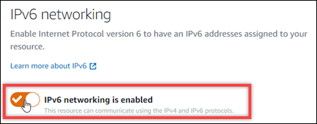

# Disable IPv6 networking for Lightsail resources

Complete the following procedure to disable IPv6 for instances, CDN distributions, and
load balancers.

1. Sign in to the [Lightsail console](https://lightsail.aws.amazon.com/ "https://lightsail.aws.amazon.com/").
2. Complete one of the following steps depending on the resource for which you want to
   disable IPv6:
   - To disable IPv6 for an instance, choose the **Instances** tab on
     the Lightsail home page, and then choose the name of the instance for which you want
     to disable IPv6.
   - To disable IPv6 for a CDN distribution or a load balancer, choose the
     **Networking** tab In the left navigation pane, and then choose the
     name of the CDN distribution or load balancer for which you want to disable
     IPv6.

3. Choose the **Networking** tab in the resource's management
   page.
4. In the **IPv6 Networking** section of the page, choose the toggle to
   disable IPv6 for the resource.

