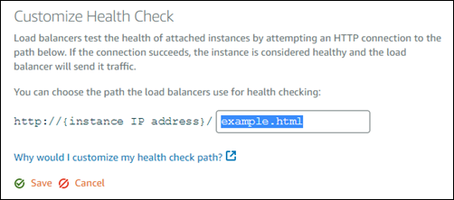

# Configure

Lightsail load balancer health checks

By default, Lightsail performs health checks on your instances at the root
(`"/"`) of your web application. The health checks are used to monitor the health
of the registered instances so that the load balancer can send requests only to the healthy
instances. The health checks start as soon as you attach the instances to your load
balancer.

One of the following statuses is returned.

- Passed
- Failed
  If your health check fails, you can try to figure out what is wrong by using the AWS Command Line Interface
  or the Lightsail API. See our troubleshooting guide for more information.

## Customize your health check path

You might want to customize your health check path. For example, if your home page loads
slowly or has a lot of images on it, you can configure Lightsail to check a different page
that loads faster.

1. In the left navigation pane, choose **Networking**.
2. Choose your load balancer to manage it.
3. On the **Target instances** tab, choose **Customize health
   checking**.
4. Type a valid path for your health check, and then choose
   **Save**.

