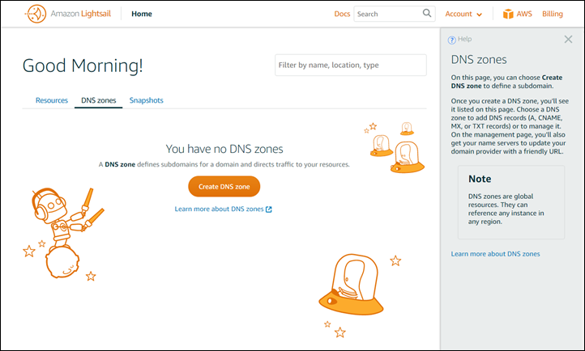

# Find helpful resources for

Lightsail

In Amazon Lightsail, you can find help in several ways.

## Context-sensitive

help panel

Lightsail has a context-sensitive **Help** panel on each page of the
console with additional tips and information that are specific to the page you're on. Open the
help panel any time you have a question about something on the page, and close it when you're
good to go. You can open the help panel by choosing **Help** on any page, or
by choosing any of the small question marks throughout the user interface.

## About the User Guide

The Amazon Lightsail User Guide contains how-to topics and conceptual overviews to help you
work in Lightsail. For example, you can [create an
instance](getting-started-with-amazon-lightsail.md "getting-started-with-amazon-lightsail.md"), [connect to your instance](lightsail-how-to-connect-to-your-instance-virtual-private-server.md "lightsail-how-to-connect-to-your-instance-virtual-private-server.md"), or [manage your domain](lightsail-how-to-create-dns-entry.md "lightsail-how-to-create-dns-entry.md").

## Using search

You can search for doc topics from any page in Lightsail by using the search box at the
top of each page. To refine your search, you can search again from the documentation search
page.

Didn't find what you were looking for? Send us feedback and we will get on it. On every page
in Lightsail, you can choose **Provide feedback** and submit feedback to
make suggestions.

## Using the Lightsail CLI and API

You can use the AWS Command Line Interface (AWS CLI) or the Lightsail REST API to create, read, update, and
delete Lightsail resources. In addition to the REST API, we also have an SDK in multiple
languages, including Java, Ruby, JavaScript (Node.js), Go, PHP, Python, .NET (C#), and C++.
For more information about the Lightsail API, see the [Lightsail
API reference](../../2016-11-28/api-reference/Welcome.md "../../2016-11-28/api-reference/Welcome.md").

###### Note

You need to generate access keys to use the Lightsail API. [Learn more
about setting up access keys to use the Lightsail API](lightsail-how-to-set-up-and-configure-aws-cli.md "lightsail-how-to-set-up-and-configure-aws-cli.md").

The AWS CLI is helpful when you work with your Lightsail resources. In the AWS AWS CLI, just
type `aws lightsail help` to learn about the available commands. For help on a
specific CLI command, type the command name followed by `help` to learn more about
its parameters and exceptions. For more information, see the [Lightsail CLI
reference](../../../cli/latest/reference/lightsail/index.md "../../../cli/latest/reference/lightsail/index.md").

## AWS forums and other community resources

You can also post your questions in our AWS discussion forum: [AWS Forums](https://forums.aws.amazon.com/forum.jspa?forumID=231 "https://forums.aws.amazon.com/forum.jspa?forumID=231").
