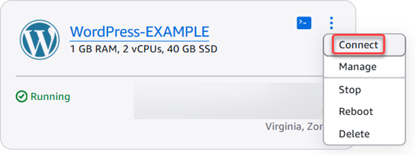

# Create Linux/Unix instances with apps on

Lightsail

###### Tip

Did you know that you can enable automatic snapshots for your instance? With automatic snapshots enabled, Lightsail stores seven daily snapshots
and automatically replaces the oldest with the newest. For more information, see [Configure
automatic snapshots for Lightsail instances and disks](amazon-lightsail-configuring-automatic-snapshots.md "amazon-lightsail-configuring-automatic-snapshots.md").

Create a Linux/Unix-based Amazon Lightsail instance (a virtual private server) running an
application like WordPress or a development stack like LAMP. After your instance starts running,
you can connect to it via SSH without leaving Lightsail. Here's how.

To create a Windows-based instance, see [Get
started with Windows-based instances in Amazon Lightsail](get-started-with-windows-based-instances-in-lightsail.md "get-started-with-windows-based-instances-in-lightsail.md").

## Create a Linux-based instance

1. On the home page, choose **Create instance**.
2. Select a location for your instance (an AWS Region and Availability Zone).

Choose **Change AWS Region and Availability Zone** to create your
instance in another location. 3. Optionally, you can change the Availability Zone.

Choose **Change your Availability Zone**. 4. Choose the Linux platform. 5. Pick an application (**Apps + OS**) or an operating system
(**OS Only**).

To learn more about Lightsail instance images, see [Choose
an Amazon Lightsail instance image](compare-options-choose-lightsail-instance-image.md "compare-options-choose-lightsail-instance-image.md"). 6. Choose your instance plan.

Choose whether your instance uses dual-stack (IPv4 and IPv6), or IPv6-only networking.
Some Lightsail blueprints don't support IPv6-only networking at this time. To see which
blueprints support IPv6-only networking see [Review the Lightsail
instance blueprint offerings](compare-options-choose-lightsail-instance-image.md "compare-options-choose-lightsail-instance-image.md").

You can try the $5 USD Lightsail plan free for one month (up to 750 hours). We will
credit one free month to your account. Learn more on our [Lightsail pricing page](http://www.amazonlightsail.com/pricing/ "http://www.amazonlightsail.com/pricing/").

###### Note

As part of the AWS Free Tier, you can get started with Amazon Lightsail for free on
select instance bundles. For more information, see **AWS Free Tier**
on the [Amazon Lightsail Pricing page](https://aws.amazon.com/lightsail/pricing "https://aws.amazon.com/lightsail/pricing"). 7. Enter a name for your instance.

Resource names:

    * Must be unique within each AWS Region in your Lightsail account.
    * Must contain 2 to 255 characters.
    * Must start and end with an alphanumeric character or number.
    * Can include alphanumeric characters, numbers, periods, dashes, and
     underscores.

8. (Optional) Choose **Add new tag** to add a tag to your instance. Repeat this step as needed to add additional tags. For
   more information on tag usage, see [Tags](amazon-lightsail-tags.md "amazon-lightsail-tags.md").
   1. For **Key**, enter a tag key.

    2. (Optional) For **Value**, enter a tag value.

   

9. Choose **Create instance**.

For advanced creation options, see [Use a launch
script to configure your Amazon Lightsail instance when it starts up](lightsail-how-to-configure-server-additional-data-shell-script.md "lightsail-how-to-configure-server-additional-data-shell-script.md") or [Set up SSH for your Linux/Unix-based Lightsail
instances](lightsail-how-to-set-up-ssh.md "lightsail-how-to-set-up-ssh.md").

Within minutes, your Lightsail instance is ready and you can connect to it via SSH,
without leaving Lightsail!

## Connect to your instance

1. On the Lightsail home page, choose the menu on the right of your instance's name,
   and then choose **Connect**.

Alternately, you can open your instance management page, choose the
**Connect** tab, then choose **Connect using
SSH**.

###### Note

To connect to your instance using an SSH client such as PuTTY, you can follow this
procedure: [Set up PuTTY to connect to your Lightsail instance](lightsail-how-to-set-up-putty-to-connect-using-ssh.md "lightsail-how-to-set-up-putty-to-connect-using-ssh.md"). 2. Now you can type commands into the terminal and manage your Lightsail instance
without setting up an SSH client.

## Next steps

Now that you can connect to your instance, what you do next depends on how you plan to use
it. For example:

- [Configure and manage Lightsail WordPress
  instances](wordpress-tutorials.md "wordpress-tutorials.md") if you're creating a blog.
- [Create a static IP
  address](lightsail-create-static-ip.md "lightsail-create-static-ip.md") for your instance to keep the same IP address each time you restart your
  Lightsail instance.
- [Create a snapshot
  of your instance](lightsail-how-to-create-a-snapshot-of-your-instance.md "lightsail-how-to-create-a-snapshot-of-your-instance.md") as a backup.
