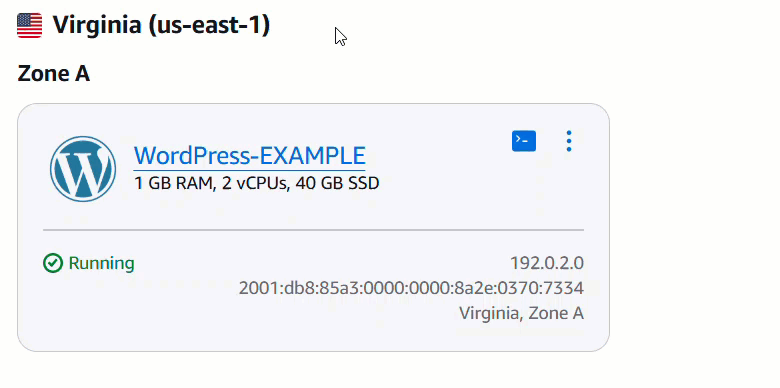
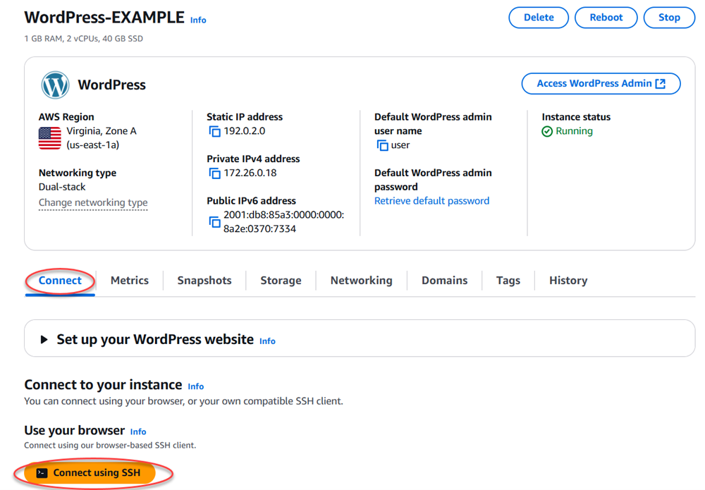
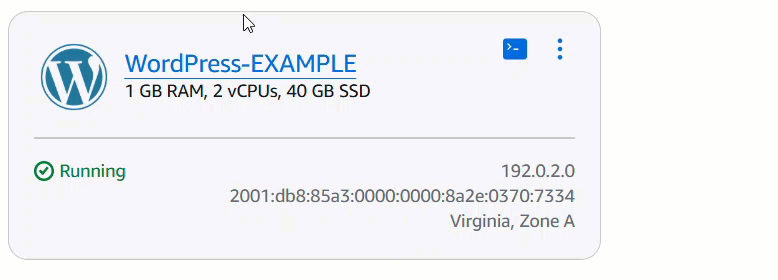

# Getting started with virtual private servers on

Lightsail

In Lightsail, an instance is a virtual private server (also called a virtual machine).
You create and manage Lightsail instances in the AWS Cloud. When you create an instance,
you choose an image that has an operating system (OS) on it. You can also choose an instance
image that has an application or development stack on it, including the base OS.

The instance that you create in this tutorial will incur usage fees from the time that you
create the instance until you delete it. Deletion is the final step of this tutorial. For
more information about pricing, see [Lightsail pricing](https://aws.amazon.com/lightsail/pricing "https://aws.amazon.com/lightsail/pricing").

###### Topics

- [Step 1: Complete the
  prerequisites](#getting-started-prerequisite "#getting-started-prerequisite")
- [Step 2: Create an instance](#getting-started-step2 "#getting-started-step2")
- [Step 3: Connect to your instance](#getting-started-step3 "#getting-started-step3")
- [Step 4: Add storage to your instance](#getting-started-step4 "#getting-started-step4")
- [Step 5: Create a snapshot](#getting-started-step5 "#getting-started-step5")
- [Step 6: Clean up](#getting-started-cleanup "#getting-started-cleanup")
- [Next steps](#getting-started-next-steps "#getting-started-next-steps")
- [Using Amazon Lightsail with the AWS CLI](getstarted-awscli.md "getstarted-awscli.md")

## Step 1: Complete the

prerequisites

If you're a new AWS customer, complete the setup prerequisites before you start
using Amazon Lightsail. For more information, see [Set up AWS account and administrative users for
Lightsail](setting-up.md "setting-up.md").

## Step 2: Create an instance

You can create an instance by using the [Lightsail console](https://lightsail.aws.amazon.com/ "https://lightsail.aws.amazon.com/") as described in the following procedure. This tutorial
is intended to help you quickly launch your first instance. We also recommend exploring
the available applications and hardware plans. For more information, see [Review the Lightsail
instance blueprint offerings](compare-options-choose-lightsail-instance-image.md "compare-options-choose-lightsail-instance-image.md").

1. Sign in to the [Lightsail
   console](https://lightsail.aws.amazon.com/ "https://lightsail.aws.amazon.com/").
2. On the home page, choose **Create instance**.
3. Select a location for your instance (an AWS Region and Availability Zone).
   Choose an AWS Region that is closest to your physical location for reduced
   latency.

Choose **Change AWS Region and Availability Zone** to
create your instance in another location. 4. You can pick an application (**Apps + OS**) or an operating
system (**OS Only**).

To learn more about Lightsail instance images, see [Review the Lightsail
instance blueprint offerings](compare-options-choose-lightsail-instance-image.md "compare-options-choose-lightsail-instance-image.md"). 5. Choose your instance plan.

Choose whether your instance uses dual-stack (IPv4 and IPv6), or IPv6-only
networking. Some Lightsail blueprints don't support IPv6-only networking at
this time. To see which blueprints support IPv6-only networking see [Review the Lightsail
instance blueprint offerings](compare-options-choose-lightsail-instance-image.md "compare-options-choose-lightsail-instance-image.md").

You can try the $5 USD Lightsail plan free for one month (up to 750 hours).
We will credit one free month to your account. Learn more on our [Lightsail pricing
page](https://aws.amazon.com/lightsail/pricing "https://aws.amazon.com/lightsail/pricing"). 6. Enter a name for your instance.

Resource names:

    * Must be unique within each AWS Region in your Lightsail
     account.
    * Must contain 2 to 255 characters.
    * Must start and end with an alphanumeric character or number.
    * Can include alphanumeric characters, numbers, periods, dashes, and
     underscores.

7. Choose **Create instance**.

Within minutes, your Lightsail instance is ready and you can connect to it.

## Step 3: Connect to your instance

1. From the Lightsail home page, choose the actions menu icon (⋮), then
   choose **Connect**.

Alternatively, you can connect from your instance's management page. Select
your instance's name, choose the **Connect** tab, then choose
**Connect using SSH**.

 2. You can now type commands into the terminal and manage your Lightsail
instance without setting up an SSH client.

To learn how to connect to add additional storage to your virtual computer, continue
to the next step of this tutorial.

## Step 4: Add storage to your instance

Lightsail provides block-level storage volumes (disks) that you can attach to an
instance. Even though your instance comes with a system disk, you can attach additional
storage disks as your needs change. You can also detach a disk from an instance and
attach it to another instance.

After you create an additional disk, you will need to connect to your Lightsail
instance to format and mount the disk.

For more information about creating, attaching, and managing a disk, see [Create and attach
Lightsail block storage disks to Linux instances](create-and-attach-additional-block-storage-disks-linux-unix.md "create-and-attach-additional-block-storage-disks-linux-unix.md").

To learn about backing up your virtual computer, continue to the next step of this
tutorial.

## Step 5: Create a snapshot

Snapshots are a point-in-time copy of your data. You can create snapshots of your
instances and use them as baselines to create new instances or for data backup. A
snapshot contains all of the data that's needed to restore your instance (from the
moment when the snapshot was taken).

For more information about creating and managing snapshots, see [Back up Linux/Unix
Lightsail instances with snapshots](lightsail-how-to-create-a-snapshot-of-your-instance.md "lightsail-how-to-create-a-snapshot-of-your-instance.md").

To learn about cleaning up your virtual computer resources, continue to the next step
of this tutorial.

## Step 6: Clean up

After you're done with the instance that you created for this tutorial, you can delete
it. This stops incurring charges for the instance if you don't need it.

Deleting an instance doesn't delete its associated snapshots or attached disks. If you
created snapshots and disks for this tutorial, you should delete those as well.

To save your instance for later, but to avoid incurring charges, you can stop the
instance instead of deleting it. Then you can start it again later. For more information
about pricing, see [Lightsail
pricing](https://aws.amazon.com/lightsail/pricing "https://aws.amazon.com/lightsail/pricing").

###### Important

Deleting a Lightsail resource is a permanent action. The deleted data cannot be
recovered. If you might need the data later, create a snapshot of your virtual
computer before you delete it. For more information, see [Back up Linux/Unix
Lightsail instances with snapshots](lightsail-how-to-create-a-snapshot-of-your-instance.md "lightsail-how-to-create-a-snapshot-of-your-instance.md").

1. Sign in to the [Lightsail
   console](https://lightsail.aws.amazon.com/ "https://lightsail.aws.amazon.com/").
2. Choose **Instances** in the navigation pane.
3. For the instance you want to delete, choose the actions menu icon (⋮),
   then choose **Delete**.

 4. Choose **Yes, delete** to confirm the deletion.

## Next steps

Use the following topics to get started with Amazon Lightsail Linux and Windows based
instances.

- [Create Linux/Unix instances with apps on
  Lightsail](getting-started-with-amazon-lightsail.md "getting-started-with-amazon-lightsail.md")
- [Create Windows Server
  instances in Lightsail](get-started-with-windows-based-instances-in-lightsail.md "get-started-with-windows-based-instances-in-lightsail.md")
