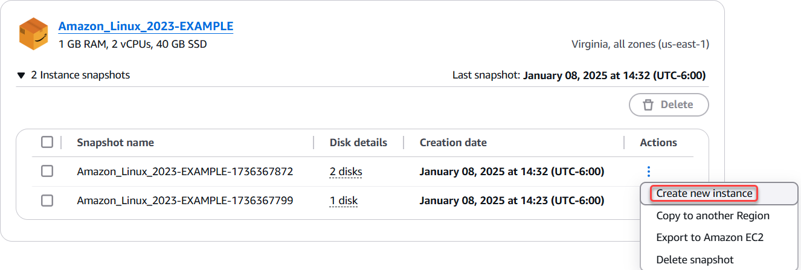

# Upsize a Lightsail

instance, storage, or database from snapshots

It happens. Your cloud project is growing and you need more compute power right away! We can
help you with that. To upsize your Lightsail instance, block storage disk, or database, create
a snapshot of your resource, and then create a new, larger version of that resource using the
snapshot.

###### Note

You cannot create a resource from a snapshot using a smaller plan size than the original
resource. For example, you can't go from an 8 GB instance to a 2 GB instance.

The default public IPv4 address that is assigned to your instance when you create it will
change when you stop and start your instance. You can optionally create and attach a static
IPv4 address to your instance. By using a static IP address, you can mask the failure of an
instance or software by rapidly remapping the address to another instance in your account.
Alternatively, you can specify the static IP address in a DNS record for your domain, so that
your domain points to your instance. For more information, see [IP
addresses](understanding-public-ip-and-private-ip-addresses-in-amazon-lightsail.md "understanding-public-ip-and-private-ip-addresses-in-amazon-lightsail.md").

## Prerequisites

You will need a snapshot of your Lightsail instance, block storage disk, or database. For
more information, see [Snapshots](understanding-snapshots-in-amazon-lightsail.md "understanding-snapshots-in-amazon-lightsail.md").

## Create your resource

1. Sign in to the [Lightsail console](https://lightsail.aws.amazon.com/ "https://lightsail.aws.amazon.com/").
2. Choose the **Snapshots** tab.
3. Find the Lightsail resource whose snapshot you want to use to create a new, larger
   resource, and choose the right-arrow to expand the list of snapshots.
4. Choose the ellipsis icon next to the snapshot you want to use, and choose
   **Create new instance**.

 5. On the **Create** page, you have a few optional settings to choose
from. For example, you can change the Availability Zone. For instances, you can [add a launch script](lightsail-how-to-configure-server-additional-data-shell-script.md "lightsail-how-to-configure-server-additional-data-shell-script.md"), or [change the SSH key you use to connect to it](understanding-ssh-in-amazon-lightsail.md "understanding-ssh-in-amazon-lightsail.md").

You can accept all the defaults and move on to the next step. 6. Choose the plan (or _bundle_) for your new resource. At this point,
you can choose a larger bundle size than the original resource, if you'd like.

###### Note

You cannot create the resource using a smaller plan size than the original resource.
The bundle options that are smaller than the original resource will be
unavailable. 7. Enter a name for your instance.

Resource names:

    * Must be unique within each AWS Region in your Lightsail account.
    * Must contain 2 to 255 characters.
    * Must start and end with an alphanumeric character or number.
    * Can include alphanumeric characters, numbers, periods, dashes, and
     underscores.

8. Choose **Create**.

Lightsail takes you to the management page for your new resource, and you can start
managing it.
