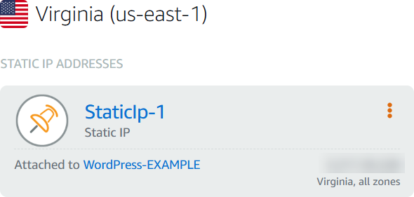
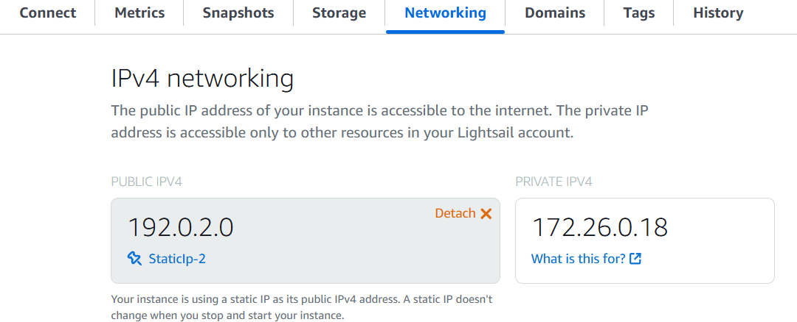

# Create and attach a static IP to your Lightsail

instance

The default dynamic public IP address attached to your Amazon Lightsail instance changes
every time you stop and restart the instance. Create a static IP address and attach it to your
instance to keep the public IP address from changing. Later, when you point a registered domain
name to your instance, you don’t have to update your domain’s DNS records every time you stop
and restart your instance. You can attach one static IP to an instance. For more information,
see [Static IP
addresses](understanding-static-ip-addresses-in-amazon-lightsail.md "understanding-static-ip-addresses-in-amazon-lightsail.md").

## Prerequisites

You need at least one dual-stack instance running in Lightsail. To create one, see [Create an
instance](getting-started-with-amazon-lightsail.md "getting-started-with-amazon-lightsail.md").

## Create and assign a Static IP address to an

instance

Follow these steps to create a new static IP address and attach it to an instance in
Lightsail.

1. Sign in to the Lightsail console at [https://lightsail.aws.amazon.com/](https://lightsail.aws.amazon.com/ "https://lightsail.aws.amazon.com/").
2. In the left navigation pane, choose **Networking**.
3. Choose **Create static IP**.
4. Select the AWS Region where you want to create your static IP.

###### Note

Static IP addresses can only be attached to instances in the same Region. 5. Choose the Lightsail resource to which you want to attach the static IP. 6. Enter a name for your static IP.

Resource names:

    * Must be unique within each AWS Region in your Lightsail account.
    * Must contain 2 to 255 characters.
    * Must start and end with an alphanumeric character or number.
    * Can include alphanumeric characters, numbers, periods, dashes, and
     underscores.

7. Choose **Create**.

Now when you go to the home page, you see a static IP address that you can
manage.

Also, on the **Networking** tab of your instance's management page,
you will see a blue pushpin next to your public IP address. This indicates that the IP
address is now static.

For more information, see [Public and private IP addresses](understanding-public-ip-and-private-ip-addresses-in-amazon-lightsail.md "understanding-public-ip-and-private-ip-addresses-in-amazon-lightsail.md").
