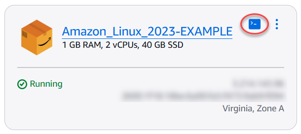
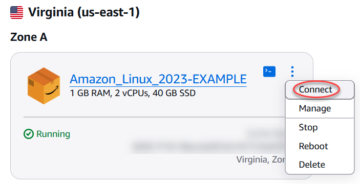
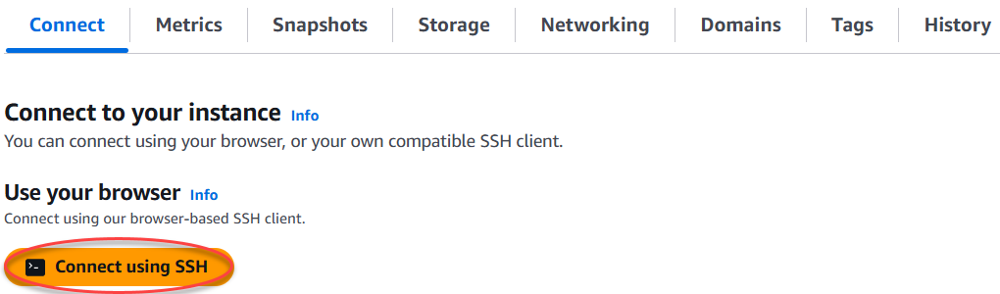
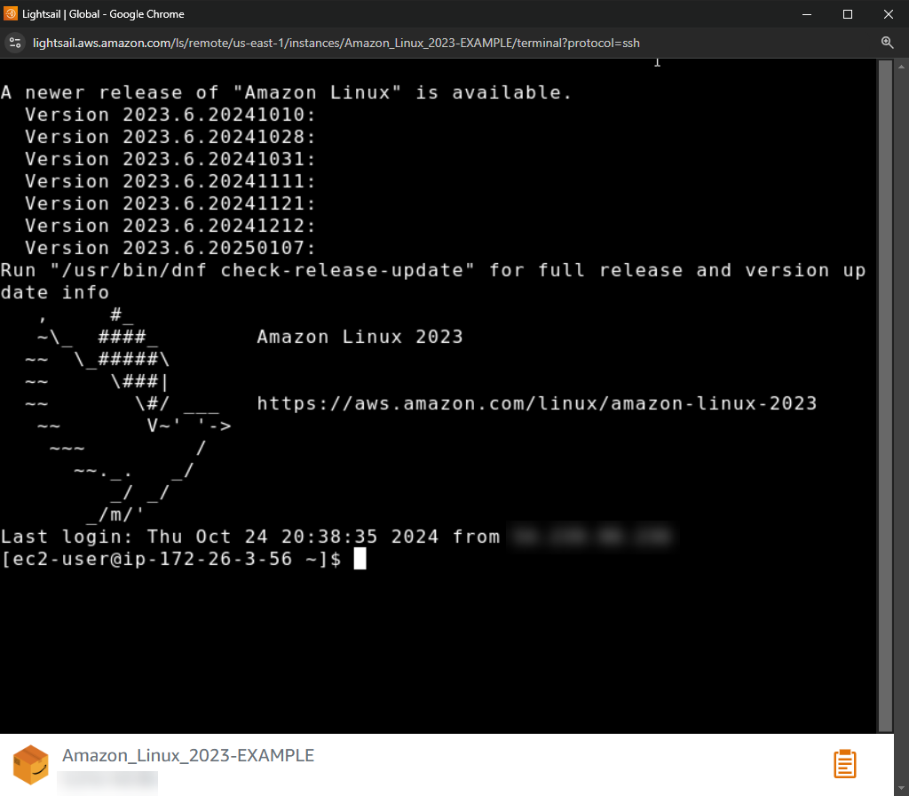

# Connect to

Linux or Unix instances on Lightsail

Amazon Lightsail provides you with a browser-based SSH client, which is the fastest way to
connect to your Linux or Unix instance. You can also use your own SSH client to connect to your
instance. For more information, see [Download and set up
PuTTY](lightsail-how-to-set-up-putty-to-connect-using-ssh.md "lightsail-how-to-set-up-putty-to-connect-using-ssh.md").

Connect to your instance with SSH to perform administrative tasks on the server, such as
installing software packages or configuring web applications. The browser-based SSH client
requires no software installation, and is available almost immediately after you create an
instance.

To connect to a Windows Server instance in Lightsail, see [Connect to your
Windows-based instance](connect-to-your-windows-based-instance-using-amazon-lightsail.md "connect-to-your-windows-based-instance-using-amazon-lightsail.md").

###### To connect to your Linux or Unix instance

1.  Sign in to the [Lightsail console](https://lightsail.aws.amazon.com/ "https://lightsail.aws.amazon.com/").
2.  Access the browser-based SSH client for the instance that you want to connect to by
    using any of the following:

        * Choose the quick connect icon, as shown in the following example.

        
        * Choose the actions menu icon (⋮), then choose
         **Connect**.

        
        * Choose the name of the instance, and on the **Connect** tab, choose
         **Connect using SSH**.

        

    You can start interacting with your instance when the browser-based SSH client opens,
    and a terminal screen is displayed as shown in the following example:

###### Note

The **Connect** tab also provides the information required to connect
using your own SSH client. For more information, see [Download and set up
PuTTY](lightsail-how-to-set-up-putty-to-connect-using-ssh.md "lightsail-how-to-set-up-putty-to-connect-using-ssh.md")

## Interact with your Linux or Unix instance using

the browser-based SSH client

Type Linux or Unix commands directly into the terminal screen, paste text into the
terminal screen, or copy text from the terminal screen of the browser-based SSH client. The
following sections show you how to copy and paste text to and from the clipboard in
SSH.

###### To paste text into the browser-based SSH client

1. Highlight text in your local desktop, then press **Ctrl+C** or
   **Cmd+C** to copy it to your local clipboard.
2. In the bottom right corner of the browser-based SSH client, choose the clipboard icon.
   The browser-based SSH client clipboard text box appears.
3. Click into the text box, then press **Ctrl+V** or
   **Cmd+V** to paste the contents from your local clipboard into the
   browser-based SSH client clipboard.
4. Right-click any area on the SSH terminal screen to paste the text from the
   browser-based SSH client clipboard to the terminal screen.

###### To copy text from the browser-based SSH client

1. Highlight text on the terminal screen.
2. In the bottom right corner of the browser-based SSH client, choose the clipboard icon.
   The browser-based SSH client clipboard text box appears.
3. Highlight the text that you want to copy, then press **Ctrl+C** or
   **Cmd+C** to copy the text to your local clipboard. You can now paste
   the copied text anywhere in your local desktop.

