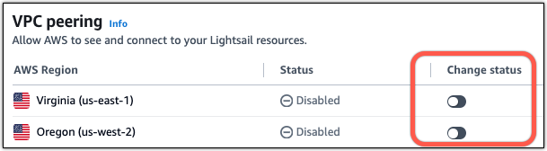

# Connect Lightsail

resources to AWS services using VPC peering

With Amazon Lightsail, you can connect to AWS resources, such as an Amazon RDS database, through
virtual private cloud (VPC) peering. A VPC is a virtual network dedicated to your AWS account.
Everything you create inside Lightsail is inside a VPC, and you can connect your Lightsail
VPC to an Amazon VPC.

Some AWS resources, such as Amazon S3, Amazon CloudFront, and Amazon DynamoDB don't require that you enable
VPC peering.

###### Note

To enable VPC peering in Lightsail, you must have a default VPC in your AWS Region.
The peering relationship will be between your resources in Lightsail and those in your
default VPC for the Region you enable VPC peering for. If you don’t have a default Amazon VPC,
you can create one. For more information, see [Default VPCs](../../../vpc/latest/userguide/default-vpc.md "../../../vpc/latest/userguide/default-vpc.md") and
[Create a Default VPC](../../../vpc/latest/userguide/work-with-default-vpc.md#create-default-vpc "../../../vpc/latest/userguide/work-with-default-vpc.md#create-default-vpc") in the _Amazon VPC User
Guide_.

Since AWS Regions are isolated from one another, a VPC is also isolated in the region
where you created it. You will need to enable VPC peering in each AWS Region where you have
Lightsail resources that you want to connect your other resources to.

Once you have a default Amazon VPC, follow these instructions to peer your Lightsail VPC with
your Amazon VPC.

1. In the [Lightsail console](https://lightsail.aws.amazon.com/ "https://lightsail.aws.amazon.com/"), choose your
   **username** on the top navigation menu.
2. Choose **Account** from the drop-down.
3. Choose the **Advanced** tab.
4. Toggle the **status** next to the AWS Region where you want to enable
   VPC peering.

If the peering connection fails, try to enable VPC peering again. If it doesn't work,
contact [AWS Support](https://console.aws.amazon.com/support/home/ "https://console.aws.amazon.com/support/home/").

A peering connection is created in your AWS account if the peering request is
successful. Go to the [Amazon VPC Dashboard](https://console.aws.amazon.com/vpc/home#PeeringConnections "https://console.aws.amazon.com/vpc/home#PeeringConnections") and choose **Peering Connections** in the
navigation pane to view the peering connection that is created.

For more information about Amazon VPC, see [VPC and Subnets](../../../AmazonVPC/latest/UserGuide/how-it-works.md#how-it-works-subnet "../../../AmazonVPC/latest/UserGuide/how-it-works.md#how-it-works-subnet") in the _Amazon VPC User Guide_.

## Allow

communication with other AWS services

Once VPC peering has been enabled, you must ensure that your resources in the other AWS
services you want to connect to accept inbound traffic from your Lightsail resources. If you
want resources from other AWS services to connect to your Lightsail instances, you can add
firewall rules to allow the required inbound traffic. For more information, see [Add firewall
rules to Lightsail instances](amazon-lightsail-editing-firewall-rules.md "amazon-lightsail-editing-firewall-rules.md").

The steps you might take will depend on the service and types of traffic you are working
with. For an example of the steps you might take to connect a Lightsail instance to an Amazon RDS
database, see the [Amazon Lightsail Database Tips
and Tricks](https://aws.amazon.com/blogs/compute/amazon-lightsail-database-tips-and-tricks/ "https://aws.amazon.com/blogs/compute/amazon-lightsail-database-tips-and-tricks/") AWS blog post. For more information on the services you can integrate
with Lightsail using VPC peering, see [Integrate Lightsail with other AWS
services with VPC peering](using-lightsail-with-other-aws-services.md "using-lightsail-with-other-aws-services.md").
