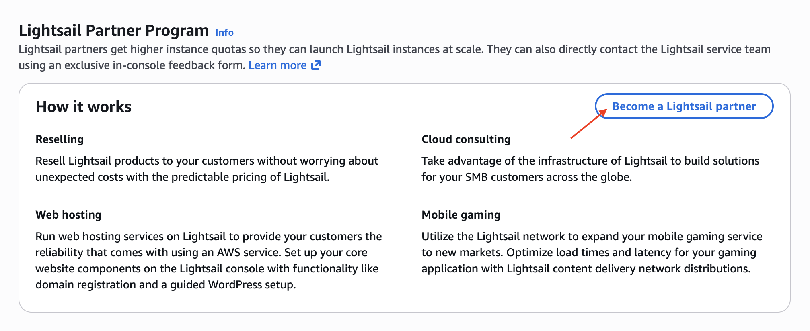
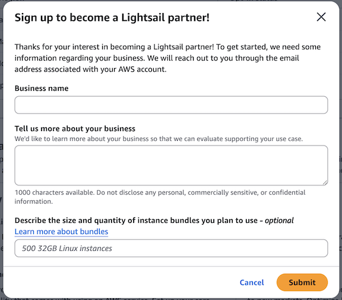
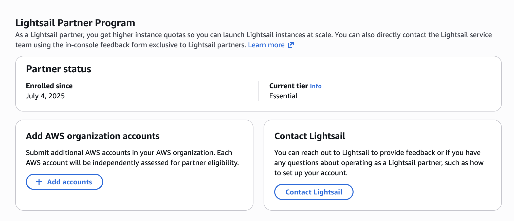
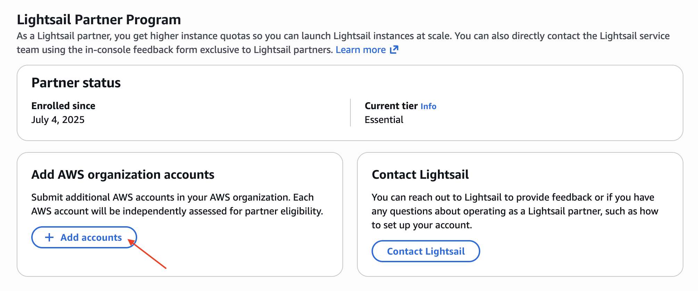
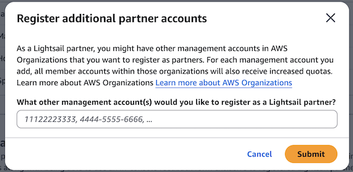

# Become a Lightsail partner

You must submit a form to be considered for becoming an Amazon Lightsail partner. The
request will be filed using the AWS account that you are logged in with at the time you
complete the form. Upon approval, you are enrolled in a partner tier based on your usage and
immediately receive higher default instance quotas for Lightsail.

If you use AWS Organizations to help centrally manage your AWS accounts, you should submit the
request while using your management account to become a partner. By using your management
account, you get increased default Lightsail instance quotas across the member accounts in
your organization. For more information on how Lightsail partner benefits affect your
AWS accounts, see [How Lightsail partner benefits apply to your accounts](lightsail-partners.md#lightsail-partners-how-accounts-benefit "lightsail-partners.md#lightsail-partners-how-accounts-benefit").

If you have additional AWS accounts or organizations that you want to enroll as partners
for discount eligibility, each additional account is evaluated independently for partner
eligibility.

###### Topics

- [Required information to become a Lightsail partner](#lightsail-partners-become-a-partner-required-information "#lightsail-partners-become-a-partner-required-information")
- [Request to become a Lightsail partner](#lightsail-partners-become-a-partner-submit-request "#lightsail-partners-become-a-partner-submit-request")
- [Request additional accounts to become Lightsail partners](#lightsail-partners-become-a-partner-request-additional-accounts "#lightsail-partners-become-a-partner-request-additional-accounts")

## Required information to become a Lightsail partner

We will require some information about your planned usage and use case to consider your
request to become an Amazon Lightsail partner. A form is available on the Lightsail console
that you can complete and submit for consideration. In addition to details about your
business, you should have the following information to complete the form:

- Size and quantity of instance bundles for the Lightsail resources you plan to use.
  For more information on the available bundles, see [Amazon Lightsail pricing](https://aws.amazon.com/lightsail/pricing/ "https://aws.amazon.com/lightsail/pricing/").
- AWS account IDs that you want to enroll. If you are using AWS Organizations, you should
  only specify your management account in the request. This also enrolls the respective
  member accounts in the organization. For more information, see [Terminology
  and concepts for AWS Organizations](../../../organizations/latest/userguide/orgs_getting-started_concepts.md "../../../organizations/latest/userguide/orgs_getting-started_concepts.md") in the _AWS Organizations User
  Guide_.

## Request to become a Lightsail partner

The following steps will submit a request to become a partner. The AWS account ID that
you are authenticated with will be used as the account that you'd like to have partner
benefits for. If your request is approved, you are enrolled in a partner tier based on your
usage.

###### Tip

If you are using AWS Organizations, you should perform this procedure as the management account
for your organization so that your member accounts also receive increased default
Lightsail instance quotas.

###### To request to become a partner

1. Sign in to the [Lightsail
   console](https://lightsail.aws.amazon.com/ "https://lightsail.aws.amazon.com/").
2. On the Lightsail home page, choose your user or role on the top navigation
   menu.
3. Choose **Account** in the dropdown menu.

 4. On the **Profile & preferences** tab, under the
**Lightsail Partner Program** section, choose **Become a
Lightsail partner**.

 5. On the registration form, enter your information into the fields and choose
**Submit**.

You will receive a confirmation of your submission to your account's email regarding your
interest in becoming a partner. If your request is approved, you are enrolled in a partner
tier based on your usage and your **Account** page in the Lightsail console
displays your partner status, including your current tier. The **Lightsail Partner
Program** section on the **Profile & preferences** tab shows
options to manage your partner accounts and contact the Lightsail team for feedback or
queries as a Lightsail partner. This section is only visible to the account that submitted
the request to become a Lightsail partner. You will also receive the higher instance quotas
for Lightsail.

## Request additional accounts to become Lightsail partners

The following steps will submit a request for additional AWS accounts to become
partners. Each additional account is evaluated independently for partner eligibility.

###### Tip

If you are using AWS Organizations, you should specify your management accounts as the
AWS accounts to add. This approach scales the increased default Lightsail instance
quotas to all of your member accounts in the organization of the management
account.

###### To request additional accounts to become Lightsail partners

1. Sign in to the [Lightsail
   console](https://lightsail.aws.amazon.com/ "https://lightsail.aws.amazon.com/").
2. On the Lightsail home page, choose your user or role on the top navigation
   menu.
3. Choose **Account** in the dropdown menu.

 4. On the **Profile & preferences** tab, in the
**Lightsail Partner Program** section, choose **Add
accounts**.

###### Important

The **Add accounts** action is only available to the account that
requested to become a Lightsail partner and was accepted.

 5. In the registration form, enter any additional AWS account IDs or management
accounts for your organizations that you'd like to register.

###### Note

If you are using Organizations, you don't need to request your member accounts.

 6. Choose **Submit**.
