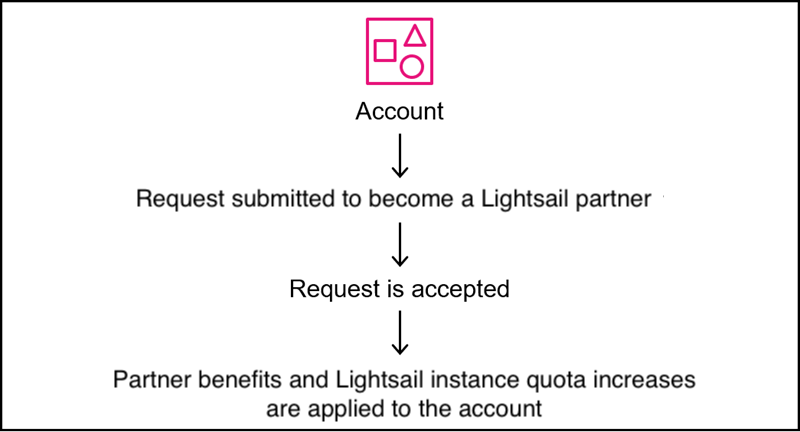
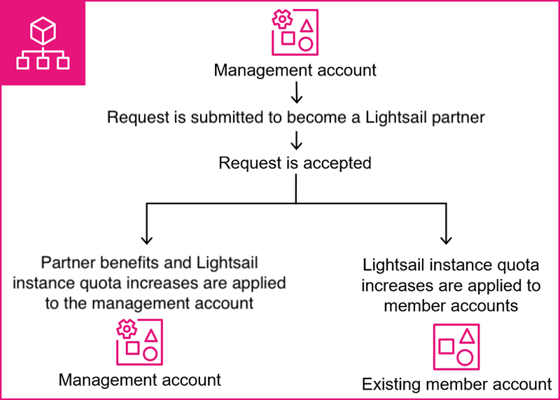
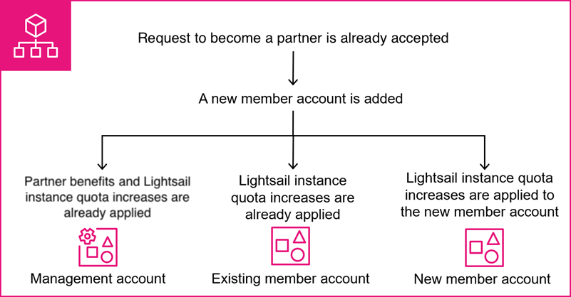

# Lightsail Partner Program

If you are looking to scale up on Amazon Lightsail, you can become a registered partner to
get benefits such as higher default instance quotas, and you may be eligible for discounts based
on your tier. You also get access
to an in-console feedback form exclusive to registered partners. The Lightsail Partner Program
offers four tiers (Essential, Growth, Accelerate, and Premier).

###### Note

No AWS Partner membership is required to participate in the Lightsail Partner Program.

###### Topics

- [Benefits of the Lightsail Partner Program](#lightsail-partners-features "#lightsail-partners-features")
- [Lightsail Partner Program tiers](#lightsail-partners-program-tiers "#lightsail-partners-program-tiers")
- [How Lightsail partner benefits apply to your accounts](#lightsail-partners-how-accounts-benefit "#lightsail-partners-how-accounts-benefit")
- [How to become a Lightsail partner](#lightsail-partners-next-steps "#lightsail-partners-next-steps")
- [Become a Lightsail partner](lightsail-partners-become-a-partner.md "lightsail-partners-become-a-partner.md")
- [Request a service quota increase for your partner accounts](lightsail-partners-request-quota-increase.md "lightsail-partners-request-quota-increase.md")
- [Contact Lightsail as a partner](lightsail-partners-contact-lightsail.md "lightsail-partners-contact-lightsail.md")

## Benefits of the Lightsail Partner Program

As a Lightsail partner, you receive the following benefits.

**Higher instance quotas**

You receive higher default instance quotas for Lightsail.

**Access to larger instance bundles**

You can immediately start creating larger instance bundles to support your
workloads.

**Discount eligibility**

You may be eligible for discounts on Lightsail resources based on
your partner tier. For more information, see [Lightsail Partner Program tiers](#lightsail-partners-program-tiers "#lightsail-partners-program-tiers").

## Lightsail Partner Program tiers

The Lightsail Partner Program has four tiers. To qualify for a specific tier, you need to
meet the monthly spend threshold for that tier.

**Essential**

The entry-level tier for all accepted partners with no minimum spend requirement.
You receive higher default instance quotas for Lightsail compared to standard accounts
immediately upon enrollment.

**Growth**

Requires a minimum monthly Lightsail spend of USD $1,500. For example, a partner
running 220 Micro dual-stack instances, or 125 Small dual-stack instances in a single
region would meet this threshold. You are eligible for discounts on Lightsail
resources.

**Accelerate**

Requires a minimum monthly Lightsail spend of USD $5,000. For example, a partner
running 750 Micro dual-stack instances in a single region, or 450 Small dual-stack
instances spread across 3 regions would meet this threshold. You are eligible for
greater discounts compared to the Growth tier.

**Premier**

Requires a minimum monthly Lightsail spend of USD $25,000. For example, a partner
running 3,600 Micro dual-stack instances in a single region, or 2,100 Small dual-stack
instances spread across 3 regions would meet this threshold. You are eligible for
greater discounts compared to the Accelerate tier.

###### Note

These examples are illustrative and don't cover all scenarios. If you are unsure whether
your use case qualifies for a specific tier, you can submit a request through the Lightsail
console. For more information, see [Become a Lightsail partner](lightsail-partners-become-a-partner.md "lightsail-partners-become-a-partner.md").

## How Lightsail partner benefits apply to your accounts

Partner benefits apply to the AWS account that you used to submit your request. If you
use AWS Organizations, all partner benefits apply to your management account. Member accounts do not
receive partner status, but they will have increased default Lightsail instance quotas. For
more information on Organizations, see [What is AWS Organizations?](../../../organizations/latest/userguide/orgs_introduction.md "../../../organizations/latest/userguide/orgs_introduction.md") in the _AWS Organizations User
Guide_.

If you have additional AWS accounts or organizations that you want to enroll as partners
for discount eligibility, each additional account is evaluated independently for partner
eligibility.

The following diagrams illustrate how Lightsail partner benefits and increased default
Lightsail instance quotas apply to AWS accounts.

###### Single AWS account

The following diagram details what occurs when a single account outside of AWS Organizations
becomes a Lightsail partner.

###### AWS accounts in Organizations

The following diagram details what occurs when a management account in AWS Organizations becomes
a Lightsail partner.

###### AWS accounts in Organizations that are added after becoming a partner

The following diagram details what occurs when a new member account is added to your
organization whose management account has already registered as a Lightsail
partner.

## How to become a Lightsail partner

To proceed, you'll need to submit a form with details about your business needs to become
a Lightsail partner. For more information, see [Become a Lightsail partner](lightsail-partners-become-a-partner.md "lightsail-partners-become-a-partner.md").
