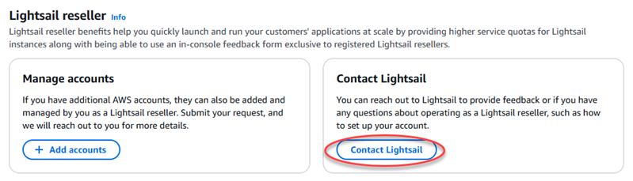
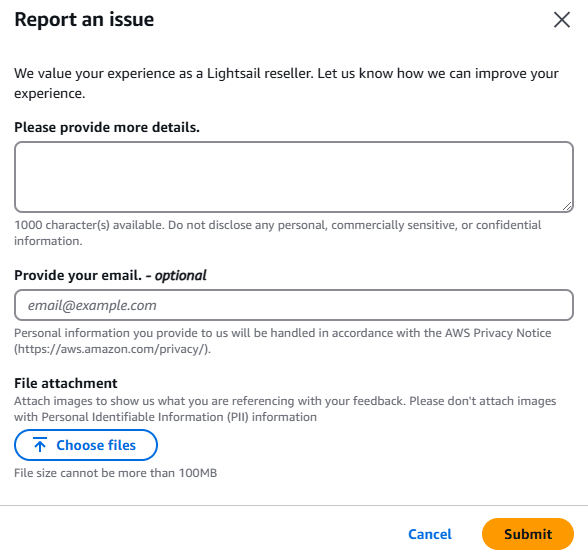

# Contact Lightsail as a reseller

As an Amazon Lightsail reseller, you can contact the Lightsail team with questions or
feedback about your efforts as a reseller right from the Lightsail console. This is
also how you can request service quota increases for Lightsail across your member
accounts in an organization.

###### To contact the Lightsail team

1. Sign in to the [Lightsail
   console](https://lightsail.aws.amazon.com/ "https://lightsail.aws.amazon.com/").
2. On the Lightsail home page, choose your user or role on the top navigation
   menu.
3. Choose **Account** in the dropdown menu.

 4. On the **Profile** tab, in the **Lightsail
reseller** section, choose **Contact
Lightsail**.

###### Important

The **Contact Lightsail** action is only available to
the account that requested to become a Lightsail reseller and was
accepted. For more information, see [Become a Lightsail
reseller](lightsail-resellers-become-a-reseller.md "lightsail-resellers-become-a-reseller.md").

 5. Fill out the necessary fields for your request. If you are requesting service
quota increases for Lightsail, you can specify multiple member
accounts.

 6. Choose **Submit**.
If you provide your email address, you might be contacted about your feedback.
