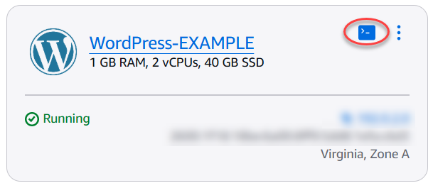
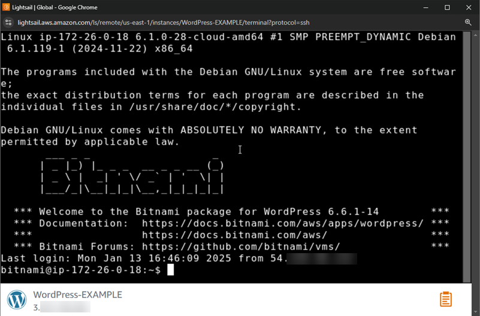
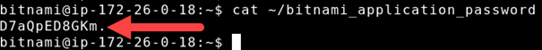
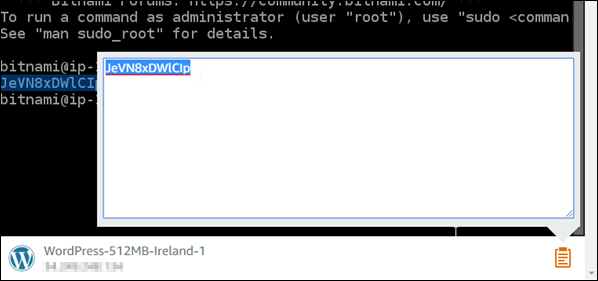
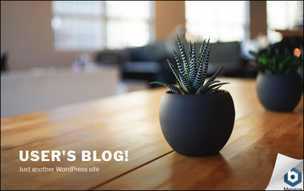
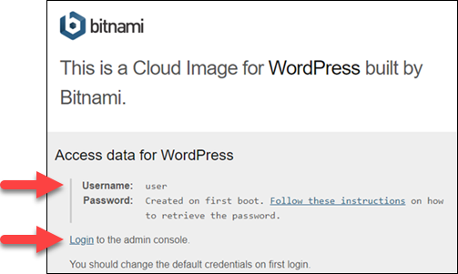
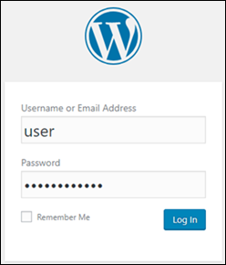

# Obtain the

default application username and password for Lightsail Bitnami instances

Bitnami provides many of the application instance images, or blueprints, that you can create
as Amazon Lightsail instances, which are your virtual private servers. These blueprints are
described as “Packaged by Bitnami” in the instance creation page in the Lightsail
console.

After you create an instance using a Bitnami blueprint, you sign in and administer it. To do
this, you must get the default user name and password for the application and/or database
running on the instance. This article shows you how to obtain the information necessary to sign
in and administer Lightsail instances created from the following blueprints:

- WordPress blogging and content management application
- WordPress Multisite blogging and content management application with support for
  multiple websites on the same instance
- Django development stack
- Ghost blogging and content management application
- LAMP development stack (PHP 7)
- Node.js development stack
- Joomla content management application
- Magento e-Commerce application
- MEAN development stack
- Drupal content management application
- GitLab CE repository application
- Redmine project management application
- Nginx (LEMP) development stack

## Get the default Bitnami application and

database user name

These are the default application and database user names for Lightsail instances
created using the Bitnami blueprints:

###### Note

Not all Bitnami blueprints include an application or a database. The user name is listed
as not applicable (N/A) when these are not included in the blueprint.

| Application name                         | Application user name | Database user name |
| ---------------------------------------- | --------------------- | ------------------ | ---------------------------------------------------------------------------------------------------------------------------------------------------------------------------------------------------------------------------------------------------------------------------------------------------------------------------------------------------------------------------------------------------------------------------------------------------------------------------------------------------------------------------------------------------------------------------------------------------------------------------------------------------------------------------------------------------------------------------------------------------------------------------------------------------------------------------------------------------------------------------------------------------------------------------------------------------------------------------------------------------------------------------------------------------------------------------------------------------------------------------------------------------------------------------------------------------------------------------------------------------------------------------------------------------------------------------------------------------------------------------------------------------------------------------------------------------------------------------------------------------------------------------------------------------------------------------------------------------------------------------------------------------------------------------------------------------------------------------------------------------------------------------------------------------------------------------------------------------------------------------------------------------------------------------------------------------------------------------------------------------------------------------------------------------------------------------------------------------------------------------------------------------------------------------------------------------------------------------------------------------------------------------------------------------------------------------------------------------------------------------------------------------------------------------------------------------------------------------------------------------------------------------------------------------------------------------------------------------------------------------------------------------------------------------------------------------------------------------------------------------------------------------------------------------------------------------------------------------------------------------------------------------------------------------------------------------------------------------------------------------------------------------------------------------------------------------------------------------------------------------------------------------------------------------------------------------------------------------------------------------------------------------------------------------------------------------------------------------------------------------------------------------------------------------------------------------------------------------------------------------------------------------------------------------------------------------------------------------------------------------------------------------------------------------------------------------------------------------------------------------------------------------------------------------------------------------------------------------------------------------------------------------------------------------------------------------------------------------------------------------------------------------------------------------------------------------------------------------------------------------------------------------------------------------------------------------------------------------------------------------------------------------------------------------------------------------------------------------------------------------------------------------------------------------------------------------------------------------------------------------------------------------------------------------------------------------------------------------------------------------------------------------------------------------------------------------------------------------------------------------------------------------------------------------------------------------------------------------------------------------------------------------------------------------------------------------------------------------------------------------------------------------------------------------------------------------------------------------------------------------------------------------------------------------------------------------------------------------------------------------------------------------------------------------------------------------------------------------------------------------------------------------------------------------------------------------------------------------------------------------------------------------------------------------------------------------------------------------------------------------------------------------------------------------------------------------------------------------------------------------------------------------------------------------------------------------------------------------------------------------------------------------------------------------------------------------------------------------------------------------------------------------------------------------------------- |
| WordPress, including WordPress Multisite | user                  | root               |
| PrestaShop                               | user@example.com      | root               |
| Django                                   | N/A                   | root               |
| Ghost                                    | user@example.com      | root               |
| LAMP stack (PHP 5 and PHP 7)             | N/A                   | root               |
| Node.js                                  | N/A                   | N/A                |
| Joomla                                   | user                  | root               |
| Magento                                  | user                  | root               |
| MEAN                                     | N/A                   | root               |
| Drupal                                   | user                  | root               |
| GitLab CE                                | user                  | postgres           |
| Redmine                                  | user                  | root               |
| Nginx                                    | N/A                   | root               | ## Get the default Bitnami application and database password The default application and database password are stored on your instance. You retrieve it by connecting to it using the browser-based SSH terminal in the Lightsail console and running a special command. ###### To get the default Bitnami application and database password 1. Sign in to the [Lightsail console](https://lightsail.aws.amazon.com/ "https://lightsail.aws.amazon.com/"). 2. If you haven't already, create an instance using a Bitnami blueprint. For more information, see [Create an Amazon Lightsail VPS](how-to-create-amazon-lightsail-instance-virtual-private-server-vps.md "how-to-create-amazon-lightsail-instance-virtual-private-server-vps.md") 3. On the Lightsail home page, choose the quick connect icon for the instance you want to connect to.  The browser-based SSH client window opens, as shown in the following example.  4. Type the following command to retrieve the default application password: `cat ~/bitnami_application_password` You should see a response similar to this, which contains the application password:  5. In the terminal screen, highlight the password, then choose the clipboard icon in the bottom right corner of the browser-based SSH client window. 6. In the clipboard text box, highlight the text you want to copy, then press **Ctrl+C** or **Cmd+C** to copy the text to your local clipboard.  ###### Important Make sure to save your password somewhere at this time. You can change it later after you sign in to the Bitnami application on your instance. ## Sign in to the Bitnami application on your instance For instances created from the WordPress, Joomla, Magento, Drupal, GitLab CE, and Redmine blueprints, sign in to the application by browsing to the public IP address of your instance. ###### To sign in to the Bitnami application 1. In a browser window, navigate to the public IP address for your instance. The Bitnami application home page opens. The home page displays according to the Bitnami blueprint you chose for your instance. For example, this is the WordPress application home page:  2. Choose the Bitnami logo at the bottom right corner of the application home page to go to the application information page. ###### Note The GitLab CE application doesn't display a Bitnami logo. Instead, sign in using the user name and password text fields displayed on the GitLab CE home page. The application information page contains the default user name and a link to the login page for the application on your instance.  3. Choose the login link on the page to go to the log in page for the application on your instance. 4. Type the user name and the password you just acquired, then choose **Log In**.  ## Next steps Use the following links to learn more about the Bitnami blueprints and view their tutorials. For example, you can [install plugins](https://docs.bitnami.com/aws/apps/wordpress/#how-to-install-a-plugin-on-wordpress "https://docs.bitnami.com/aws/apps/wordpress/#how-to-install-a-plugin-on-wordpress") or [enable HTTPS support with SSL certificates](https://docs.bitnami.com/aws/apps/wordpress/#how-to-enable-https-support-with-ssl-certificates "https://docs.bitnami.com/aws/apps/wordpress/#how-to-enable-https-support-with-ssl-certificates") for your WordPress instance.  • [Bitnami WordPress for Amazon Web Services](https://docs.bitnami.com/aws/apps/wordpress/ "https://docs.bitnami.com/aws/apps/wordpress/")  • [Bitnami LAMP stack for Amazon Web Services](https://docs.bitnami.com/aws/infrastructure/lamp/ "https://docs.bitnami.com/aws/infrastructure/lamp/")  • [Bitnami Node.js for Amazon Web Services](https://docs.bitnami.com/aws/infrastructure/nodejs/ "https://docs.bitnami.com/aws/infrastructure/nodejs/")  • [Bitnami Joomla for Amazon Web Services](https://docs.bitnami.com/aws/apps/joomla/ "https://docs.bitnami.com/aws/apps/joomla/")  • [Bitnami Magento for Amazon Web Services](https://docs.bitnami.com/aws/apps/magento/ "https://docs.bitnami.com/aws/apps/magento/")  • [Bitnami MEAN stack for Amazon Web Services](https://docs.bitnami.com/aws/infrastructure/mean/ "https://docs.bitnami.com/aws/infrastructure/mean/")  • [Bitnami Drupal for Amazon Web Services](https://docs.bitnami.com/aws/apps/drupal/ "https://docs.bitnami.com/aws/apps/drupal/")  • [Bitnami GitLab for Amazon Web Services](https://docs.bitnami.com/aws/apps/gitlab/ "https://docs.bitnami.com/aws/apps/gitlab/")  • [Bitnami Redmine for Amazon Web Services](https://docs.bitnami.com/aws/apps/redmine/ "https://docs.bitnami.com/aws/apps/redmine/")  • [Bitnami Nginx (LEMP stack) for Amazon Web Services](https://docs.bitnami.com/aws/infrastructure/nginx/ "https://docs.bitnami.com/aws/infrastructure/nginx/") For more information, see [Get Started with Bitnami Applications using Amazon Lightsail](https://docs.bitnami.com/aws/get-started-lightsail/ "https://docs.bitnami.com/aws/get-started-lightsail/") or [Using Amazon Lightsail FAQ](https://docs.bitnami.com/aws/faq/#using-amazon-lightsail "https://docs.bitnami.com/aws/faq/#using-amazon-lightsail"). |
