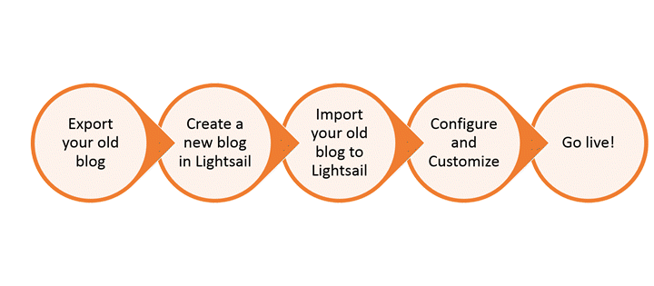
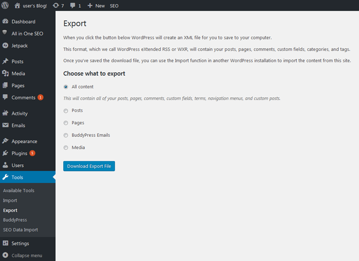
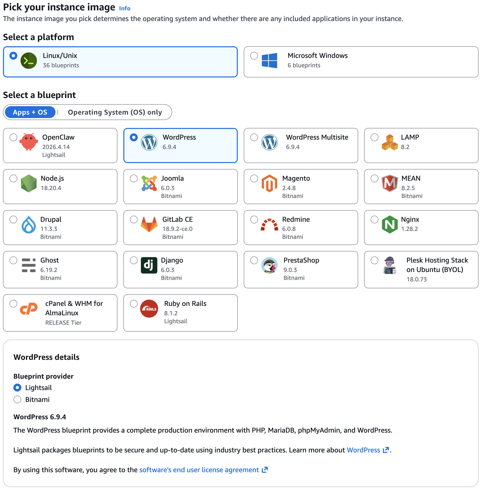
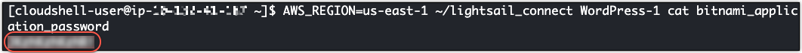
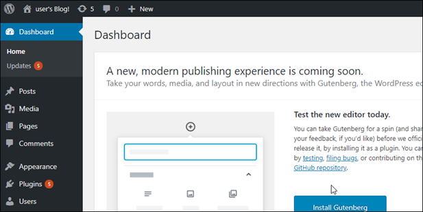
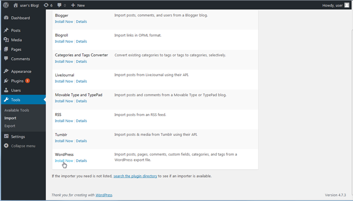

# Migrate your WordPress blog to

Lightsail

Looking to change your WordPress hosting provider? Amazon Lightsail is the easiest way to run
a WordPress site on AWS.

You can choose one of our pricing plans (starting at $5 USD per month) and have full control
over your WordPress installation, including plugins, themes, and more.

Creating a Lightsail WordPress instance only takes a few minutes. Follow this tutorial to
back up your existing WordPress blog and import it to a new instance running in
Lightsail.

Here's a quick overview of the process:

Continue reading to get started.

## Prerequisites

Before you begin, you will need the following:

1. You will need to an AWS account. [Sign up for AWS](https://console.aws.amazon.com/console/home "https://console.aws.amazon.com/console/home"), or [sign in to AWS](https://console.aws.amazon.com/console/home "https://console.aws.amazon.com/console/home") if you
   already have an account.
2. Make sure your account is set up to use Lightsail. If it has been a while since you
   created your account, or if you haven't provided a credit card yet, you may need to log in
   to the AWS Management Console and update your account first.

## Step 1: Back up your existing

WordPress blog

You can use WordPress to back up your existing blog. You will just need to be able to log
into the WordPress admin console and manage your blog.

1. Navigate to your blog, and then choose **Manage**.

If the **Manage** banner is not shown, you can reach the sign in page
by browsing to
`http://`<PublicIP>`/wp-login.php`. Replace
`<PublicIP>` with the public IP address of
your instance. 2. Enter your user name and password to log into the WordPress admin console. 3. On the WordPress **Dashboard**, choose **Tools**,
and then choose **Export**. 4. On the **Export** page, choose **All content** to
export everything as an XML file.

 5. Choose **Download export file** to download your old blog as an XML
file.

Save the XML file in a location that's easy to find. You will need it in Step 4.

## Step 2: Create a new WordPress instance in Lightsail

You can create a new WordPress instance in Lightsail in just a few minutes. Here's
how:

1. Go to the [Lightsail home page](https://lightsail.aws.amazon.com/ "https://lightsail.aws.amazon.com/")
   and log in.
2. Choose **Create instance**.
3. Select the AWS Region where you'd like to create your blog.

You can choose the default Availability Zone or change that once you select an
AWS Region. 4. Select **WordPress**.

 5. Choose your instance plan (or _bundle_).

You can upgrade your Lightsail plan later if needed. For more information, see [Create an
instance from a snapshot in Lightsail](lightsail-how-to-create-instance-from-snapshot.md "lightsail-how-to-create-instance-from-snapshot.md"). 6. Enter a name for your instance.

Resource names:

    * Must be unique within each AWS Region in your Lightsail account.
    * Must contain 2–255 characters.
    * Must start and end with an alphanumeric character.
    * Can include alphanumeric characters, periods, dashes, and underscores.

7. (Optional) Choose **Add new tag** to add a tag to your instance. Repeat this step as needed to add additional tags. For
   more information on tag usage, see [Tags](amazon-lightsail-tags.md "amazon-lightsail-tags.md").
   1. For **Key**, enter a tag key.

    2. (Optional) For **Value**, enter a tag value.

   

8. Choose **Create instance**.

## Step 3: Log into your new Lightsail WordPress blog

Now that you have a new blog in Lightsail, you will need to access the WordPress Dashboard
to import your old blog data. The default password to sign in to the administration dashboard
of your WordPress website is stored on the instance. Complete the following steps to get the
password.

###### To get the default password for the WordPress administrator

1. Open the instance management page for your WordPress instance.
2. On the **WordPress** panel, choose **Retrieve default
   password**. This expands **Access default password** at
   the bottom of the page.

 3. Choose **Launch CloudShell**. This opens a panel at the bottom of
the page. 4. Choose **Copy** and then paste the contents into the CloudShell
window. You can either put your cursor at the CloudShell prompt and press Ctrl+V,
or you can right-click to open the menu and then choose **Paste**. 5. Make a note of the password displayed in the CloudShell window. You need this
to sign in to the administration dashboard of your WordPress website.

Now that you have the password for the administration dashboard of your WordPress website,
you can sign in. In the administration dashboard, you can change your user password, install
plugins, change the theme of your website, and more.

Complete the following steps to sign in to the administration dashboard of your WordPress
website.

###### To sign in to the administration dashboard

1. Open the instance management page for your WordPress instance.
2. On the **WordPress** panel, choose **Access WordPress
   Admin**.
3. On the **Access your WordPress Admin Dashboard** panel, under
   **Use public IP address**, choose the link with this format:

http://`public-ipv4-address`./wp-admin 4. For **Username or Email Address**, enter `user`. 5. For **Password**, enter the password obtained in the previous step. 6. Choose **Log in**.

You are now signed in to the administration dashboard of your WordPress website where
you can perform administrative actions. For more information about administering your
WordPress website, see the [WordPress
Codex](https://codex.wordpress.org/ "https://codex.wordpress.org/") in the WordPress documentation.

## Step 4: Import your XML file into your new Lightsail blog

Once you have successfully logged into the WordPress Dashboard on your new Lightsail
instance, follow these steps to import the XML file into your new Lightsail blog.

1. From the WordPress **Dashboard** on your new Lightsail instance,
   choose **Tools**.
2. Choose **Import**, and then choose **Install Now**
   to install the WordPress import tool.

 3. Once the tool is done installing, choose **Run Importer** to run the
import tool. 4. On the **Import WordPress** page, choose
**Browse**. 5. Find the XML file you saved in _Step 1: Back up your existing WordPress
blog_, and then choose **Open**. 6. Choose **Upload file and import**.

Accept the rest of the defaults, and then choose **Submit**.

## Next steps

You can verify that everything worked by choosing your blog (next to the Home icon), and
then choosing **Visit Site** from the WordPress dashboard. You can also type
the IP address into a browser and view the blog.

Here are some next steps:

- Migrate your DNS so that your domain name servers point to the new version of your
  blog.
- Customize your new blog's appearance and/or install some WordPress plugins.
- [Enable HTTPS support with SSL certificates](https://docs.bitnami.com/aws/apps/wordpress/#how-to-enable-https-support-with-ssl-certificates "https://docs.bitnami.com/aws/apps/wordpress/#how-to-enable-https-support-with-ssl-certificates")
