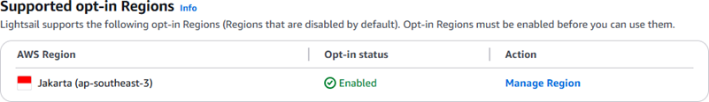
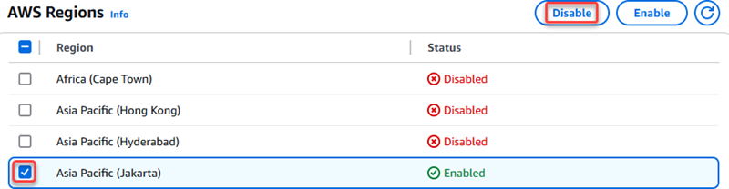
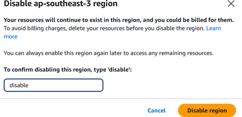
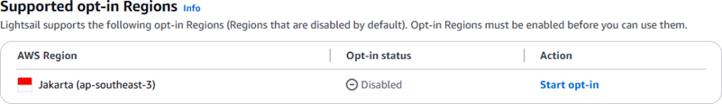

# Disable opt-in Regions for

Lightsail

If you decide you no longer want to operate resources in an opt-in Region, you can
disable it. Before you disable the Region, you should evaluate whether you have any
resources in that Region that you want to delete. You can do this by reviewing your
resources in the Lightsail console or checking the Billing and Cost Management console. Reviewing your costs from
the Billing and Cost Management console can help you identify resources used across all AWS services in the
Region. For additional information about working with Regions, see [Enable or
disable AWS Regions in your account](../../../accounts/latest/reference/manage-acct-regions.md "../../../accounts/latest/reference/manage-acct-regions.md").

## Behavior of

resources in a disabled opt-in Region

If you disable a Region that still contains resources, charges for those resources (if
any) continue to accrue at the standard rate. Additionally, you lose access to manage your resources in the Region, though they continue to run.
As a result, you won't be able to work with these resources using the Lightsail console, Lightsail
API, AWS CLI, or SDKs. To delete resources in a disabled Region, you must enable the Region again to take
action on them.

For example, if you have a running WordPress instance and you disable the opt-in
Region where it resides without first deleting the instance, charges continue to
accrue. Also, the instance will continue to run and be available on the internet. In this example, you would no longer be able to manage
the WordPress instance in the disabled Region.

## Verify if resources are in the Region

You can use the following steps to verify if there are charges for Lightsail resources in the Region that you want to disable.
If you have charges for resources in the Region, you can delete them before proceeding.

###### To review your Lightsail costs by Region

1. Sign in to the [Billing and Cost Management
   console](https://console.aws.amazon.com/costmanagement/home "https://console.aws.amazon.com/costmanagement/home").
2. In the left navigation pane, under **Billing and Payments**,
   choose **Bills**.
3. In the **Charges by service** tab, under **Amazon Web Services,
   Inc. charges by service**, expand the entry for Lightsail.
4. If there are charges for Lightsail in the Region you intend to disable, choose
   the expand icon next to the Region name.
5. Review the list of resource types that you are incurring charges for within the
   Region. For example, charges for **Amazon Lightsail Bundle** would
   indicate that you have a Lightsail instance created in the Region.
6. To stop incurring further charges, delete any resources within the Region before
   you disable it.

## Disable an opt-in Region

This procedure can be used to disable an opt-in Region. Ensure you have first reviewed
the [Verify if resources are in the Region](#opt-in-regions-for-lightsail-disable-verify-resources "#opt-in-regions-for-lightsail-disable-verify-resources") section before
proceeding.

###### To disable an opt-in Region for Lightsail

1. Sign in to the [Lightsail
   console](https://lightsail.aws.amazon.com/ "https://lightsail.aws.amazon.com/").
2. On the Lightsail home page, choose your user or role on the top navigation
   menu.
3. Choose **Account** in the dropdown menu.

 4. On the **Profile** tab, under **Support opt-in
Regions**, choose **Manage Region**.

 5. Review the message about first deleting resources within the Region. If you are
ready to proceed, choose **Manage AWS profile**. 6. Review the required steps and choose **Manage your
AWS account** to proceed. The [AWS Account Management](https://console.aws.amazon.com/billing/home#/account "https://console.aws.amazon.com/billing/home#/account") page should open. 7. Under the AWS Regions section, select the Region to disable, and then choose
**Disable**.

###### Note

The Region names in Lightsail vary slightly as compared to the Region names in
other AWS services. For example, _Jakarta (ap-southeast-3)_ in
the Lightsail console is the same as _Asia Pacific (Jakarta)_ in
the AWS Account Management console.

 8. Review any additional information that is displayed, then enter
`disable` and choose **Disable Region** to
proceed with the operation.

 9. Return to your account page in the Lightsail console to periodically check the
**Opt-in status** value for the Region. The Opt-in status should
show as **Disabling** until the process completes and updates to
**Disabled**.

