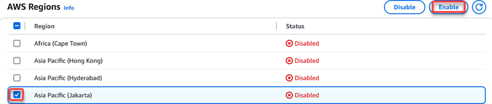

# Enable opt-in Regions for

Lightsail

You can enable the supported opt-in Region for Lightsail for no additional charge.
You're charged only for resources that you create in the newly enabled Region. This process
takes a few minutes for most accounts. For additional information about working with
Regions, see [Enable or disable AWS Regions
in your account](../../../accounts/latest/reference/manage-acct-regions.md "../../../accounts/latest/reference/manage-acct-regions.md").

###### Note

Before you can use the opt-in Region with Lightsail, the **Opt-in
status** must be **Enabled** on the Lightsail
console.

This procedure details how to enable an opt-in Region starting from the Lightsail
console.

###### To enable an opt-in Region for Lightsail

1. Sign in to the [Lightsail
   console](https://lightsail.aws.amazon.com/ "https://lightsail.aws.amazon.com/").
2. On the Lightsail home page, choose your user or role on the top navigation menu.
3. Choose **Account** in the dropdown menu.

 4. On the account page, choose the **Profile** tab. 5. In the **Supported opt-in Regions** section, choose **Start
opt-in** for the Region that you want to enable.

 6. Review the opt-in information and choose **Start Opt-in**. 7. Review the required steps and choose **Manage AWS profile** to
proceed. The [AWS Account Management](https://console.aws.amazon.com/billing/home#/account "https://console.aws.amazon.com/billing/home#/account")
console page should open. Leave the Lightsail console open for later steps. 8. In the AWS Regions section, select the Region that you want to enable, then choose
**Enable**.

###### Note

The Region names in Lightsail vary slightly as compared to the Region names in
other AWS services. For example, _Jakarta (ap-southeast-3)_ in
the Lightsail console is the same as _Asia Pacific (Jakarta)_ in
the AWS Account Management console.

 9. Review any additional information that is displayed, then choose **Enable
Region** to proceed with the operation. 10. Return to your account page in the Lightsail console to periodically check the
**Opt-in status** value for the Region. The **Opt-in
status** should show as **Enabling** until the process
completes and updates to **Enabled**. You can now
provision resources in the new Region.

