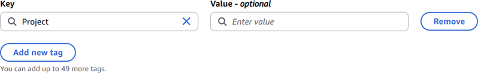
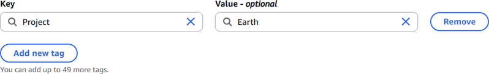
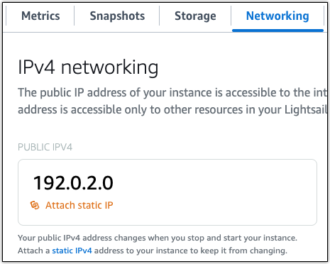
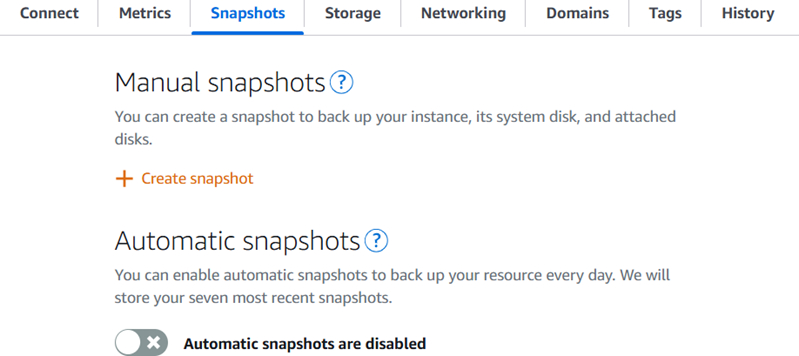

# Deploy a Plesk hosting stack on

Lightsail

###### Tip

Did you know that you can enable automatic snapshots for your instance? With automatic snapshots enabled, Lightsail stores seven daily snapshots
and automatically replaces the oldest with the newest. For more information, see [Configure
automatic snapshots for Lightsail instances and disks](amazon-lightsail-configuring-automatic-snapshots.md "amazon-lightsail-configuring-automatic-snapshots.md").

Learn how to create a Plesk instance in Amazon Lightsail, and how to sign in to the Plesk
User Interface for the first time by creating a username and password. You will also learn how
to how to connect to and configure your Plesk instance after it is up and running.

###### Important

Instances launched with the **Plesk Hosting Stack on Ubuntu (BYOL)** blueprint have a 30-day trial license. After 30 days, you must purchase a license from Plesk to continue using the Plesk application.

Plesk hosting stacks in Lightsail include the following features.

- WordPress Toolkit, featuring automation in a graphical user interface
- Let's Encrypt support for SSL certificates and configuring encrypted (HTTPS) traffic on
  a single instance
- FTP access to transfer files to and from your instance
- Docker Proxy Rules
- Web-based server management and security tools, including Plesk Firewall, Logs, and
  ModSecurity

## Step 1: Create a Plesk instance

Complete the following steps to create a Plesk instance on Lightsail.

1. Sign in to the Lightsail console at
   [https://lightsail.aws.amazon.com/](https://lightsail.aws.amazon.com/ "https://lightsail.aws.amazon.com/").
2. On the **Instances** home page, choose **Create
   instance**.
3. Choose the location where you want to create your instance.

Choose **Change AWS Region and Availability Zone** to change your
instance location. 4. Under **Apps + OS**, choose **Plesk Hosting Stack on Ubuntu
(BYOL)**. 5. Choose your instance plan. The $5 USD per month Lightsail plan does not support the
Plesk hosting stack. 6. Enter a name for your instance.

Resource names:

    * Must be unique within each AWS Region in your Lightsail account.
    * Must contain 2 to 255 characters.
    * Must start and end with an alphanumeric character or number.
    * Can include alphanumeric characters, numbers, periods, dashes, and
     underscores.

7. (Optional) Choose **Add new tag** to add a tag to your instance. Repeat this step as needed to add additional tags. For
   more information on tag usage, see [Tags](amazon-lightsail-tags.md "amazon-lightsail-tags.md").
   1. For **Key**, enter a tag key.

    2. (Optional) For **Value**, enter a tag value.

   

8. Choose **Create instance**.

The instance requires a few minutes to provision and become available after you create
it.

If you experience issues after launching your Plesk instance, go to the Plesk support page
to see if there are updates that need to be installed on the instance. For more information,
see the [Plesk help center](https://support.plesk.com/hc/ "https://support.plesk.com/hc/") and [Plesk
Updates](https://docs.plesk.com/en-US/obsidian/administrator-guide/plesk-updates.59215/ "https://docs.plesk.com/en-US/obsidian/administrator-guide/plesk-updates.59215/") in the _Plesk Documentation and Help Portal_.

## Step 2: Sign in to the Plesk User Interface

for the first time

Use the following procedure to obtain a one-time login URL. You need the one-time login
URL to access the Plesk User Interface as an administrator.

1. On your instance management page, under the **Connect** tab, choose
   **Connect using SSH**.
2. After you're connected, enter the following command to get the one-time login
   URL.

```
sudo plesk login | grep -v internal:8
```

You should see a response similar to the following example, which contains the
one-time login URL.

```
https://heuristic-bassi.192-0-2-0.plesk.page/login?secret=ce-e3b0c44298fc1c149afbf4c8996fb92427
```

###### Tip

If you recently attached a static IP to your Plesk instance, you might get a
one-time login URL that uses the old public IP address. Reboot the instance, and then
run the above command again to get a one-time login URL that uses the new static, public
IP address. 3. Copy and paste the one-time login URL into a web browser.

###### Note

You might see a browser warning that your connection is not private, not secure, or
that there’s a security risk. This happens because your Plesk instance does not yet have
an SSL/TLS certificate applied to it. In the browser window, choose
**Advanced**, **Details**, or **More
information** to view the options that are available. Then choose to proceed
to the website even if it’s not private or secure. 4. Follow the instructions on the page to create your sign in credentials for Plesk. You
should see an option to add your domain to Plesk when you sign in for the first
time.

To sign in again later, navigate to
`https://`PublicIPAddress`:8443`. Replace
`PublicIPAddress` with the public IP address or static IP address
of your instance. For example,
`https://`192.0.2.0`/:8443`. Then enter the username and
password you created earlier to sign in to the Plesk User Interface.

## Step 3: Read the Plesk

documentation

Read the Plesk documentation to learn how to administer websites, customize the Plesk User
Interface, and more.

For more information, see the [Getting
Started with Managing Websites in Plesk](https://docs.plesk.com/en-US/obsidian/quick-start-guide/read-me-first.74371/ "https://docs.plesk.com/en-US/obsidian/quick-start-guide/read-me-first.74371/") in the _Plesk Documentation and
Help Portal_.

## Step 4: Attach a static IP address

to your Plesk instance

The default dynamic public IP address attached to your instance changes every time you
stop and start the instance. You can create a static IP address and attach it to your instance to
keep the public IP address from changing. Later, when you use your domain name with your
instance, you don’t have to update your domain’s DNS records each time you stop and start the
instance. You can attach only one static IP address to each instance.

On the instance management page, under the **Networking** tab,
choose **Create a static IP** or **Attach static
IP** (if you previously created a static IP that you can attach to your
instance), then follow the instructions on the page. For more information, see [Create a static IP and attach it to an
instance](lightsail-create-static-ip.md "lightsail-create-static-ip.md").



## Step 5: Map your

domain name to your Plesk instance

Map a domain to your Plesk instance, which you can use to access your Plesk User
Interface. You can also map multiple domains within the Plesk User Interface, which you can
use to manage websites. This section describes how to map your domain to your Plesk instance.
For more information about mapping multiple domains within the Plesk User Interface, see
[Adding a Domain in Plesk](https://docs.plesk.com/en-US/obsidian/quick-start-guide/plesk-tutorial/step-6-change-your-password-and-log-out.74376/#adding-a-domain-in-plesk "https://docs.plesk.com/en-US/obsidian/quick-start-guide/plesk-tutorial/step-6-change-your-password-and-log-out.74376/#adding-a-domain-in-plesk") in the _Plesk Documentation and Help
Portal_.

To map your domain name, such as `example.com`, to your instance, you add a
record to the domain name system (DNS) of your domain. DNS records are typically managed and
hosted at the registrar where you registered your domain. However, we recommend that you
transfer management of your domain's DNS records to Lightsail so that you can administer it
using the Lightsail console.

On the Lightsail console home page, on **Domains & DNS**, choose
**Create DNS zone**, then follow the instructions on the page.

For more information, see [Creating a DNS
zone to manage your domain’s DNS records in Lightsail](lightsail-how-to-create-dns-entry.md "lightsail-how-to-create-dns-entry.md").

## Step 6: Purchase a Plesk

license

Your Plesk instance includes a 30-day trial license. After 30 days, you must purchase a
license from Plesk to continue using it. For more information, see [Pricing](https://www.plesk.com/pricing/ "https://www.plesk.com/pricing/") on the _Plesk_
website.

You must install the license after you purchase it from Plesk. To install your Plesk
license, see [How to install the Plesk license](https://support.plesk.com/hc/en-us/articles/12378028764951-How-to-install-the-Plesk-license "https://support.plesk.com/hc/en-us/articles/12378028764951-How-to-install-the-Plesk-license") on the _Plesk support_
website.

## Step 7: Create a snapshot of your

Plesk instance

After you configure your website the way you want it, create
periodic snapshots of your instance to back it up. A snapshot is a copy of the system disk and original configuration of an instance. A
snapshot contains all of the data that is needed to restore your instance (from the moment
when the snapshot was taken).

You can create snapshots manually, or
enable automatic snapshots to have Lightsail create daily snapshots for you. If
something goes wrong with your instance, you can create a new replacement instance using
the snapshot.

You can work with snapshots on your instance's management page on the **Snapshots** tab.
For more information, see [Snapshots in Amazon Lightsail](understanding-snapshots-in-amazon-lightsail.md "understanding-snapshots-in-amazon-lightsail.md").


