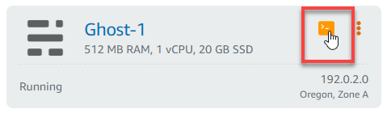
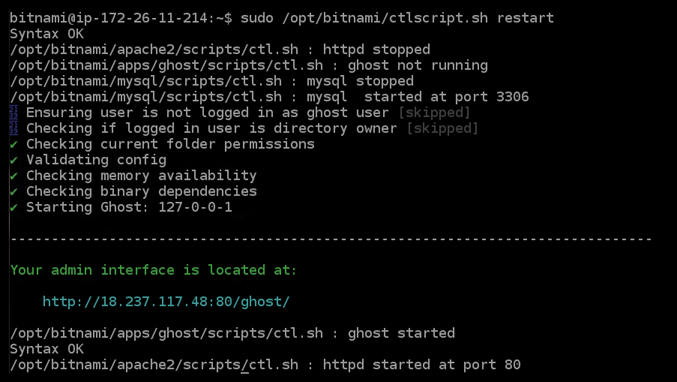
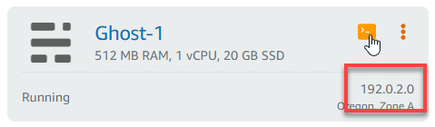
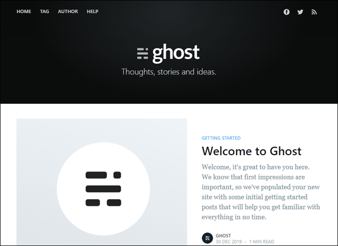

# Troubleshoot Ghost instance 503 service unavailable error on Lightsail

After you create a new Ghost instance in Amazon Lightsail, and try to access your website,
you might see an error stating that the service is unavailable (503). In some cases, the Ghost
service on the instance is not automatically started when the instance is created. This can
happen when you select the $5 USD/month bundle for your instance. Use the following procedure to
start the Ghost service, and resolve the "service is unavailable" error.

## Start the Ghost service

1. Sign in to the [Lightsail console](https://lightsail.aws.amazon.com/ "https://lightsail.aws.amazon.com/").
2. In the left navigation pane, choose **Instances**.
3. Choose the browser-based SSH client icon for your Ghost instance.

 4. After the SSH client is connected, enter the following command to restart all services
on the instance:

```
sudo /opt/bitnami/ctlscript.sh restart
```

You should see a result similar to the following example:

 5. Browse to the public IP address of your instance to confirm that your Ghost website is
up and running.

The public IP address of your instance is listed next to the instance name in the
**Instances** section of the Lightsail console.



When you browse to the public IP of your new Ghost instance, you should see the
default Ghost website template:


