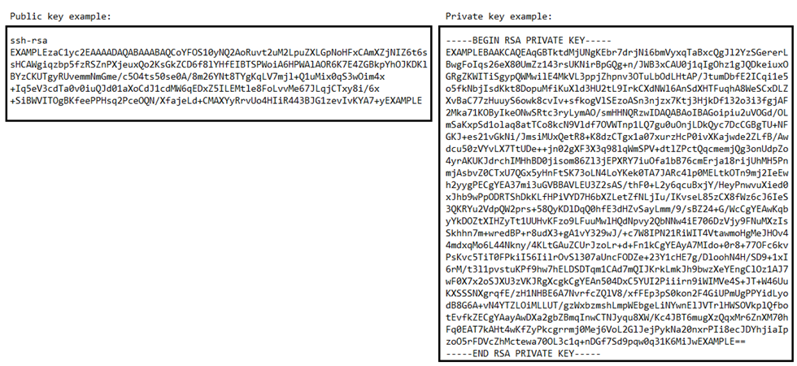

# Manage SSH key pairs and connect to your

Lightsail instances

A key pair is a set of security credentials that you use to prove your identity when
connecting to an Amazon Lightsail instance. A key pair consists of a public key and a private
key. Lightsail stores the public key on your instance, and you store the private key.

The key pair files contain the following text:

On Linux and Unix instances, the private key allows you to establish a secure SSH connection
to your instance. On Windows instances, the private key decrypts the default administrator
password that you use to establish a secure RDP connection to your instance.

Anyone who has access to your private key can connect to your instances, so it's important
that you store your private key in a secure place.

**Contents**

- [Choosing a key pair
  option](#choosing-a-key-pair-option "#choosing-a-key-pair-option")
- [Connecting to your
  instances](#connecting-to-your-instances "#connecting-to-your-instances")
- [Manage keys stored on
  instances](#managing-keys-stored-on-instances "#managing-keys-stored-on-instances")

## Choose a key pair option

You can choose one of the following key pair options when you create a Lightsail
instance. Windows instances always use the default key; therefore, you can’t create a key pair
or upload a key when creating Windows instances.

- **Default SSH key** – Lightsail automatically
  creates a default key pair in each AWS Region where you create instances. When you use
  the default key pair with your instance, Lightsail stores the public key on your
  instance. You can download the private key of a default key pair at any time from the
  **Account** page on the Lightsail console. You can have
  up to one default key pair in each AWS Region.
- **Create custom key (Linux and Unix instances)** –
  You can use the Lightsail console to create a new custom key pair to use with your
  instance. When you create a custom key pair, you give it a unique name, and Lightsail
  stores the public key on your instance. You can download the private key of a custom key
  pair only when you first create it.
- **Upload key (Linux and Unix instances)** – To use
  an existing key pair of your own, you can upload your public key to Lightsail. When you
  upload a public key to use with your instance, you give it a unique name, and Lightsail
  stores it on your instance. You keep and store the private key of your key pair.

If you configure a single public key on multiple instances, you can use the same private
key of the key pair to connect to those instances. For more information about managing key
pairs, see [Managing key pairs in
Amazon Lightsail](amazon-lightsail-managing-ssh-keys.md "amazon-lightsail-managing-ssh-keys.md").

## Connect to your instances

You can connect to your Lightsail instances using one of the following options.

**Lightsail browser-based SSH and RDP clients**

In the Lightsail console, you can instantly connect to your Linux and Unix instances
using a browser-based SSH client, and connect to your Windows instances using a browser-based
RDP client.
You don't have to install an SSH client on your computer, configure key pairs, or specify
administrator passwords when you connect to your instances using the browser-based clients.
This is the fastest way to connect to your instances. For more information, see [Connecting to
your Linux or Unix instance in Amazon Lightsail](lightsail-how-to-connect-to-your-instance-virtual-private-server.md "lightsail-how-to-connect-to-your-instance-virtual-private-server.md") and [Connecting to your
Windows instance in Amazon Lightsail](connect-to-your-windows-based-instance-using-amazon-lightsail.md "connect-to-your-windows-based-instance-using-amazon-lightsail.md").

The browser-based clients use a different key pair than the one you configure when you
create your instances, such as the default key, or a key you create or upload. Therefore, even
if you delete or lose one of the keys you originally configured, you can continue to connect
to your instances using the browser-based clients.

**Third-party SSH and RDP clients**

You can connect to your Linux and Unix instances using a third-party SSH client, and
connect to your Windows instances using a third-party RDP client. When you use an SSH client,
you must configure it to use the private key of the key pair that you configured on your
instance. When you use an RDP client, you must specify the administrator password of your
Windows instance.

If you use a Windows computer locally, you can use the following clients to connect to
your Lightsail instances.

- **PuTTY** – Use PuTTY to connect to Linux or Unix
  instances using SSH. For more information, see [Set up PuTTY to connect to
  your instance](lightsail-how-to-set-up-putty-to-connect-using-ssh.md "lightsail-how-to-set-up-putty-to-connect-using-ssh.md").
- **Remote Desktop Connection** – Use the Remote
  Desktop Connection client to connect to Windows instances using RDP. For more information,
  see [Connect to
  your Windows instance using the Remote Desktop Connection client on a Windows
  computer](amazon-lightsail-connecting-to-windows-instance-using-rdc.md "amazon-lightsail-connecting-to-windows-instance-using-rdc.md").

If you use a Mac computer locally, use the following clients to connect to your
Lightsail instances.

- **Native SSH client in Terminal** – Use the native
  SSH client in Terminal to connect to Linux and Unix instances. For more information, see
  [Connect to your Linux or Unix
  instance using SSH in Terminal](amazon-lightsail-ssh-using-terminal.md "amazon-lightsail-ssh-using-terminal.md").
- **Microsoft Remote Desktop** – Use the Microsoft
  Remote Desktop client for macOS to connect to Windows instances using RDP. For more
  information, see [Connect to your Windows instance using the Microsoft Remote Desktop client on a
  Mac](amazon-lightsail-connecting-to-windows-instance-using-microsoft-remote-desktop.md "amazon-lightsail-connecting-to-windows-instance-using-microsoft-remote-desktop.md").

## Manage keys stored on instances

After your instance is up and running, you can add a new key to the instance, or replace
the key that you originally assigned to it. For example, if a user in your organization
requires access to the instance using a separate key, you can add that key to your instance.
Another example might be when someone leaves your organization and they have a copy of the
private key (.PEM) file. You can prevent them from connecting to your instance by replacing
the key with a new one or removing it completely. For more information, see [Manage keys stored on an instance in
Amazon Lightsail](amazon-lightsail-remove-ssh-key-on-instance.md "amazon-lightsail-remove-ssh-key-on-instance.md").

###### Topics

- [Set up SSH keys](lightsail-how-to-set-up-ssh.md "lightsail-how-to-set-up-ssh.md")
- [Manage SSH keys](amazon-lightsail-managing-ssh-keys.md "amazon-lightsail-managing-ssh-keys.md")
- [Manage instance SSH
  keys](amazon-lightsail-remove-ssh-key-on-instance.md "amazon-lightsail-remove-ssh-key-on-instance.md")
- [Connect to Linux instances](lightsail-how-to-connect-to-your-instance-virtual-private-server.md "lightsail-how-to-connect-to-your-instance-virtual-private-server.md")
- [Connect to Windows instances](connect-to-your-windows-based-instance-using-amazon-lightsail.md "connect-to-your-windows-based-instance-using-amazon-lightsail.md")
