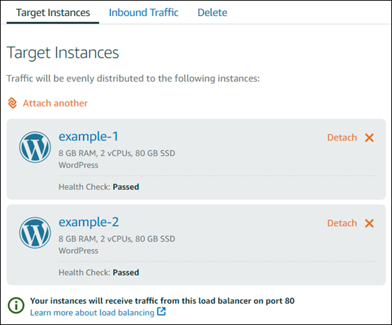

# Customize Lightsail load balancer health checks and HTTPS settings

When you create a Lightsail load balancer, you choose the AWS Region and the name. This
topic instructs you how to update your load balancer to enable more options.

If you haven't done so already, you will need to create a load balancer. [Create a
load balancer](create-lightsail-load-balancer-and-attach-lightsail-instances.md "create-lightsail-load-balancer-and-attach-lightsail-instances.md")

## Health checks

The first thing you're going to want to do is [Configure an
instance for load balancing](configure-lightsail-instances-for-load-balancing.md "configure-lightsail-instances-for-load-balancing.md"). Once that's done, you can attach an instance to your
load balancer. Attaching an instance starts the health checking process, and you get a
**Passed** or **Failed** message on the load balancer
management page.

You can also customize your health check path. For example, if your home page loads slowly
or has a lot of images on it, you can configure Lightsail to check a different page that
loads faster. [Customize load balancer health check paths](enable-set-up-health-checking-for-lightsail-load-balancer-metrics.md "enable-set-up-health-checking-for-lightsail-load-balancer-metrics.md")

## Encrypted traffic (HTTPS)

You can set up HTTPS to create a more secure experience for your website users. It's a
three-step process to create and validate an SSL/TLS certificate once you set up your load
balancer.

[Learn
more about HTTPS](understanding-tls-ssl-certificates-in-lightsail-https.md "understanding-tls-ssl-certificates-in-lightsail-https.md")

## Session persistence

Session persistence is useful if you're storing session information locally in the user's
browser. For example, you might be running a Magento e-commerce application with a shopping
cart on Lightsail. If you turn on session persistence, your users can add items to their
shopping carts,end their sessions, and still find the items in their carts when they come
back.

You can also adjust the cookie duration for the persistent session. This is useful if you
want to have a particularly long or short duration. For more information, see [Enable session
persistence for a load balancer](enable-session-stickiness-persistence-or-change-cookie-duration.md "enable-session-stickiness-persistence-or-change-cookie-duration.md").
