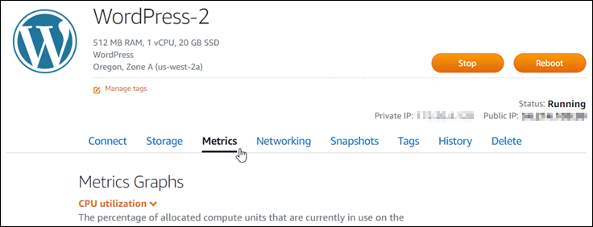
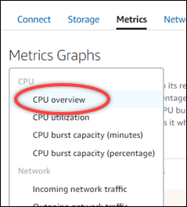
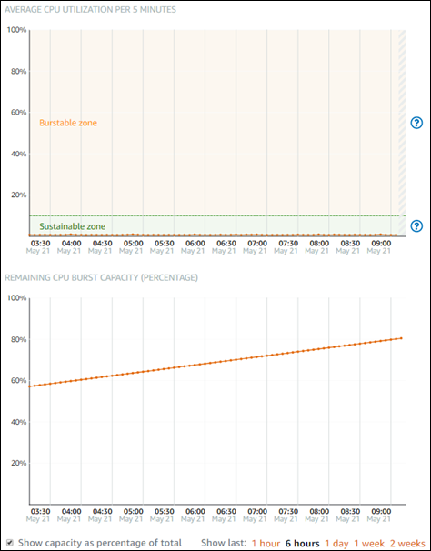

# View CPU utilization and burst capacity for

Lightsail instances

Complete the following steps to access the CPU overview page, and view your instance's CPU
utilization and remaining CPU burst capacity.

1. Sign in to the [Lightsail console](https://lightsail.aws.amazon.com/ "https://lightsail.aws.amazon.com/").
2. On the Lightsail home page, choose the name of the instance for which you want to
   view CPU utilization and burst capacity.
3. Choose the **Metrics** tab on the instance management page.

 4. Choose **CPU overview** in the drop-down menu under the
**Metrics graphs** heading.

The page displays **Average CPU utilization per 5 minutes** and
**Remaining CPU burst capacity** graphs.

###### Note

The **Remaining CPU burst capacity** graph might display a
**Launch mode** zone for a short period of time after you create an
instance. Some Lightsail instances start in launch mode, which temporarily removes
some of the performance limitations that are typically present on burstable instances.
Launch mode allows you to run resource-intensive scripts at launch without affecting the
overall performance of your instance.

 5. You can perform the following actions on the metric graphs:

    * For the burst capacity graph, select **Show capacity as percentage of
     total** to change the view from burst capacity minutes available to burst
     capacity percentage available.
    * Change the view of the graph to show data for 1 hour, 6 hours, 1 day, 1 week, and
     2 weeks.
    * Pause your cursor on a data point to view detailed information about that data
     point.
    * Add an alarm to be notified when CPU utilization and burst capacity crosses a
     threshold you specify. Alarms cannot be added in the CPU overview page. You must add
     them in the individual CPU utilization, CPU burst capacity percentage, and CPU burst
     capacity minutes metric graph pages. For more information, see [Alarms](amazon-lightsail-alarms.md "amazon-lightsail-alarms.md") and [Create instance
     metric alarms](amazon-lightsail-adding-instance-health-metric-alarms.md "amazon-lightsail-adding-instance-health-metric-alarms.md").
