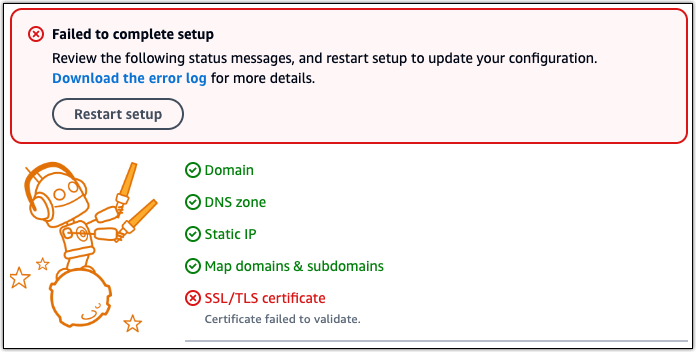

# Troubleshooting WordPress setup failures in

Lightsail

The following information can help you troubleshoot failure messages that can appear
in the **Set up your WordPress website** section of the instance
**Connect** tab. Setup failures can occur within a few minutes
after you complete the final step in the workflow. They're caused when the Let's Encrypt
HTTPS certificate cannot be configured on your instance.

**`Failed to complete setup – Review the following status messages, and
 restart setup to update your configuration. Download the error log for more
 details.`**


From the failure message, choose the **Download the error log** link
to download and view the error logs that setup generated. To begin troubleshooting,
match the error message from the logs with one of the following errors.

###### Errors

- [Certbot.errors.AuthorizationError:
  Some challenges have failed](#certbot-authorization-error "#certbot-authorization-error")
- [Certbot failed to authenticate some
  domains](#domain-authentication-failed "#domain-authentication-failed")
- [The repository
  http://cdn-aws.deb.debian.org/debian buster-backports no longer has a Release
  file](#deprecated-debian-repo "#deprecated-debian-repo")
- [The repository
  http://ppa.launchpad.net/certbot/certbot/ubuntu lunar Release does not have a
  Release file](#deprecated-ppa-repo-error "#deprecated-ppa-repo-error")
- [Too many certificates (5) already issued for
  this exact set of domains in the last 168 hours](#too-many-certificates "#too-many-certificates")
- [Too many failed authorizations](#too-many-failed-authorizations "#too-many-failed-authorizations")

## Certbot.errors.AuthorizationError:

Some challenges have failed

**Reason**

This error is caused by misconfigured DNS records, or DNS records that
have not had sufficient time to propagate throughout the
Internet.

**Fix**

Verify that the **A** or **AAAA**
DNS records are present in the DNS zone, and that they point to the
public IP address of your instance. For more information, see [DNS in
Lightsail](understanding-dns-in-amazon-lightsail.md "understanding-dns-in-amazon-lightsail.md").

When you add or update DNS records that point traffic from your apex
domain (`example.com`) and its `www` subdomains
(`www.example.com`), they will need to propagate
throughout the Internet. You can verify that your DNS changes have taken
effect by using tools such as [nslookup](https://aws.amazon.com/blogs/messaging-and-targeting/how-to-check-your-domain-verification-settings/ "https://aws.amazon.com/blogs/messaging-and-targeting/how-to-check-your-domain-verification-settings/"), or [DNS Lookup](https://mxtoolbox.com/DnsLookup.aspx "https://mxtoolbox.com/DnsLookup.aspx") from
_MxToolbox_.

###### Note

Allow time for any DNS record changes to propagate through the
internet's DNS, which may take several hours.

## Certbot failed to authenticate some

domains

**Reason**

This error can surface if another process is using port 80 while the
HTTPS certificate is being configured on the instance.

**Fix**

Restart your WordPress instance. Then, run the guided workflow again.
Use the following procedure to terminate any running processes on the
instance that are running on port 80 if restarting doesn’t resolve the
issue.

###### Procedure

1. Connect to your instance by using the Lightsail [browser-based SSH client](lightsail-how-to-connect-to-your-instance-virtual-private-server.md "lightsail-how-to-connect-to-your-instance-virtual-private-server.md"), or by using [AWS CloudShell](amazon-lightsail-cloudshell.md "amazon-lightsail-cloudshell.md").
2. Stop the Bitnami process that's running on the instance:

```
`$` sudo /opt/bitnami/ctlscript.sh stop
```

Verify that the Bitnami process is stopped:

```
`$` sudo /opt/bitnami/ctlscript.sh status
```

3. Check if there are other processes that are using port 80:

```
`$` fuser -n tcp 80
```

4. Terminate any processes that are not needed by another application:

```
`$` fuser -k -n tcp 80
```

5. Restart WordPress setup.

## The repository

http://cdn-aws.deb.debian.org/debian buster-backports no longer has a Release
file

**Reason**

There is a deprecated Debian repository on your instance that cannot
be updated.

**Fix**

Use the following procedure to edit the repository URL that's listed
in the Debian repository file.

###### Procedure

1. Connect to your instance by using the Lightsail [browser-based SSH client](lightsail-how-to-connect-to-your-instance-virtual-private-server.md "lightsail-how-to-connect-to-your-instance-virtual-private-server.md"), or by using [AWS CloudShell](amazon-lightsail-cloudshell.md "amazon-lightsail-cloudshell.md").
2. Navigate to the `/etc/apt/sources.list.d/` directory.

```
`$` cd /etc/apt/sources.list.d/
```

3. Use a text editor of your choice to open the
   `buster-backports.list` file. If the file isn't found in this
   directory, you can also check in `/etc/apt/sources.list`. The
   preinstalled Vim text editor is used in the example command. For more
   information, see the [_Vim
   documentation_](https://www.vim.org/docs.php "https://www.vim.org/docs.php").

```
`$` vim buster-backports.list
```

4. Locate any line that contains the following text:
   `http://deb.debian.org/debian buster-backports main`.

Replace `deb.debian.org` with `archive.debian.org`.
For example, `http://`deb`.debian.org/debian
 buster-backports main contrib non-free` would become
`http://`archive`.debian.org/debian
 buster-backports main contrib non-free`. 5. Save and close the file. 6. Restart WordPress setup.

## The repository

http://ppa.launchpad.net/certbot/certbot/ubuntu lunar Release does not have a
Release file

**Reason**

There is a deprecated Certbot Personal Package Archive (PPA)
repository on your instance that cannot be updated.

**Fix**

Use the following procedure to manually remove the deprecated PPA
repository from your instance.

###### Procedure

1. Connect to your instance by using the Lightsail [browser-based SSH client](lightsail-how-to-connect-to-your-instance-virtual-private-server.md "lightsail-how-to-connect-to-your-instance-virtual-private-server.md"), or by using [AWS CloudShell](amazon-lightsail-cloudshell.md "amazon-lightsail-cloudshell.md").
2. Navigate to the `/etc/apt/sources.list.d/` directory.

```
`$` cd /etc/apt/sources.list.d/
```

3. Use a text editor of your choice to open the
   `certbot-ubuntu-certbot-`version`.list`
   file. The preinstalled Vim text editor is used in the example command. For
   more information, see the [_Vim documentation_](https://www.vim.org/docs.php "https://www.vim.org/docs.php").

In the command, replace `version` with the version of
Ubuntu that the repository is incompatible with; this will be the same
version that shows up in the error message. For example,
`lunar` or `mantic`.

```
`$` vim certbot-ubuntu-certbot-`version`.list
```

4. Remove any line that contains the following text:
   `http://ppa.launchpad.net/certbot/certbot/ubuntu`.
5. Save and close the file.
6. Restart WordPress setup.

## Too many certificates (5) already issued for

this exact set of domains in the last 168 hours

**Reason**

One or more of your domains or subdomains has already been used to
create 5 certificates within the last week. For more information, see
[Rate
Limits](https://letsencrypt.org/docs/rate-limits/ "https://letsencrypt.org/docs/rate-limits/") on the _Let’s Encrypt
website_.

**Fix**

Wait one week (168 hours), and then restart the guided workflow for
this domain.

## Too many failed authorizations

**Reason**

One or more of the domains or subdomains in the request has exceeded
the limit of five validations per hour. For more information, see [Rate Limits](https://letsencrypt.org/docs/rate-limits/ "https://letsencrypt.org/docs/rate-limits/")
on the _Let’s Encrypt website_.

**Fix**

Wait one hour and run WordPress setup again. Verify that other
validation errors have been fixed before you restart setup.
