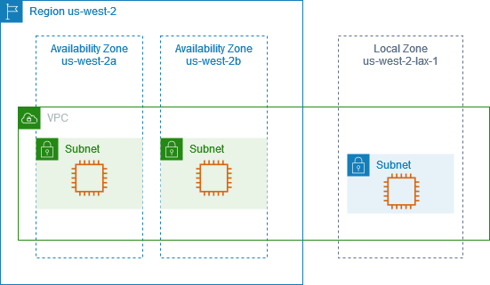

# How AWS Local Zones work

A Local Zone is an extension of an [AWS Region](../../../global-infrastructure/latest/regions/aws-regions.md "../../../global-infrastructure/latest/regions/aws-regions.md") in geographic
proximity to your users. Local Zones have their own connections to the internet and support Direct Connect, so
that resources created in a Local Zone can serve applications that require low latency.

To use a Local Zone, you must first enable it. Next, you create a subnet in the Local Zone. Finally, you
launch resources in the Local Zone subnet. For more detailed instructions, see [Getting started with AWS Local Zones](getting-started.md "getting-started.md").

The following diagram illustrates an account with a VPC in the AWS Region
`us-west-2` that is extended to the Local Zone `us-west-2-lax-1`. Each zone in
the VPC has one subnet, and each subnet has one EC2 instance.

## AWS resources supported in Local Zones

Creating a resource in a Local Zone subnet puts it close to your users. For a list of services
with resources that are supported in Local Zones, see [AWS Local Zones features](https://aws.amazon.com/about-aws/global-infrastructure/localzones/features/ "https://aws.amazon.com/about-aws/global-infrastructure/localzones/features/").

## Considerations

- Local Zone subnets follow the same routing rules as Availability Zone subnets, including the use
  of route tables, security groups, and network ACLs.
- Outbound internet traffic leaves a Local Zone from the Local Zone.
- Network traffic will hairpin to the AWS Region when connecting from an on-premises
  location into a Local Zone using a Transit Gateway.
- You cannot select a subnet from a Local Zone while creating a Cloud WAN or transit gateway VPC
  attachment. Doing so will result in an error.
- Traffic that is destined for a subnet in a Local Zone using Direct Connect does not travel through the
  parent Region of the Local Zone. Instead, traffic takes the shortest path to the Local Zone. This decreases
  latency and helps make your applications more responsive.

If you require a more resilient connection, implement more than one Direct Connect between your
on-premises locations and the Local Zone. For more information on building resilience with Direct Connect,
see [Direct Connect Resiliency
Recommendations](https://aws.amazon.com/directconnect/resiliency-recommendation/ "https://aws.amazon.com/directconnect/resiliency-recommendation/").

- The following Local Zones support IPv6: `us-east-1-atl-2a`,
  `us-east-1-chi-2a`, `us-east-1-dfw-2a`, `us-east-1-iah-2a`,
  `us-east-1-mia-2a`, `us-east-1-nyc-2a`, `us-west-2-lax-1a`,
  `us-west-2-lax-1b`, and `us-west-2-phx-2a`.
- The following Local Zones support edge association with virtual private gateway (VGW):
  `us-east-1-atl-2a`, `us-east-1-chi-2a`, `us-east-1-dfw-2a`,
  `us-east-1-iah-2a`, `us-east-1-mia-2a`, `us-east-1-nyc-2a`,
  `us-west-2-lax-1a`, `us-west-2-lax-1b`, and
  `us-west-2-phx-2a`.

To understand edge association and other route-table concepts, see [Route table
concepts](../../../vpc/latest/userguide/VPC_Route_Tables.md#RouteTables "../../../vpc/latest/userguide/VPC_Route_Tables.md#RouteTables") in the _Amazon VPC User Guide_.

To understand virtual private gateway and other AWS Site-to-Site VPN concepts, see [Concepts](../../../vpn/latest/s2svpn/VPC_VPN.md#concepts "../../../vpn/latest/s2svpn/VPC_VPN.md#concepts") in the
_AWS Site-to-Site VPN User Guide_.

- You cannot create VPC endpoints inside Local Zone subnets.
- The AWS Site-to-Site VPN is not available in Local Zones. Use a software-based VPN to establish a
  site-to-site VPN connection into a Local Zone.
- Generally, the Maximum Transmission Unit (MTU) is as follows:
  - 9001 bytes between Amazon EC2 instances in the same Local Zone.
  - 1500 bytes between an internet gateway and a Local Zone.
  - 1500 bytes between Direct Connect and all Local Zones except:
    - 8500 bytes for `us-east-1-atl-2a`, `us-east-1-chi-2a`,
      `us-east-1-dfw-2a`, `us-east-1-iah-2a`,
      `us-west-2-lax-1a`, `us-west-2-lax-1b`, `us-east-1-mia-2a`,
      `us-east-1-nyc-2a`, and `us-west-2-phx-2a`

  - 1300 bytes between an Amazon EC2 instance in a Local Zone and an Amazon EC2 instance in the Region for
    all Local Zones except:
    - 9001 bytes for `us-west-2-lax-1a` and `us-west-2-lax-1b`
    - 8801 bytes for `us-east-1-atl-2a`, `us-east-1-chi-2a`,
      `us-east-1-dfw-2a`, `us-east-1-iah-2a`,
      `us-east-1-mia-2a`, `us-east-1-nyc-2a`, and
      `us-west-2-phx-2a`

## Resources

Learn how to get started with AWS Local Zones with the following resources:

- [Getting
  started](getting-started.md "getting-started.md")
- [Get Started Deploying
  Low Latency Applications with AWS Local Zones](https://aws.amazon.com/tutorials/deploying-low-latency-applications-with-aws-local-zones/ "https://aws.amazon.com/tutorials/deploying-low-latency-applications-with-aws-local-zones/")
