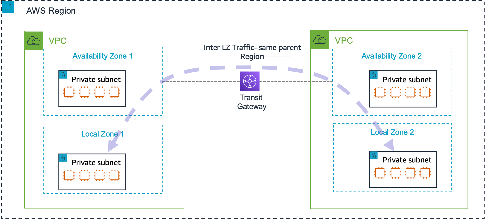

# Transit gateway connection between

Local Zones

A transit gateway can be used to connect one Local Zone to another within the same parent Region.
For more information about transit gateways, see [Connect your VPC to other VPCs and networks using a
transit gateway](../../../vpc/latest/userguide/extend-tgw.md "../../../vpc/latest/userguide/extend-tgw.md") in the _Amazon VPC User Guide_.

A transit gateway connection between Local Zones is useful when you have workloads in different
Local Zones and also require network connectivity between them.

The following diagram shows the transit gateway connection between two Local Zones in the same
Region.



###### Considerations

- You must create a transit gateway attachment in the parent zone.
- You can't connect a Local Zone to another Local Zone or Outpost that is within the same VPC.

###### Parent zone

You can use the AWS Global View console or the command line interface to get the parent zone details for a Local Zone.

AWS Global View console

###### To get the parent zone details for a Local Zone

1. Sign in to the [AWS Global View console](https://console.aws.amazon.com/ec2globalview/home#RegionsAndZones "https://console.aws.amazon.com/ec2globalview/home#RegionsAndZones").
2. From the navigation pane, choose **Regions and Zones**.
3. Choose the **Local Zones** tab.
4. Find the Local Zone.
5. Scroll to see the **Parent Zone name** and **Parent Zone ID** for the Local Zone.

AWS CLI

###### To get the parent zone details for a Local Zone

Use the [describe-availability-zones](../../../cli/latest/reference/ec2/describe-availability-zones.md "../../../cli/latest/reference/ec2/describe-availability-zones.md") command. The following example uses a Local Zone in Los Angeles.

```
aws ec2 describe-availability-zones \
  --zone-names `us-west-2-lax-1a` \
  --query 'AvailabilityZones[0].ParentZoneName' \
  --region `us-west-2` \
  --output text
```
