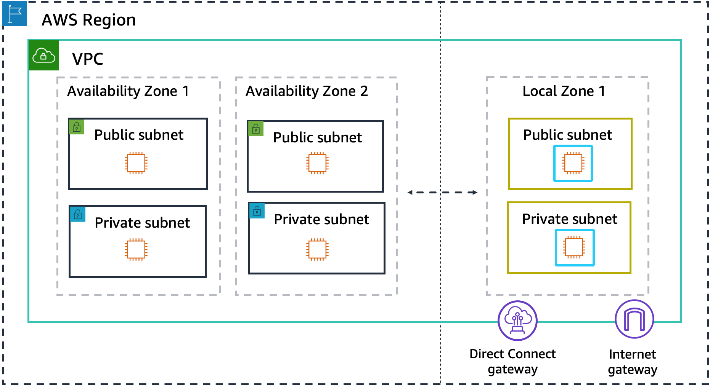

# Connectivity options for Local Zones

There are many ways to connect users and applications to resources running in a Local Zone.

You build Local Zones into your network architecture in the same way you choose an Availability
Zone. Your workloads use the same application programming interfaces (APIs), security models, and
toolsets. You can extend any VPC from a parent Region into a Local Zone by creating a new subnet and
assigning it to the Local Zone. When you create a subnet in AWS Local Zones, we extend your VPC to that Local Zone
and your VPC treats the subnet the same as any subnet in any other Availability Zone and
automatically adjusts any relevant gateways and route tables.

The following diagram shows a network with resources running in two Availability Zones and in
a Local Zone within an AWS Region. The Local Zone network can have public or private subnets, internet
gateways, and Direct Connect gateways (DXGW). Workloads running in the Local Zone can directly access
workloads or AWS services that live in any AWS Region.

The following sections explain the different ways to connect to resources in a Local Zone.

###### Connection options

- [Internet gateway](local-zones-connectivity-igw.md "local-zones-connectivity-igw.md")
- [NAT gateway](local-zones-connectivity-nat.md "local-zones-connectivity-nat.md")
- [VPN](local-zones-connectivity-ec2-vpn.md "local-zones-connectivity-ec2-vpn.md")
- [Direct
  Connect](local-zones-connectivity-direct-connect.md "local-zones-connectivity-direct-connect.md")
- [Transit gateway
  between Local Zones](local-zones-connectivity-transit-gateway-lzs.md "local-zones-connectivity-transit-gateway-lzs.md")
- [Transit gateway to data
  center](local-zones-connectivity-transit-gateway-dc.md "local-zones-connectivity-transit-gateway-dc.md")
