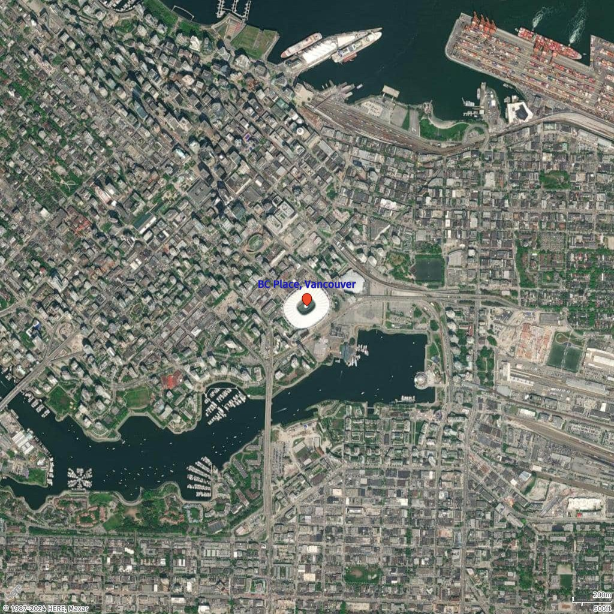
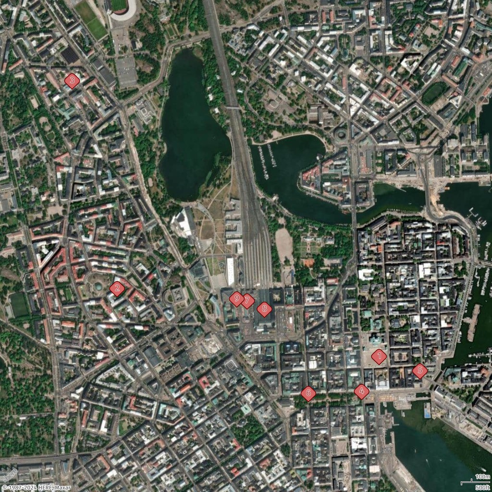
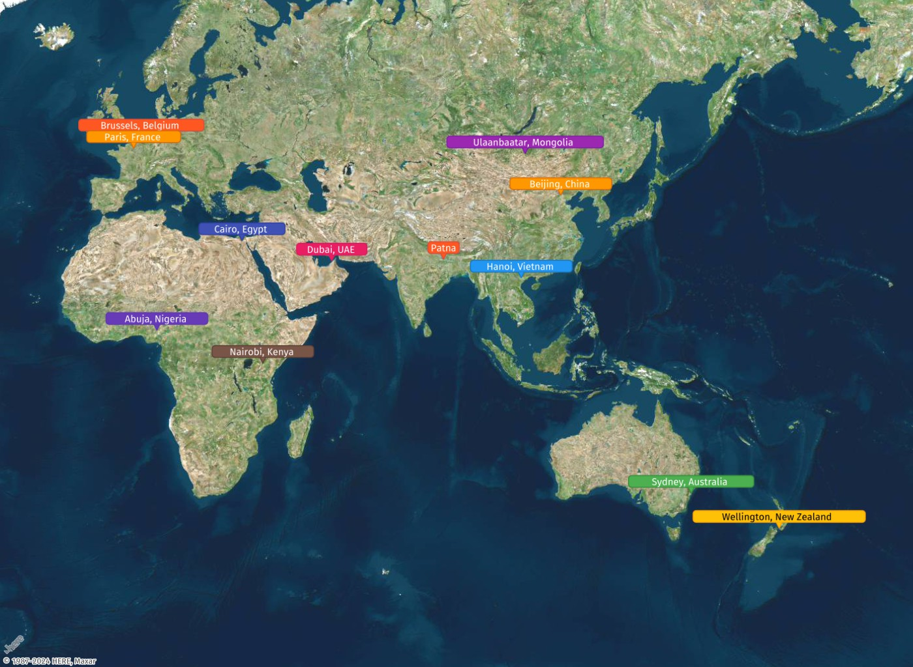

# How to add a marker to a static map

In this topic, you will learn how to add markers to static maps generated with Amazon Location Service.
You can customize the marker's icon, label, size, color, and other styling options. This
allows you to highlight specific locations with visual cues that align with your map's
purpose.

## Marker styling

| Name                 | Type    | Default          | Description                                                                                                                                                     |
| -------------------- | ------- | ---------------- | --------------------------------------------------------------------------------------------------------------------------------------------------------------- |
| `style`              | String  | `marker`         | The style of the Point geometry. To create a marker, set the value to `marker` or do not include the `style` attribute in the properties object of the GeoJSON. |
| `icon`               | String  | `pin`            | The marker icon type. Available values include: `cp` (proximity circle), `diamond`, `pin`, `poi`, `square`, `triangle`, `bubble`.                               |
| `label`              | String  | `<empty>`        | The text to display at the coordinates. To set automatic labels, use the following values: `$alpha` (Latin alphabet) or `$num` (Arabic numerals).               |
| `color`              | Color   | Style-dependent  | The icon color.                                                                                                                                                 |
| `outline-color`      | Color   | Style-dependent  | The icon outline color.                                                                                                                                         |
| `text-color`         | Color   | Style-dependent  | The label text color.                                                                                                                                           |
| `text-outline-color` | Color   | Style-dependent  | The text outline color.                                                                                                                                         |
| `outline-width`      | Integer | `0` (turned off) | The text outline width.                                                                                                                                         |
| `size`               | String  | `medium`         | The label and icon size. Available values: `small`, `medium`, `large`.                                                                                          |

## Add a Marker to a Map Image

In this example, you will place a marker with a label on the map image of BC Place, Vancouver.

`Geo JSON`:

```
{
  "type": "FeatureCollection",
  "features": [
    {
      "type": "Feature",
      "geometry": {
        "type": "Point",
        "coordinates": [
          -123.11210,
          49.2767875
        ]
        },
      "properties": {
          "color":"#EE4B2B",
          "size":"large",
          "label":"BC Place, Vancouver",
          "text-color":"#0000FF"
       }
    }
  ]
}
```

`Compact`:

```
point: -123.11210,49.27678;
label=BC Place, Vancouver;
size=large;
text-color=#0000FF;
color=#EE4B2B

```

Request URL
With the GeoJSON overlay

```
https://maps.geo.eu-central-1.amazonaws.com/v2/static/map?style=Satellite&width=1024&height=1024&zoom=15&scale-unit=KilometersMiles&geojson-overlay=%7B%22type%22%3A%22FeatureCollection%22,%22features%22%3A%5B%7B%22type%22%3A%22Feature%22,%22properties%22%3A%7B%22color%22%3A%22%23EE4B2B%22,%22size%22%3A%22large%22,%22label%22%3A%22BC%20Place,%20Vancouver%22,%22text-color%22%3A%22%230000FF%22%7D,%22geometry%22%3A%7B%22coordinates%22%3A%5B-123.11210974152168,49.27678753813112%5D,%22type%22%3A%22Point%22%7D%7D%5D%7D&key=`API_KEY`
```

Response image



## Add multiple markers to a map image

In this example, you will add markers for must-see places in Helsinki, Finland using their coordinates (longitude, latitude). You can also apply padding to ensure the map accommodates all markers properly.

###### Note

The available marker icon type include: `cp` for proximity circle,
`diamond, pin, poi, square, triangle, bubble`.

`Geo JSON`:

```
{
  "type": "FeatureCollection",
  "features": [
    {
      "type": "Feature",
      "geometry": {
        "type": "MultiPoint",
        "coordinates": [
          [24.9526, 60.1692],
          [24.9270, 60.1725],
          [24.9226, 60.1826],
          [24.9509, 60.1675],
          [24.9566, 60.1685],
          [24.9457, 60.1674],
          [24.9397, 60.1719],
          [24.9414, 60.1715],
          [24.9387, 60.1720]
        ]
      },
      "properties": {
        "icon":"diamond",
        "label":"$num",
        "size":"large",
        "text-color":"%23972E2B",
        "text-outline-color":"%23FFF",
        "text-outline-width":2
      }
    }
  ]
}
```

Request URL

```
https://maps.geo.eu-central-1.amazonaws.com/v2/static/map?style=Satellite&width=1024&height=1024&padding=150&geojson-overlay=%7B%22type%22%3A%22FeatureCollection%22,%22features%22%3A%5B%7B%22type%22%3A%22Feature%22,%22geometry%22%3A%7B%22type%22%3A%22MultiPoint%22,%22coordinates%22%3A%5B%5B24.9526,60.1692%5D,%5B24.927,60.1725%5D,%5B24.9226,60.1826%5D,%5B24.9509,60.1675%5D,%5B24.9566,60.1685%5D,%5B24.9457,60.1674%5D,%5B24.9397,60.1719%5D,%5B24.9414,60.1715%5D,%5B24.9387,60.172%5D%5D%7D,%22properties%22%3A%7B%22icon%22%3A%22diamond%22,%22label%22%3A%22%24num%22,%22size%22%3A%22large%22,%22text-color%22%3A%22%23972E2B%22,%22text-outline-color%22%3A%22%23FFF%22,%22text-outline-width%22%3A2%7D%7D%5D%7D&key=`API_KEY`
```

Response image



## Change color of marker in a map image

In this example, you will use bubble markers of different colors to represent cities across the world. You can customize the marker’s color, label, and other properties to suit the context of your map.

`Geo JSON`:

```
{
  "type": "FeatureCollection",
  "features": [
    {
      "type": "Feature",
      "geometry": {
        "type": "Point",
        "coordinates": [85.1376, 25.5941]
      },
      "properties": {
        "label": "Patna",
        "icon": "bubble",
        "color": "#FF5722",
        "outline-color": "#D74D3D",
        "text-color": "#FFFFFF"
      }
    },
    .....redacted.....
    {
      "type": "Feature",
      "geometry": {
        "type": "Point",
        "coordinates": [2.3522, 48.8566]
      },
      "properties": {
        "label": "Paris, France",
        "icon": "bubble",
        "color": "#FF9800",
        "outline-color": "#D76B0B",
        "text-color": "#FFFFFF"
      }
    }
  ]
}
```

Request URL

```
https://maps.geo.eu-central-1.amazonaws.com/v2/static/map?style=Satellite&width=1400&height=1024&padding=150&geojson-overlay=%7B%22type%22%3A%22FeatureCollection%22,%22features%22%3A%5B%7B%22type%22%3A%22Feature%22,%22geometry%22%3A%7B%22type%22%3A%22Point%22,%22coordinates%22%3A%5B85.1376,25.5941%5D%7D,%22properties%22%3A%7B%22label%22%3A%22Patna%22,%22icon%22%3A%22bubble%22,%22color%22%3A%22%23FF5722%22,%22outline-color%22%3A%22%23D74D3D%22,%22text-color%22%3A%22%23FFFFFF%22%7D%7D,%7B%22type%22%3A%22Feature%22,%22geometry%22%3A%7B%22type%22%3A%22Point%22,%22coordinates%22%3A%5B105.8542,21.0285%5D%7D,%22properties%22%3A%7B%22label%22%3A%22Hanoi,%20Vietnam%22,%22icon%22%3A%22bubble%22,%22color%22%3A%22%232196F3%22,%22outline-color%22%3A%22%231A78C2%22,%22text-color%22%3A%22%23FFFFFF%22%7D%7D,%7B%22type%22%3A%22Feature%22,%22geometry%22%3A%7B%22type%22%3A%22Point%22,%22coordinates%22%3A%5B116.4074,39.9042%5D%7D,%22properties%22%3A%7B%22label%22%3A%22Beijing,%20China%22,%22icon%22%3A%22bubble%22,%22color%22%3A%22%23FF9800%22,%22outline-color%22%3A%22%23D76B0B%22,%22text-color%22%3A%22%23FFFFFF%22%7D%7D,%7B%22type%22%3A%22Feature%22,%22geometry%22%3A%7B%22type%22%3A%22Point%22,%22coordinates%22%3A%5B106.9101,47.918%5D%7D,%22properties%22%3A%7B%22label%22%3A%22Ulaanbaatar,%20Mongolia%22,%22icon%22%3A%22bubble%22,%22color%22%3A%22%239C27B0%22,%22outline-color%22%3A%22%237B1FA2%22,%22text-color%22%3A%22%23FFFFFF%22%7D%7D,%7B%22type%22%3A%22Feature%22,%22geometry%22%3A%7B%22type%22%3A%22Point%22,%22coordinates%22%3A%5B151.2093,-33.8688%5D%7D,%22properties%22%3A%7B%22label%22%3A%22Sydney,%20Australia%22,%22icon%22%3A%22bubble%22,%22color%22%3A%22%234CAF50%22,%22outline-color%22%3A%22%23388E3C%22,%22text-color%22%3A%22%23FFFFFF%22%7D%7D,%7B%22type%22%3A%22Feature%22,%22geometry%22%3A%7B%22type%22%3A%22Point%22,%22coordinates%22%3A%5B174.7633,-41.2865%5D%7D,%22properties%22%3A%7B%22label%22%3A%22Wellington,%20New%20Zealand%22,%22icon%22%3A%22bubble%22,%22color%22%3A%22%23FFC107%22,%22outline-color%22%3A%22%23FFA000%22,%22text-color%22%3A%22%23000000%22%7D%7D%5D%7D&key=`API_KEY`
```

Response image


