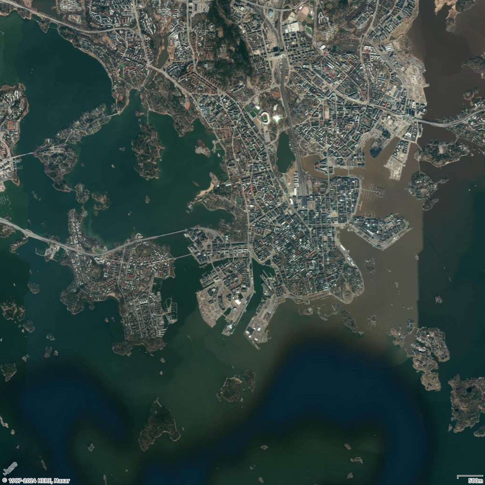
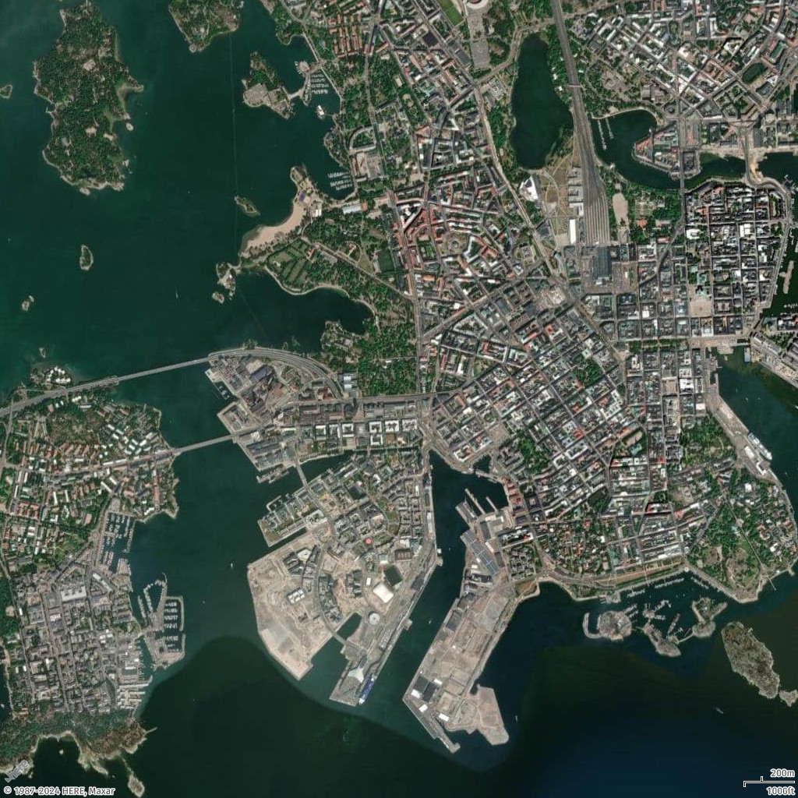

# How to add scale for a static map

In this topic, you will learn how to display a scale on the bottom-right corner of a static map generated with Amazon Location Service. The scale can show a single unit, such as `Miles` or `Kilometers`, or both units, such as `KilometersMiles` or `MilesKilometers`, with one unit displayed at the top and the other at the bottom.

## Add scale with single unit

In this example, you will display a map of Helsinki, Finland with the scale set to `Kilometers` in the bottom-right corner.

Request URL

```
https://maps.geo.eu-central-1.amazonaws.com/v2/static/map?style=Satellite&width=1024&height=1024&zoom=13.5&center=24.9189564,60.1645772&scale-unit=Kilometers&key=`API_KEY`
```

Response image



## Add scale with both units

In this example, you will display a map of Helsinki, Finland with both `Kilometers` and `Miles` shown on the scale in the bottom-right corner, with one unit displayed above the other.

Request URL

```
https://maps.geo.eu-central-1.amazonaws.com/v2/static/map?style=Satellite&width=1024&height=1024&zoom=14&center=24.9189564,60.1645772&scale-unit=KilometersMiles&key=`API_KEY`
```

Response image


