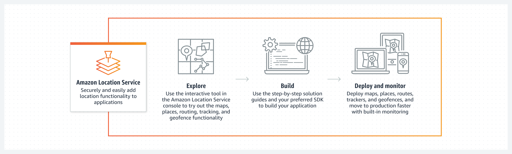

# Key benefits of Amazon Location Service

This section provides an overview of the key benefits of Amazon Location Service. The main benefits
are:

- **Access high-quality geospatial data** -
  Integrate reliable, complete, and up-to-date data into applications to make
  informed decisions, deliver precise insights, and optimize operations.
- **Integrate seamlessly** - Quickly deploy and
  accelerate application development with seamless integration with AWS
  services. Amazon Location seamlessly integrates with various AWS services, enabling
  faster development, deployment, monitoring, and security compliance.
- **Own your data** - Safeguard sensitive customer
  information, protect user privacy and reduce your application's overall security
  risks. The service provides robust data protection measures, including data
  anonymization, encryption, and integration with AWS security services.
- **Reduce operating costs** - It offers
  high-quality geospatial data with a pay-as-you-go model, requiring no upfront
  commitment or minimum fee.
- **Rapid development** - The service allows for
  easy integration of geospatial data into applications, accelerating development
  cycles and streamlining integration with other AWS services.

## Access high-quality geospatial data

Amazon Location Service offers a comprehensive solution for integrating geospatial capabilities
into applications, focusing on four key benefits: seamless AWS integration, data
ownership and privacy, cost reduction, and rapid development. By leveraging AWS
infrastructure and security measures, the service enables you to quickly implement
location-based features while maintaining control over your data and reducing
operational costs.

## Integrate seamlessly

With Amazon Location Service, you quickly deploy and accelerate application development with
seamless integrations with AWS services. Amazon Location seamlessly integrates with a
suite of AWS services to streamline development workflows, accelerate deployment,
and provide robust monitoring, security, and compliance. It works with CloudFormation for
consistent resource provisioning, Amazon CloudWatch for tracking metrics, AWS CloudTrail for
logging account activity, and Amazon EventBridge for event-driven architectures utilizing
AWS Lambda. Amazon Location also leverages AWS Identity and Access Management (IAM) for secure access controls and
resource tagging for efficient organization and management. This comprehensive
integration enables faster development cycles, operational visibility, and adherence
to security best practices.

For more information, see [AWS integration for Amazon Location Service](integration.md "integration.md").

## Own your data

With Amazon Location Service, you protect user privacy, shield your sensitive information, and
reduce your application’s security risks. Amazon Location provides robust data control,
rights, and secure access measures to ensure your organization's data remains
private and secure. It anonymizes queries, encrypts sensitive location data at rest
and in transit, and integrates with AWS Key Management Service (AWS KMS) so you can use your own
encryption keys. You retain full rights to your data, with no third-party access for
advertising or resale. Amazon Location also seamlessly integrates with AWS Identity and Access Management and Amazon Cognito
for secure authentication and access controls, leveraging the proven security
services at AWS to safeguard your data and applications.

For more information, see [Security in Amazon Location Service](security.md "security.md").

## Reduce operating costs

With Amazon Location Service, you access cost-effective, high-quality geospatial data from
trusted data providers. Amazon Location requires no up-front commitment, and no minimum
fee. You are only charged for what you use. Location data is billed based on each
request your application makes to the service.

See the following case studies:

- [Halodoc, a digital health system, reduced 88% cost using
  Amazon Location Service](https://aws.amazon.com/solutions/case-studies/halodoc-amazon-location-case-study/ "https://aws.amazon.com/solutions/case-studies/halodoc-amazon-location-case-study/")
- [Geo.me, a web services provider, reduced 90% geospatial cost using
  Amazon Location Service](https://aws.amazon.com/solutions/case-studies/geo-me-case-study/ "https://aws.amazon.com/solutions/case-studies/geo-me-case-study/")

## Rapid development

Amazon Location Service enables developers to quickly integrate geospatial data and functionality
into their applications. By providing fully managed APIs, Amazon Location eliminates the
need to build and maintain complex location data infrastructure. The service also
seamlessly integrates with AWS services like CloudFormation, CloudWatch, CloudTrail, and EventBridge, allowing
developers to leverage these tools to build efficient, event-driven architectures.
This integration streamlines the development process, accelerating the prototyping,
iteration, and deployment of location-based experiences. With Amazon Location,
organizations can rapidly enhance their offerings with geospatial features, reducing
time-to-market and allowing developers to focus on core product development.

_...Since it was so easy to get started and implement
Amazon Location Service, our application was up and running in production in 2 weeks. Our
ability to develop at this speed ensured readiness for the state department of
transportation review date. We’ve done the review with the state and they
approved our solution, we are now rolling it out to multiple company divisions
for their upcoming state regulatory needs..._

_[Charles
Evans, Chief Technology Officer at Command Alkon](https://aws.amazon.com/location/customers/ "https://aws.amazon.com/location/customers/")_
