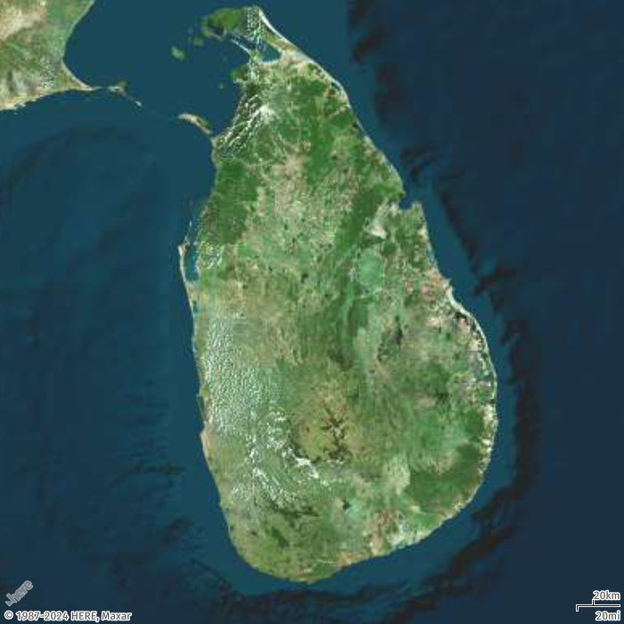
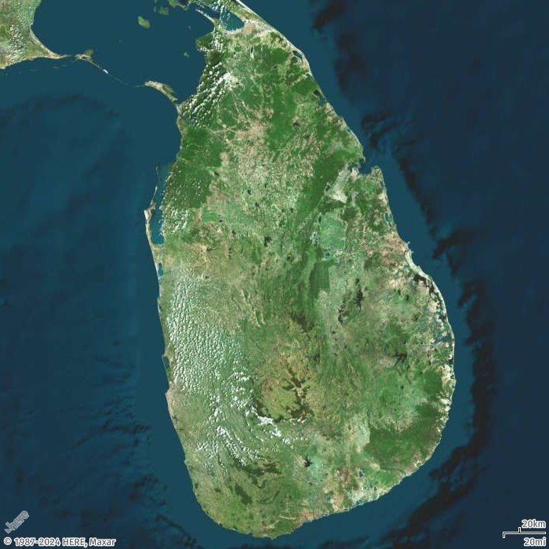

# How to decide between radius and zoom for a static map

In this topic, you will learn how to choose between using `radius` or `zoom` when generating static maps with Amazon Location Service. The `radius` parameter provides more precise control over the area of coverage, making it ideal for customer-facing applications where you know the exact coverage area. The `zoom` parameter is better suited for geospatial analysis when you want to adjust the level of detail displayed.

## With radius

In this example, you will create a map image of Sri Lanka using the `radius` parameter with a center location.

Request URL

```
https://maps.geo.eu-central-1.amazonaws.com/v2/static/map?style=Satellite&width=700&height=700&center=80.60596,7.76671&radius=235000&scale-unit=KilometersMiles&key=`API_KEY`
```

Response image



## With zoom

In this example, you will create a map image of Sri Lanka using the `zoom` parameter with a center location.

Request URL

```
https://maps.geo.eu-central-1.amazonaws.com/v2/static/map?style=Satellite&width=700&height=700&zoom=8&center=80.60596,7.76671&scale-unit=KilometersMiles&key=`API_KEY`
```

Response image


