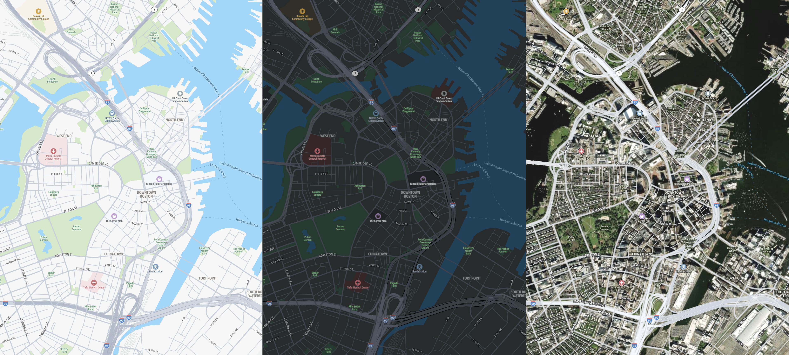
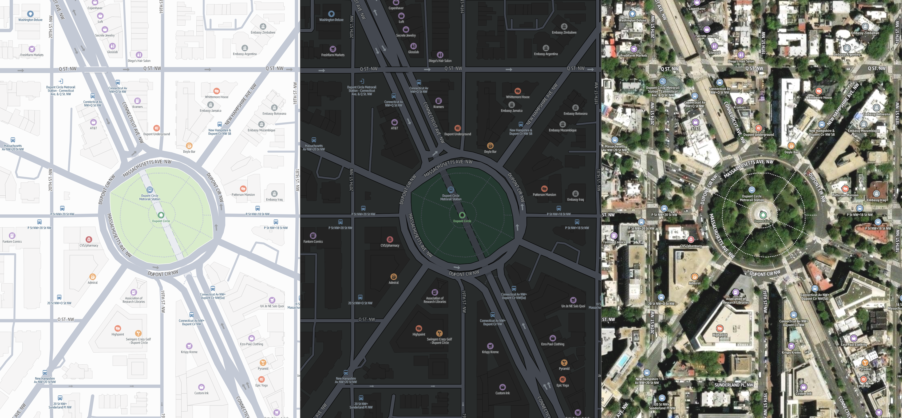
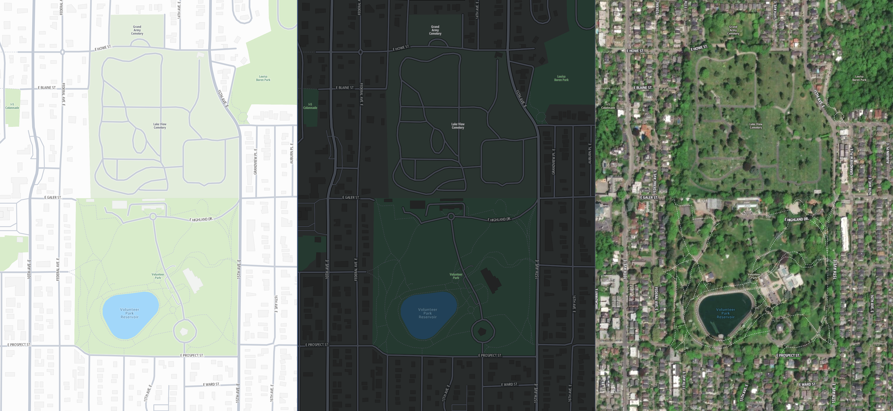

# Dynamic maps

###### Note

You must use the political view feature to comply with applicable laws, including
those related to mapping the country or region where maps, images, and other data you
access through Amazon Location Service are made available.

Dynamic maps, also known as interactive maps, are digital maps that support gestures such
as zoom, pan, ease, fly, pitch, rotate, and bearing. With Amazon Location Service, you can build map
applications that provide responsive, interactive, and immersive experiences for your users.
These maps help users visualize and analyze real-time and historical data based on user
input, allowing them to pan, zoom, and explore the map in real-time. Maps offered by
Amazon Location Service also support multiple languages and political views.

Learn more about [Localization and internationalization](maps-localization-internationalization.md "maps-localization-internationalization.md").

For example requests, responses, cURL, and CLI commands for this API, see [How
to use dynamic maps](dynamic-maps-how-to.md "dynamic-maps-how-to.md").

City

Roads

Park

For more information about AWS Map Styles, see [AWS map styles and features](map-styles.md "map-styles.md").

## Common use cases

**Analyze and visualize data**

Overlay your data onto high-quality maps to uncover transformative spatial
patterns and trends. Empower your teams to create customizable, interactive
map visualizations with your geographic data. Use maps and data to optimize
site selection, plan infrastructure, or analyze market opportunities.

**Enhance real estate experiences**

Provide prospective buyers with comprehensive location context for real
estate listings. Display the property's exact location along with
surrounding neighborhood details such as jurisdictional boundaries, local
businesses, parks, and schools. Help customers find directions to your open
houses and create informative, location-centric real estate
experiences.

**Build engaging travel experiences**

Display dynamic maps showcasing destinations, with detailed street views
and key geographic features. Highlight points of interest such as hotels,
restaurants, and attractions for tourists and travelers. Plot outdoor
amenities like hiking trails to help users plan their ideal
itinerary.

## Rendering dynamic maps

A map rendering engine is a library responsible for the visual rendering of maps on
digital screens. The rendering engine stitches map tiles (vector, hybrid, satellite),
map data (points, lines, polygons), or raster data (imagery) together to display an
interactive map in web browsers or native apps. Amazon Location Service recommends using the [MapLibre](https://github.com/maplibre/maplibre-gl-js "https://github.com/maplibre/maplibre-gl-js") rendering engine,
which supports both web and mobile (iOS and Android) platforms. MapLibre also provides a
plugin model and supports user interfaces for searching and routing in various
languages.

For more information, see [Create your first Amazon Location Maps and Places
application](first-app.md "first-app.md").

## Requesting map assets

The rendering engine uses a map style, which contains references to map tiles, sprites
(icons), and glyphs (fonts). As users interact with the map—loading, panning, or
zooming—the rendering engine calls APIs (for tiles, sprites, and glyphs) with the
desired input parameters. You can also directly call these APIs based on your
application's needs.

**Map tiles**

Small square tiles containing data that are retrieved from servers and
assembled by a rendering engine to create an interactive digital map.

**Map style**

A collection of rules that define the visual appearance of the map, such
as colors and styles. Amazon Location Service follows the [Mapbox GL style
specification](https://docs.mapbox.com/style-spec/guides/ "https://docs.mapbox.com/style-spec/guides/").

**Glyph file**

A binary file containing encoded Unicode characters, used by the map
renderer to display text labels.

**Sprite file**

A Portable Network Graphics (PNG) image file that contains small raster
images, with location descriptions in a JSON file. Used by the map renderer
to render icons or textures on the map.
