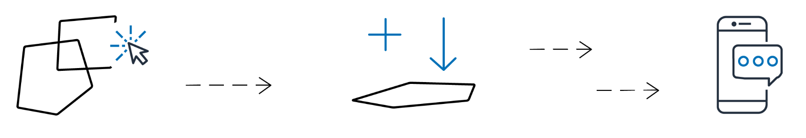

# Amazon Location Service Geofences

Geofence collection resources allow you to store and manage geofences - virtual boundaries
on a map. You can evaluate locations against a geofence collection resource and receive
notifications when the location update crosses the boundary of any of the geofences in the
collection.

**Geofences and geofence collection**

A geofence is a circle, polygon, or multipolygon geometry that defines a virtual boundary
on a map. A geofence collection contains zero or more geofences. It's capable of geofence
monitoring by emitting `ENTER` and `EXIT` events, when requested, to
evaluate a device position against its geofences.

**Geofence events**

Locations for positions you're monitoring are referenced by an ID called a
`DeviceId`. The positions are referred to as device positions. You can send a
list of device positions to evaluate directly to the geofence collection resource, or you
can use a tracker. For more information about using trackers, see [Amazon Location Service trackers](trackers.md "trackers.md").

You receive events (via Amazon EventBridge) only when a device enters or exits a geofence, not for
every position change. This means that you will typically receive events and have to respond
to them much less frequently than every device position update.

###### Note

For the first location evaluation for a specific `DeviceID`, it is assumed
that the device was previously not in any geofences. So the first update will generate
an `ENTER` event, if inside a geofence in the collection, and no event if
not.

In order to calculate whether a device has entered or exited a geofence, Amazon Location Service must
keep previous position state for the device. This position state is stored for 30 days.
After 30 days without an update for a device, a new location update will be treated as
the first position update.

## Use cases for Amazon Location Service Geofences

The following are a few common uses for Amazon Location Service Geofences.

**Improve field service
operations**

Keep a pulse on your mobile workforce with real-time tracking. Set geofences around
customer sites and service areas to receive alerts when staff arrive and depart. Use
location data to optimize scheduling, dispatch the nearest available technician, and
reduce response times. Empower your field teams (such as a your plumbing or HVAC repair
business) to work more efficiently, while enhancing the customer experience.

**Monitor and control critical
assets**

Utilize Amazon Location Service to track the real-time location and status of your valuable
equipment, inventory, and other mobile assets. Set up geofences to receive alerts on
unauthorized movements or removals, enhancing security and compliance. Use this location
visibility to improve asset utilization, optimize maintenance schedules, and ensure your
critical resources are accounted for at all times. Always monitor your heavy machinery,
IT hardware, or retail inventory with precision, reduce losses, and make more informed
operational decisions.

**Enhance supply chain
visibility**

Leverage Amazon Location Service to track shipments and deliveries across your entire supply chain.
Define geofences around distribution centers, stores, and other key facilities to
monitor the movement of inventory and assets. Use real-time location data to improve
inventory management, optimize logistics planning, and deliver a superior customer
experience. Gain end-to-end visibility into your supply chain operations, identify
bottlenecks, and make data-driven decisions that drive efficiency and responsiveness.

**Strengthen safety and security**

Geofencing enables you to set up virtual boundaries around secure areas, restricted
zones, and other critical locations. Receive instant alerts when unauthorized personnel
or assets enter or exit these predefined geofences. Leverage this real-time location
monitoring to enhance workplace safety, deter trespassing, and ensure regulatory
compliance. Whether you manage a manufacturing facility, construction site, or corporate
campus, geofencing empowers you to maintain tighter control over access, improve
incident response, and protect your people, property, and assets.

**Location-based
marketing**

Unlock the power of location data to supercharge your geomarketing efforts. Use
Amazon Location Service to set virtual boundaries around competitor locations, events, and high-traffic
areas. Trigger personalized ads, offers, and notifications when customers enter these
geofenced zones. Analyze foot traffic patterns to optimize ad placements and uncover
prime sites for new business locations. Monitor customer movements within your own
geofenced spaces to gain deeper insights on browsing behaviors and path-to-purchase.
Combine real-time location tracking with precision geofencing to deliver hyper-targeted,
contextual engagement that drives sales and loyalty in the physical world.
