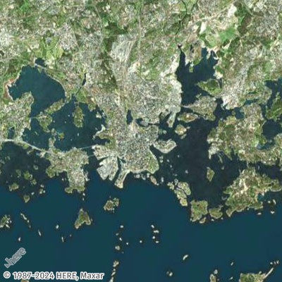
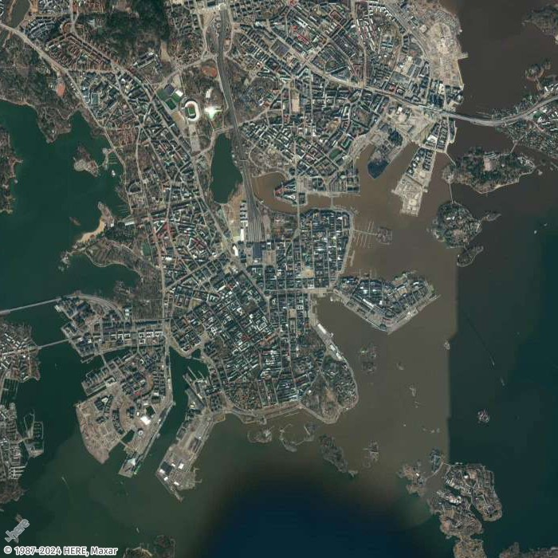
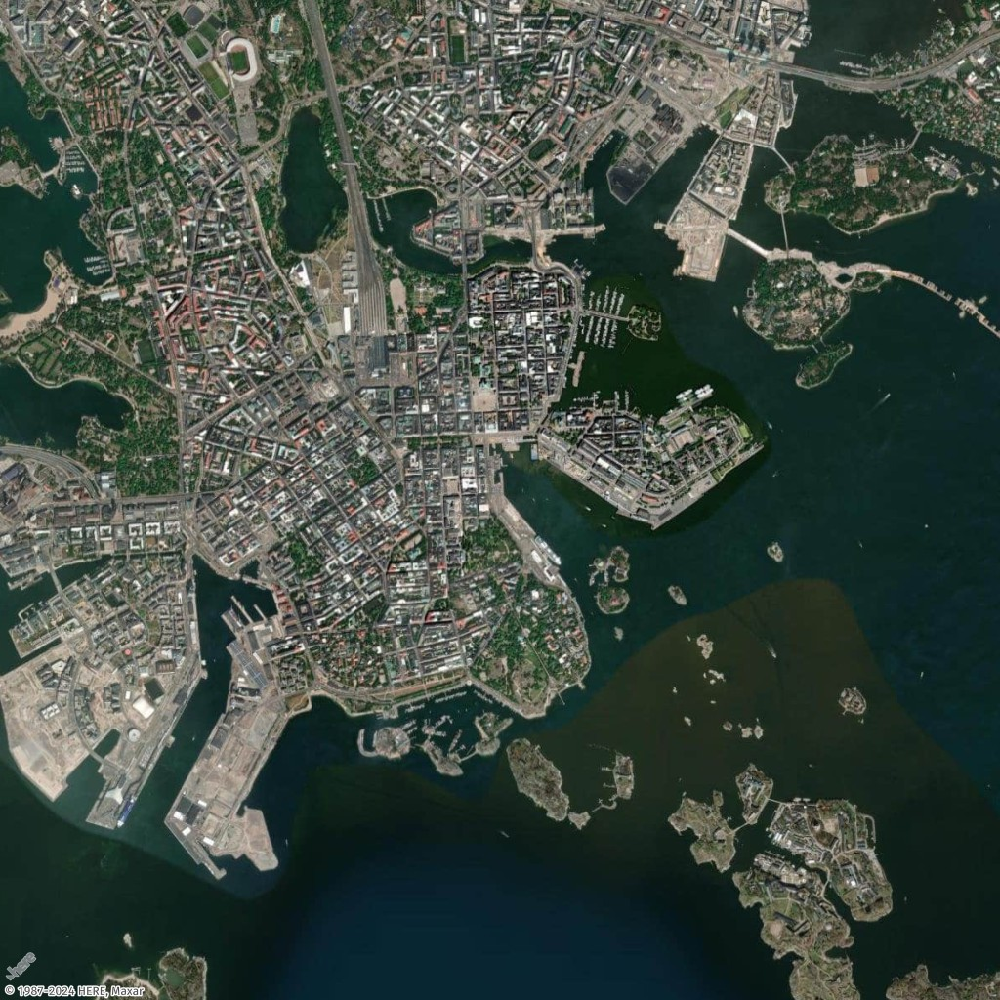
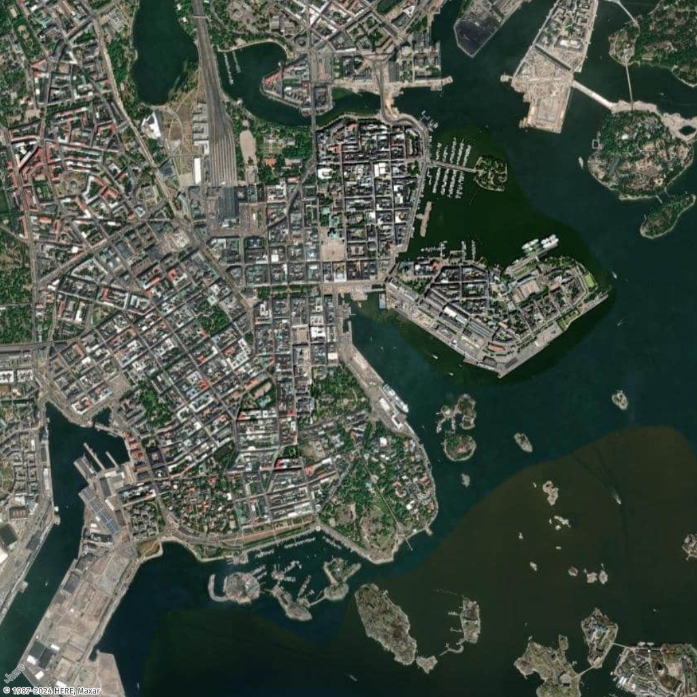

# How to get a static map of a specific dimension

In this topic, you will learn how to set the dimensions (height and width) for static maps using Amazon Location Service. Customizing the dimensions of a map image allows you to balance performance, visual quality, and usability. The maximum values for both `width` and `height` are 1400 pixels, while the minimum values are 64 pixels. The maximum result size is 6 MB.

Additionally, you can use the `bbox` and `bounds` parameters along with `padding` to ensure that important map features near the edges are fully visible and not cut off.

## Get map image with specific height and width

In this example, you will create a low-resolution and mid-resolution map image of Helsinki, Finland.

Request URL for low-resolution thumbnail

```
https://maps.geo.eu-central-1.amazonaws.com/v2/static/map?style=Satellite&width=200&height=200&zoom=11.5&center=24.9460,60.1690&key=`API_KEY`
```

Response (Thumbnail 200x200)



Request URL for mid-resolution image

```
https://maps.geo.eu-central-1.amazonaws.com/v2/static/map?style=Satellite&width=700&height=700&zoom=13&center=24.9460,60.1690&key=`API_KEY`
```

Response image (700x700)



## Get map image with padding on all sides

In this example, you will generate a map using several must-see places in Helsinki, Finland, with their coordinates (longitude, latitude), both with and without padding.

Request URL with padding

```
https://maps.geo.eu-central-1.amazonaws.com/v2/static/map?style=Satellite&width=1024&height=1024&padding=150&bounded-positions=24.9526,60.1692,24.9850,60.1465,24.9270,60.1725,24.9226,60.1826,24.9509,60.1675,24.9566,60.1685,24.9457,60.1674,24.9397,60.1719,24.9414,60.1715,24.9387,60.1720&key=`API_KEY`
```

Response image (with padding)



Request URL without padding

```
https://maps.geo.eu-central-1.amazonaws.com/v2/static/map?style=Satellite&width=1024&height=1024&bounded-positions=24.9526,60.1692,24.9850,60.1465,24.9270,60.1725,24.9226,60.1826,24.9509,60.1675,24.9566,60.1685,24.9457,60.1674,24.9397,60.1719,24.9414,60.1715,24.9387,60.1720&key=`API_KEY`
```

Response image (without padding)


