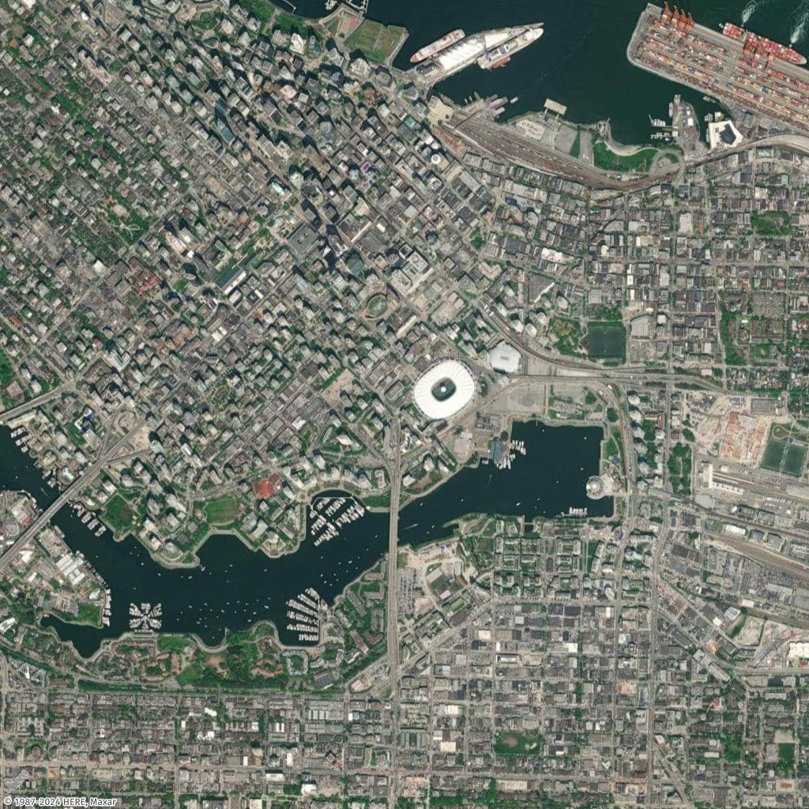
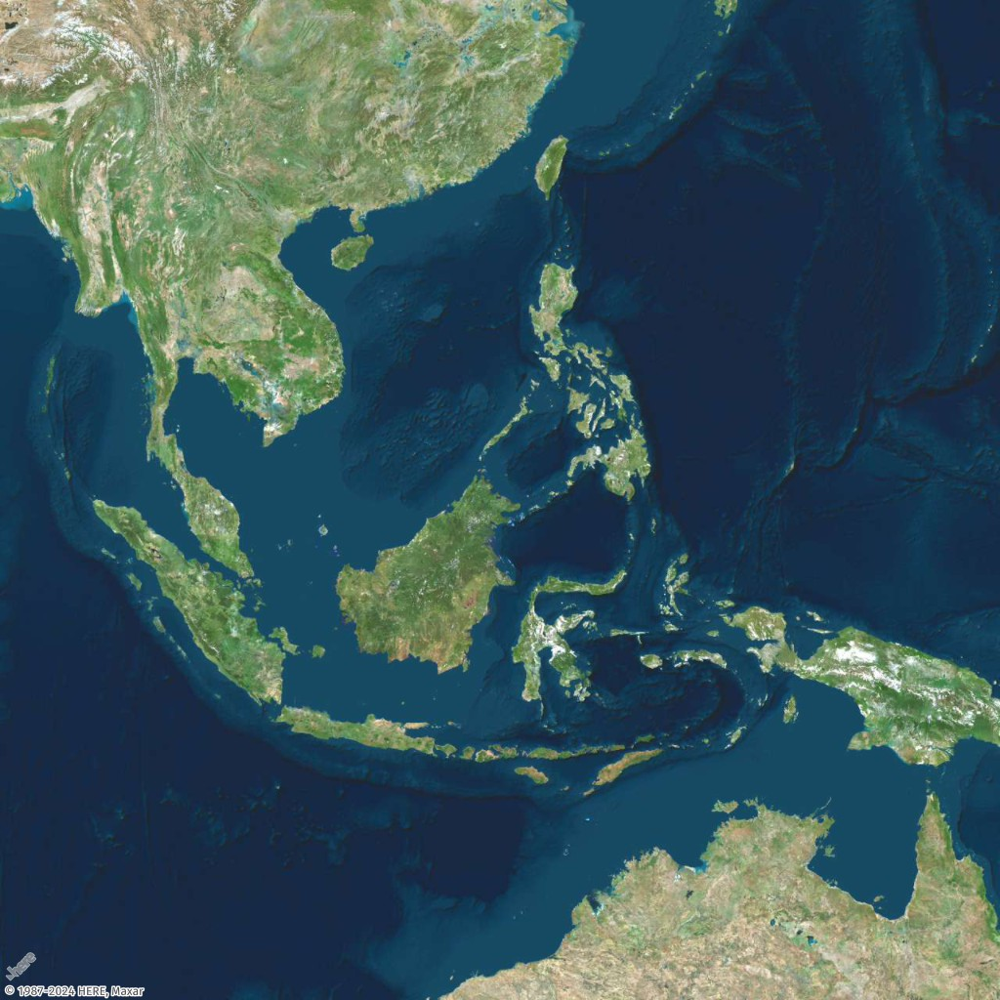
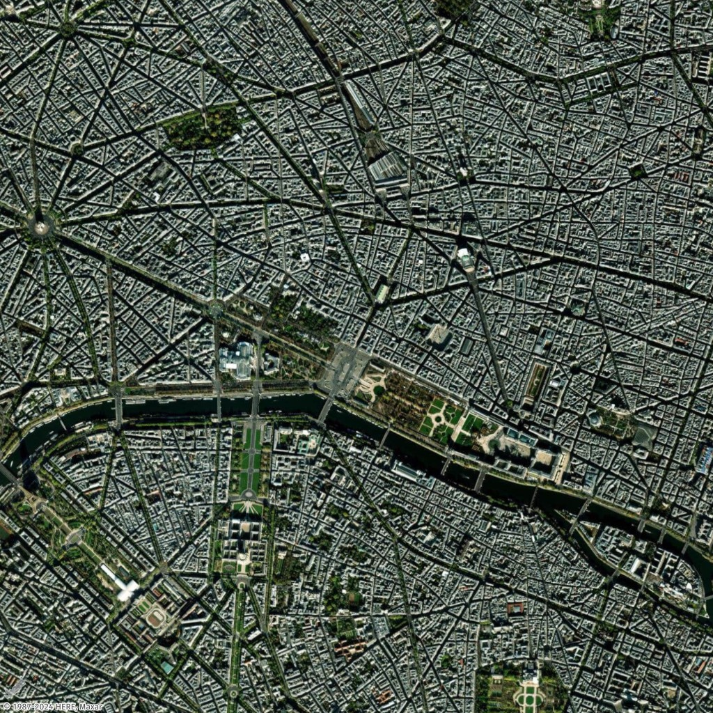

# How to get a static map of a specific position

In this topic, you will learn how to retrieve static maps from Amazon Location Service based on specific parameters. You will learn how to generate a static map for a center position, a bounding box, and a set of bounded positions. The examples provided will help you customize the width, height, and style of the map.

###### Note

You must pass either `map` or `map@2x` when generating a static map.

## Get map image for a center position

In this example, you will create a map image with a width of `1024` and a
height of `1024` with the center coordinates set at
`-123.1143,49.2763`, where `longitude=-123.1143` and
`latitude=49.2763`, and a zoom level of `15`.

Request URL

```
https://maps.geo.eu-central-1.amazonaws.com/v2/static/map?style=Satellite&width=1024&height=1024&zoom=15&center=-123.1156126,49.2767046&key=`API_KEY`
```

Response image



## Get map image for bounding box

In this example, you'll generate a map image of Southeast Asia by setting the bounding
box for the area.

The `bbox` format is
`{southwest_longitude},{southwest_latitude},{northeast_longitude},{northeast_latitude}`.

Request URL

```
https://maps.geo.eu-central-1.amazonaws.com/v2/static/map?style=Satellite&width=1024&height=1024&bounding-box=90.00,-21.94,146.25,31.95&key=`API_KEY`
```

Response image



## Get map image for bounded positions

In this example, you will generate a map that covers several must-see places in Paris,
each specified by its coordinates (longitude, latitude). The bounded positions
include: Eiffel Tower, Louvre Museum, Notre-Dame Cathedral, Champs-Élysées, Arc de
Triomphe, Sacré-Cœur Basilica, Luxembourg Gardens, Musée d'Orsay, Place de la
Concorde, and Palais Garnier.

The format for bounding positions is
`{longitude1},{latitude1},{longitude2},{latitude2} ...
 {longitudeN},{latitudeN}`.

Request URL

```
https://maps.geo.eu-central-1.amazonaws.com/v2/static/map?style=Satellite&width=1024&height=1024&bounded-positions=2.2945,48.8584,2.3376,48.8606,2.3500,48.8529,2.3076,48.8698,2.2950,48.8738,2.3431,48.8867,2.3372,48.8462,2.3266,48.8600,2.3212,48.8656,2.3317,48.8719&key=`API_KEY`
```

Response image


