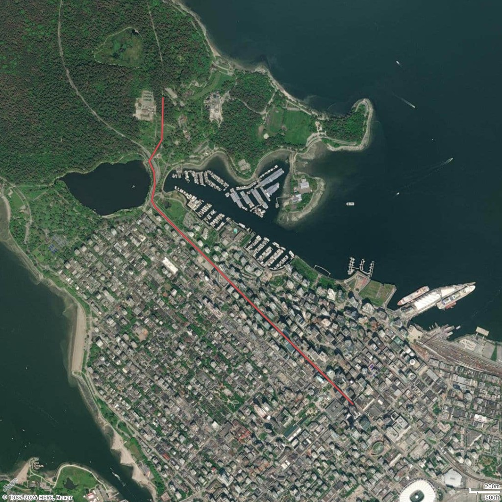
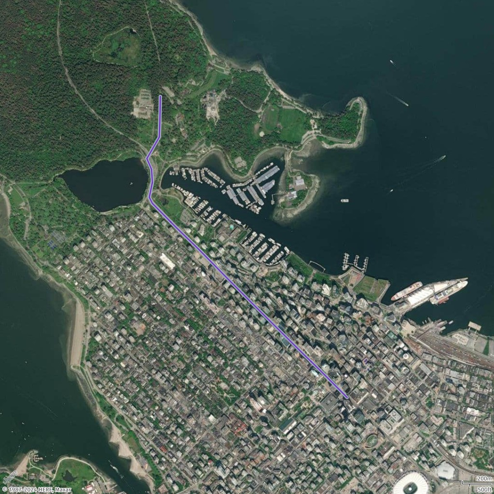

# How to add a line to a static map

In this topic, you'll learn how to add a line to a static map using Amazon Location Service. We'll cover the supported styling options, how to define a line using GeoJSON, and how to apply custom styles such as color, width, and outline. We'll also explore how to use different measurement units for properties like line width.

## Supported styling

| Name            | Type           | Default         | Description                                                                                                                                     |
| --------------- | -------------- | --------------- | ----------------------------------------------------------------------------------------------------------------------------------------------- |
| `color`         | Color          | style-dependent | The line color.                                                                                                                                 |
| `width`         | Integer/String | 2               | The line width. For more information, see [How to add a line to a static map](how-to-add-line-static.md "how-to-add-line-static.md").           |
| `outline-color` | Color          | style-dependent | The line outline color.                                                                                                                         |
| `outline-width` | Integer/String | 0 (turned off)  | The width of the outline. For more information, see [How to add a line to a static map](how-to-add-line-static.md "how-to-add-line-static.md"). |

## Supported unit

| Unit                                   | Description                                                                                                                                                                                                                                                |
| -------------------------------------- | ---------------------------------------------------------------------------------------------------------------------------------------------------------------------------------------------------------------------------------------------------------- |
| Integer, for example, `5`              | Pixels                                                                                                                                                                                                                                                     |
| String with no unit, for example `"5"` | Pixels                                                                                                                                                                                                                                                     |
| `"px"`                                 | Pixels                                                                                                                                                                                                                                                     |
| `"m"`                                  | Meters                                                                                                                                                                                                                                                     |
| `"km"`                                 | Kilometers                                                                                                                                                                                                                                                 |
| `"mi"`                                 | Miles                                                                                                                                                                                                                                                      |
| `"ft"`                                 | Feet                                                                                                                                                                                                                                                       |
| `"yd"`                                 | Yards                                                                                                                                                                                                                                                      |
| `"%"`                                  | The percentage of the default value for a specific property, in pixels. For example, if the<br>default value for `width` is `2` pixels,<br>then `200%` is `4` pixels. `%`<br>is a sensitive character that must be encoded in the request URL<br>as `%25`. |

## Add a line

In this example, you will add a line from a place in Vancouver to Stanley Park. The line is created using a GeoJSON format with defined coordinates.

Request

```
{
  "type": "FeatureCollection",
  "features": [
    {
      "type": "Feature",
      "geometry": {
        "type": "LineString",
        "coordinates": [
          [-123.11813, 49.28246],
          [-123.11967, 49.28347],
          [-123.12108, 49.28439],
          [-123.12216, 49.28507],
          [-123.12688, 49.28812],
          [-123.1292, 49.28964],
          [-123.13216, 49.2916],
          [-123.13424, 49.29291],
          [-123.13649, 49.2944],
          [-123.13678, 49.29477],
          [-123.13649, 49.29569],
          [-123.13657, 49.29649],
          [-123.13701, 49.29715],
          [-123.13584, 49.29847],
          [-123.13579, 49.29935],
          [-123.13576, 49.30018],
          [-123.13574, 49.30097]
        ]
      },
      "properties": {
        "name": "To Stanley Park",
        "description": "An evening walk to Stanley Park."
      }
    }
  ]
}
```

Request URL

```
https://maps.geo.eu-central-1.amazonaws.com/v2/static/map?style=Satellite&width=1024&height=1024&padding=200&scale-unit=KilometersMiles&geojson-overlay=%7B%22type%22%3A%22FeatureCollection%22,%22features%22%3A%5B%7B%22type%22%3A%22Feature%22,%22geometry%22%3A%7B%22type%22%3A%22LineString%22,%22coordinates%22%3A%5B%5B-123.11813,49.28246%5D,%5B-123.11967,49.28347%5D,%5B-123.12108,49.28439%5D,%5B-123.12216,49.28507%5D,%5B-123.12688,49.28812%5D,%5B-123.1292,49.28964%5D,%5B-123.13216,49.2916%5D,%5B-123.13424,49.29291%5D,%5B-123.13649,49.2944%5D,%5B-123.13678,49.29477%5D,%5B-123.13649,49.29569%5D,%5B-123.13657,49.29649%5D,%5B-123.13701,49.29715%5D,%5B-123.13584,49.29847%5D,%5B-123.13579,49.29935%5D,%5B-123.13576,49.30018%5D,%5B-123.13574,49.30097%5D%5D%7D,%22properties%22%3A%7B%22name%22%3A%22To%20Stanley%20Park%22,%22description%22%3A%22An%20evening%20walk%20to%20Stanley%20Park.%22%7D%7D%5D%7D&key=`API_KEY`
```

Response image



## Add styling to the line

In this example, you will style the line added in the previous example. This includes defining the line's color, width, outline color, and outline width to customize the visual appearance of the line on the map.

Request

```
{
  "type": "FeatureCollection",
  "features": [
    {
      "type": "Feature",
      "geometry": {
        "type": "LineString",
        "coordinates": [
          [-123.11813, 49.28246],
          [-123.11967, 49.28347],
          [-123.12108, 49.28439],
          [-123.12216, 49.28507],
          [-123.12688, 49.28812],
          [-123.1292, 49.28964],
          [-123.13216, 49.2916],
          [-123.13424, 49.29291],
          [-123.13649, 49.2944],
          [-123.13678, 49.29477],
          [-123.13649, 49.29569],
          [-123.13657, 49.29649],
          [-123.13701, 49.29715],
          [-123.13584, 49.29847],
          [-123.13579, 49.29935],
          [-123.13576, 49.30018],
          [-123.13574, 49.30097]
        ]
      },
      "properties": {
        "color": "#6d34b3",
        "width": "9m",
        "outline-color": "#a8b9cc",
        "outline-width": "2px"
      }
    }
  ]
}
```

Request URL

```
https://maps.geo.eu-central-1.amazonaws.com/v2/static/map?style=Satellite&width=1024&height=1024&padding=200&scale-unit=KilometersMiles&geojson-overlay=%7B%22type%22%3A%22FeatureCollection%22,%22features%22%3A%5B%7B%22type%22%3A%22Feature%22,%22geometry%22%3A%22LineString%22,%22coordinates%22%3A%5B%5B-123.11813,49.28246%5D,%5B-123.11967,49.28347%5D,%5B-123.12108,49.28439%5D,%5B-123.12216,49.28507%5D,%5B-123.12688,49.28812%5D,%5B-123.1292,49.28964%5D,%5B-123.13216,49.2916%5D,%5B-123.13424,49.29291%5D,%5B-123.13649,49.2944%5D,%5B-123.13678,49.29477%5D,%5B-123.13649,49.29569%5D,%5B-123.13657,49.29649%5D,%5B-123.13701,49.29715%5D,%5B-123.13584,49.29847%5D,%5B-123.13579,49.29935%5D,%5B-123.13576,49.30018%5D,%5B-123.13574,49.30097%5D%5D%7D,%22properties%22%3A%7B%22color%22%3A%22%236d34b3%22,%22width%22%3A%229m%22,%22outline-color%22%3A%22%23a8b9cc%22,%22outline-width%22%3A%222px%22%7D%7D%5D%7D&key=`API_KEY`
```

Response image


