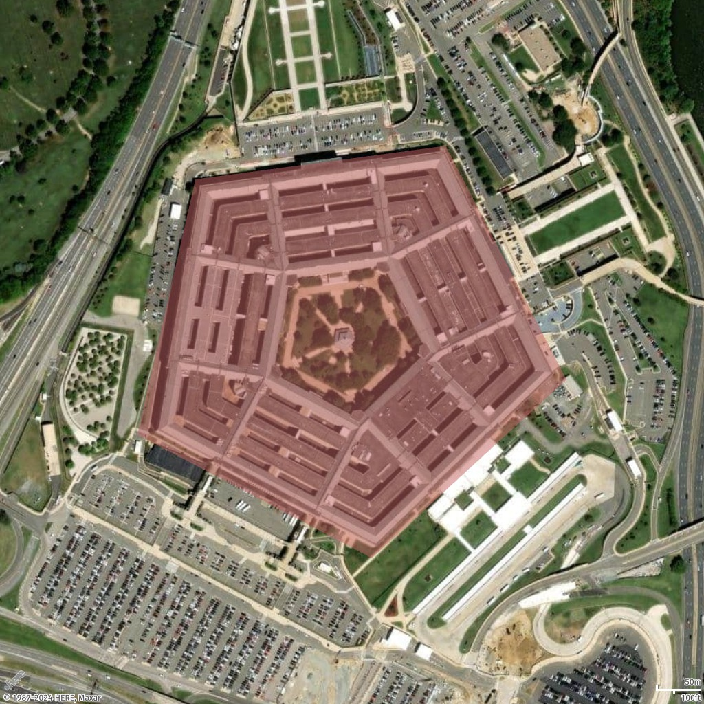
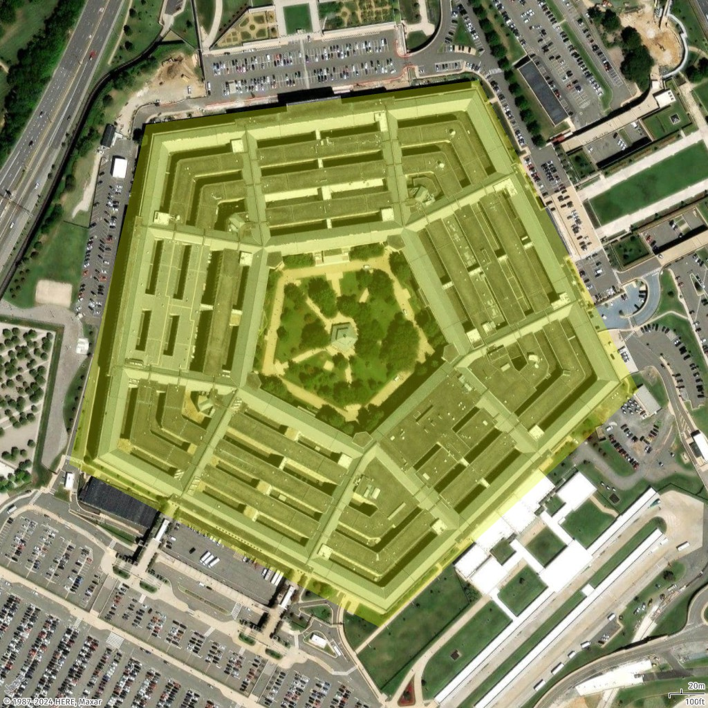
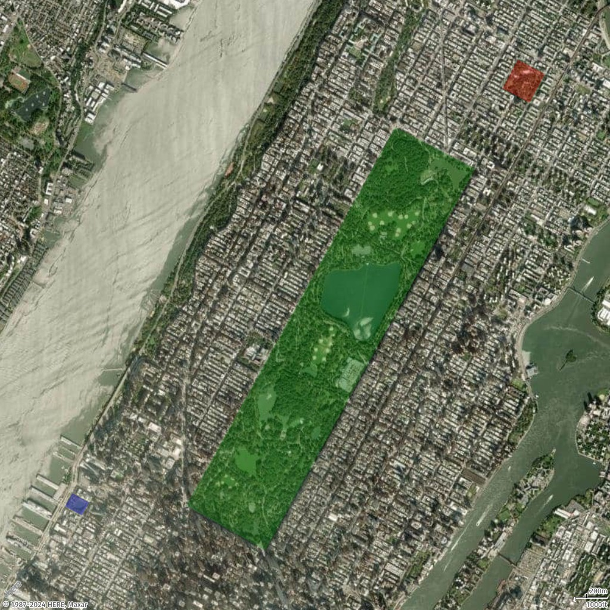

# How to add a polygon to a static map

Buildings and locations can be highlighted on a map by designating a polygon around them, for example, the Pentagon (located in Washington, D.C.).

## Add a single polygon

In this example, you add a polygon (a pentagon) for the Pentagon building on the map.

Geo JSON

```
{
  "type": "FeatureCollection",
  "features": [
    {
      "type": "Feature",
      "geometry": {
        "coordinates": [
          [
            [
              -77.0579282196337,
              38.87264268371487
            ],
            [
              -77.05868880963534,
              38.87003145971428
            ],
            [
              -77.05560979468949,
              38.86876862025221
            ],
            [
              -77.05305311263672,
              38.87059509268525
            ],
            [
              -77.0546384387842,
              38.872985132206225
            ],
            [
              -77.0579282196337,
              38.87264268371487
            ]
          ]
        ],
        "type": "Polygon"
      }
    }
  ]
}
```

Request URL

```
https://maps.geo.eu-central-1.amazonaws.com/v2/static/map?style=Satellite&width=600&height=1024&padding=200&scale-unit=KilometersMiles&geojson-overlay=%7B%22type%22%3A%22FeatureCollection%22,%22features%22%3A%5B%7B%22type%22%3A%22Feature%22,%22geometry%22%3A%7B%22coordinates%22%3A%5B%5B%5B-77.0579282196337,38.87264268371487%5D,%5B-77.05868880963534,38.87003145971428%5D,%5B-77.05560979468949,38.86876862025221%5D,%5B-77.05305311263672,38.87059509268525%5D,%5B-77.0546384387842,38.872985132206225%5D,%5B-77.0579282196337,38.87264268371487%5D%5D%5D,%22type%22%3A%22Polygon%22%7D%7D%5D%7D&key=your_API_Key
```

Response image



## Add a style polygon

In this example, we restyle the polygon shown in the previous example. We draw the polygon in a different color (**#E3F70550**). The color components are as follows.

- **E3** represents the red component.
- **F7** represents the green component.
- **05** represents the blue component.
- **50** represents the alpha (opacity) component.

Geo JSON

```
{
  "type": "FeatureCollection",
  "features": [
    {
      "type": "Feature",
      "geometry": {
        "coordinates": [
          [
            [
              -77.0579282196337,
              38.87264268371487
            ],
            [
              -77.05868880963534,
              38.87003145971428
            ],
            [
              -77.05560979468949,
              38.86876862025221
            ],
            [
              -77.05305311263672,
              38.87059509268525
            ],
            [
              -77.0546384387842,
              38.872985132206225
            ],
            [
              -77.0579282196337,
              38.87264268371487
            ]
          ]
        ],
        "type": "Polygon"
      },
      "properties": {
        "color": "#E3F70550"
      }
    }
  ]
}
```

Request URL

```
https://maps.geo.eu-central-1.amazonaws.com/v2/static/map?style=Satellite&width=1024&height=1024&padding=100&scale-unit=KilometersMiles&geojson-overlay=%7B%22type%22%3A%22FeatureCollection%22,%22features%22%3A%5B%7B%22type%22%3A%22Feature%22,%22geometry%22%3A%7B%22coordinates%22%3A%5B%5B%5B-77.0579282196337,38.87264268371487%5D,%5B-77.05868880963534,38.87003145971428%5D,%5B-77.05560979468949,38.86876862025221%5D,%5B-77.05305311263672,38.87059509268525%5D,%5B-77.0546384387842,38.872985132206225%5D,%5B-77.0579282196337,38.87264268371487%5D%5D%5D,%22type%22%3A%22Polygon%22%7D,%22properties%22%3A%7B%22color%22%3A%22%23E3F70550%22%7D%7D%5D%7D&key=your_API_Key
```

Response image



## Add multiple polygons

In this example, we add multiple polygons, to highlight multiple parks in New York City.

Geo JSON

```
{
  "type": "FeatureCollection",
  "features": [
    {
      "type": "Feature",
      "properties": {
        "color": "#00800050"
      },
      "geometry": {
        "type": "Polygon",
        "coordinates": [
          [
            [
              -73.95824708489555,
              40.80055774655358
            ],
            [
              -73.9818875523859,
              40.76810261850716
            ],
            [
              -73.9729556303776,
              40.7642422333698
            ],
            [
              -73.94916953372382,
              40.79699323614054
            ],
            [
              -73.95824708489555,
              40.80055774655358
            ]
          ]
        ]
      }
    },
    {
      "type": "Feature",
      "properties": {
        "color": "#FF000050"
      },
      "geometry": {
        "type": "Polygon",
        "coordinates": [
          [
            [
              -73.94432602794981,
              40.80634757577718
            ],
            [
              -73.94607200977896,
              40.803869579741644
            ],
            [
              -73.94301654157768,
              40.80263972513214
            ],
            [
              -73.94127055974795,
              40.805099411561145
            ],
            [
              -73.94432602794981,
              40.80634757577718
            ]
          ]
        ]
      }
    },
    {
      "type": "Feature",
      "properties": {
        "color": "#0000FF50"
      },
      "geometry": {
        "type": "Polygon",
        "coordinates": [
          [
            [
              -73.9947948382843,
              40.7691390468232
            ],
            [
              -73.99564708262241,
              40.76802192177411
            ],
            [
              -73.99372953286147,
              40.76723992306512
            ],
            [
              -73.99289367783732,
              40.76835706126087
            ],
            [
              -73.9947948382843,
              40.7691390468232
            ]
          ]
        ]
      }
    }
  ]
}
```

Request URL

```
https://maps.geo.eu-central-1.amazonaws.com/v2/static/map?style=Satellite&width=1024&height=1024&padding=100&scale-unit=KilometersMiles&geojson-overlay=%7B%22type%22%3A%22FeatureCollection%22,%22features%22%3A%5B%7B%22type%22%3A%22Feature%22,%22properties%22%3A%7B%22color%22%3A%22%2300800050%22%7D,%22geometry%22%3A%7B%22type%22%3A%22Polygon%22,%22coordinates%22%3A%5B%5B%5B-73.95824708489555,40.80055774655358%5D,%5B-73.9818875523859,40.76810261850716%5D,%5B-73.9729556303776,40.7642422333698%5D,%5B-73.94916953372382,40.79699323614054%5D,%5B-73.95824708489555,40.80055774655358%5D%5D%5D%7D%7D,%7B%22type%22%3A%22Feature%22,%22properties%22%3A%7B%22color%22%3A%22%23FF000050%22%7D,%22geometry%22%3A%7B%22type%22%3A%22Polygon%22,%22coordinates%22%3A%5B%5B%5B-73.94432602794981,40.80634757577718%5D,%5B-73.94607200977896,40.803869579741644%5D,%5B-73.94301654157768,40.80263972513214%5D,%5B-73.94127055974795,40.805099411561145%5D,%5B-73.94432602794981,40.80634757577718%5D%5D%5D%7D%7D,%7B%22type%22%3A%22Feature%22,%22properties%22%3A%7B%22color%22%3A%22%230000FF50%22%7D,%22geometry%22%3A%7B%22type%22%3A%22Polygon%22,%22coordinates%22%3A%5B%5B%5B-73.9947948382843,40.7691390468232%5D,%5B-73.99564708262241,40.76802192177411%5D,%5B-73.99372953286147,40.76723992306512%5D,%5B-73.99289367783732,40.76835706126087%5D,%5B-73.9947948382843,40.7691390468232%5D%5D%5D%7D%7D%5D%7D&key=your_API_Key
```

Response image


