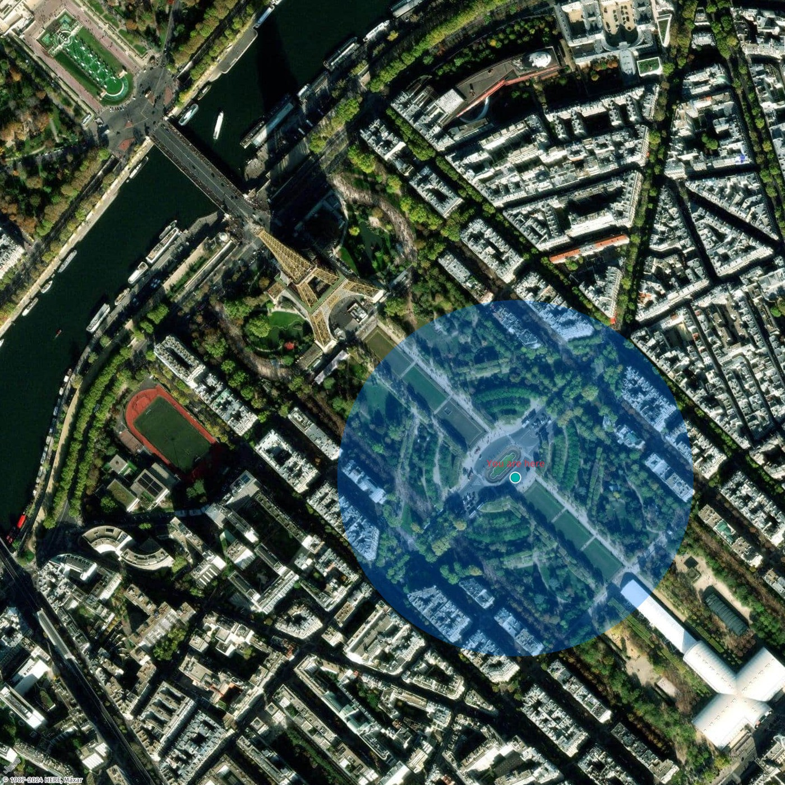

# How to add a proximity circle to a static map

Proximity circles offer important insights into the accuracy of a reported or
estimated device or user location. By showing a circle around the reported point, users
are informed that the actual position could fall anywhere within the circle, due to
various factors affecting positioning precision. This added clarity helps with
decision-making and enhances navigation safety.

In this example, you add a proximity circle of 500 meters near the Eiffel Tower in Paris.

Request

```
{
  "type": "FeatureCollection",
  "features": [
    {
      "type": "Feature",
      "geometry": {
        "type": "Point",
        "coordinates": [
          2.298151,
          48.855921
        ]
      },
      "properties": {
        "style": "circle",
        "color": "#007BFF50",
        "width": "500m"
      }
    },
    {
      "type": "Feature",
      "geometry": {
        "type": "Point",
        "coordinates": [
          2.298151,
          48.855921
        ]
      },
      "properties": {
        "icon": "cp",
        "color": "#007BFF",
        "text-color":"#DC3545",
        "text-outline-color":"#007BFF",
        "outline-width":"20px",
        "label": "You are here",
        "size": "large"
      }
    }
  ]
}
```

Request URL

```
https://maps.geo.eu-central-1.amazonaws.com/v2/static/map@2x?style=Satellite&width=700&height=700&zoom=17&center=2.2958,48.8570&geojson-overlay=%7B%20%20%22type%22%3A%20%22FeatureCollection%22,%20%20%22features%22%3A%20%5B%20%20%20%20%7B%20%20%20%20%20%20%22type%22%3A%20%22Feature%22,%20%20%20%20%20%20%22geometry%22%3A%20%7B%20%20%20%20%20%20%20%20%22type%22%3A%20%22Point%22,%20%20%20%20%20%20%20%20%22coordinates%22%3A%20%5B%20%20%20%20%20%20%20%20%20%202.298151,%20%20%20%20%20%20%20%20%20%2048.855921%20%20%20%20%20%20%20%20%5D%20%20%20%20%20%20%7D,%20%20%20%20%20%20%22properties%22%3A%20%7B%20%20%20%20%20%20%20%20%22style%22%3A%20%22circle%22,%20%20%20%20%20%20%20%20%22color%22%3A%20%22%23007BFF50%22,%20%20%20%20%20%20%20%20%22width%22%3A%20%22500m%22%20%20%20%20%20%20%7D%20%20%20%20%7D,%20%20%20%20%7B%20%20%20%20%20%20%22type%22%3A%20%22Feature%22,%20%20%20%20%20%20%22geometry%22%3A%20%7B%20%20%20%20%20%20%20%20%22type%22%3A%20%22Point%22,%20%20%20%20%20%20%20%20%22coordinates%22%3A%20%5B%20%20%20%20%20%20%20%20%20%202.298151,%20%20%20%20%20%20%20%20%20%2048.855921%20%20%20%20%20%20%20%20%5D%20%20%20%20%20%20%7D,%20%20%20%20%20%20%22properties%22%3A%20%7B%20%20%20%20%20%20%20%20%22icon%22%3A%20%22cp%22,%20%20%20%20%20%20%20%20%22color%22%3A%20%22%23007BFF%22,%20%20%20%20%20%20%20%20%22text-color%22%3A%22%23DC3545%22,%20%20%20%20%20%20%20%20%22text-outline-color%22%3A%22%23007BFF%22,%20%20%20%20%20%20%20%20%22outline-width%22%3A%2220px%22,%20%20%20%20%20%20%20%20%22label%22%3A%20%22You%20are%20here%22,%20%20%20%20%20%20%20%20%22size%22%3A%20%22large%22%20%20%20%20%20%20%7D%20%20%20%20%7D%20%20%5D%7D&key=your_API_Key
```

Response image


