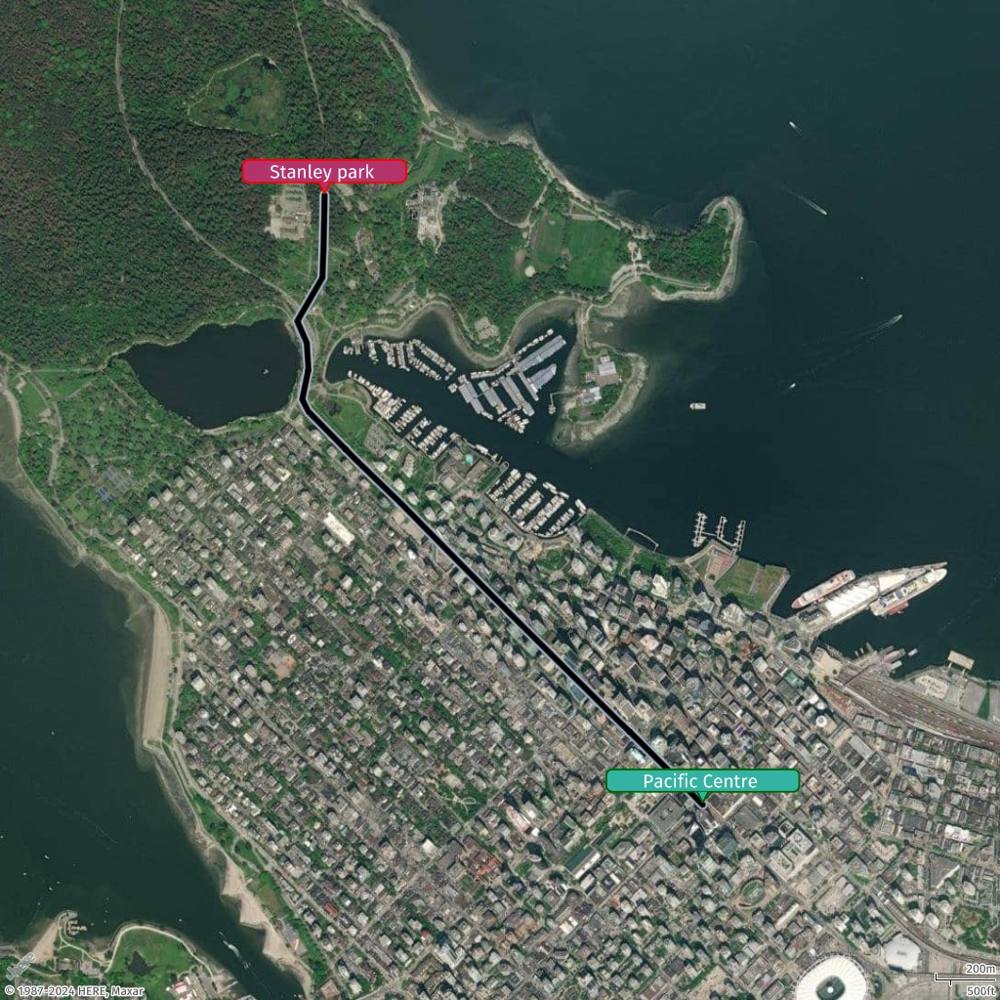

# How to add a route to a static map

In this topic, you'll learn how to add a route to a static map using Amazon Location Service. You'll go
through the steps to obtain a route using the CalculateRoutes API and then visualize it
on a static map using GeoJSON and custom styling for points and lines.

## Steps to add a route

1. Get routes from the `CalculateRoutes` API. Remove coordinates that fall on the same straight line to optimize the LineString, preventing the query string from reaching its limit.
2. Create a GeoJSON object based on the optimized set of coordinates.
3. Take the first and last points of the LineString and add Point geometries to mark the start and end locations.
4. Style the points and the LineString according to your business needs, adjusting properties like color, size, and labels.

## Add a route using compact style

In this example, you will add a route with start and end points to the line created in [How to add a line to a static map](how-to-add-line-static.md "how-to-add-line-static.md"). The route will be defined with custom styling, including color, size, and labels for the start and end points.

```
{
  "type": "FeatureCollection",
  "features": [
    {
      "type": "Feature",
      "geometry": {
        "type": "LineString",
        "coordinates": [
          [-123.11813, 49.28246],
          [-123.11967, 49.28347],
          [-123.12108, 49.28439],
          [-123.12216, 49.28507],
          [-123.12688, 49.28812],
          [-123.1292, 49.28964],
          [-123.13216, 49.2916],
          [-123.13424, 49.29291],
          [-123.13649, 49.2944],
          [-123.13678, 49.29477],
          [-123.13649, 49.29569],
          [-123.13657, 49.29649],
          [-123.13701, 49.29715],
          [-123.13584, 49.29847],
          [-123.13579, 49.29935],
          [-123.13576, 49.30018],
          [-123.13574, 49.30097]
        ]
      },
      "properties": {
        "color": "#000000",
        "width": "20m",
        "outline-color": "#a8b9cc",
        "outline-width": "2px"
      }
    },
    {
      "type": "Feature",
      "geometry": {
        "type": "Point",
        "coordinates": [-123.11813, 49.28246]
      },
      "properties": {
        "label": "Pacific Centre",
        "icon": "bubble",
        "size": "large",
        "color": "#34B3A4",
        "outline-color": "#006400",
        "text-color": "#FFFFFF"
      }
    },
    {
      "type": "Feature",
      "geometry": {
        "type": "Point",
        "coordinates": [-123.13574, 49.30097]
      },
      "properties": {
        "label": "Stanley Park",
        "icon": "bubble",
        "size": "large",
        "color": "#B3346D",
        "outline-color": "#FF0000",
        "text-color": "#FFFFFF"
      }
    }
  ]
}
```

Request URL

```
https://maps.geo.eu-central-1.amazonaws.com/v2/static/map?style=Satellite&width=1024&height=1024&padding=200&scale-unit=KilometersMiles&geojson-overlay=%7B%22type%22%3A%22FeatureCollection%22,%22features%22%3A%5B%7B%22type%22%3A%22Feature%22,%22geometry%22%3A%7B%22type%22%3A%22LineString%22,%22coordinates%22%3A%5B%5B-123.11813,49.28246%5D,%5B-123.11967,49.28347%5D,%5B-123.12108,49.28439%5D,%5B-123.12216,49.28507%5D,%5B-123.12688,49.28812%5D,%5B-123.1292,49.28964%5D,%5B-123.13216,49.2916%5D,%5B-123.13424,49.29291%5D,%5B-123.13649,49.2944%5D,%5B-123.13678,49.29477%5D,%5B-123.13649,49.29569%5D,%5B-123.13657,49.29649%5D,%5B-123.13701,49.29715%5D,%5B-123.13584,49.29847%5D,%5B-123.13579,49.29935%5D,%5B-123.13576,49.30018%5D,%5B-123.13574,49.30097%5D%5D%7D,%22properties%22%3A%7B%22color%22%3A%22%23000000%22,%22width%22%3A%2220m%22,%22outline-color%22%3A%22%23a8b9cc%22,%22outline-width%22%3A%222px%22%7D%7D,%7B%22type%22%3A%22Feature%22,%22geometry%22%3A%22Point%22,%22coordinates%22%3A%5B-123.11813,49.28246%5D%7D,%22properties%22%3A%7B%22label%22%3A%22Pacific%20Centre%22,%22icon%22%3A%22bubble%22,%22size%22%3A%22large%22,%22color%22%3A%22%2334B3A4%22,%22outline-color%22%3A%22%23006400%22,%22text-color%22%3A%22%23FFFFFF%22%7D%7D,%7B%22type%22%3A%22Feature%22,%22geometry%22%3A%22Point%22,%22coordinates%22%3A%5B-123.13574,49.30097%5D%7D,%22properties%22%3A%7B%22label%22%3A%22Stanley%20park%22,%22icon%22%3A%22bubble%22,%22size%22%3A%22large%22,%22color%22%3A%22%23B3346D%22,%22outline-color%22%3A%22%23FF0000%22,%22text-color%22%3A%22%23FFFFFF%22%7D%7D%5D%7D&key=`API_KEY`
```

Response image


