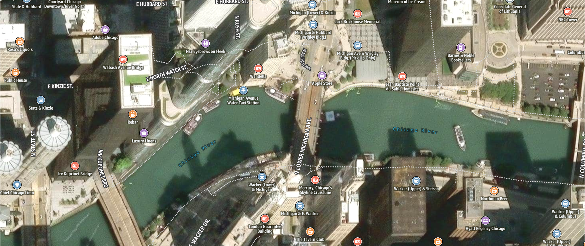

# Hybrid map style

The Hybrid map style combines global satellite imagery with the same clear labels and
configurable points of interest (POI) categories found in the Standard map style. This
combination provides rich geographic detail while ensuring readability and usability for
your application.

## Rich points of interest (POI)

The labels and POIs have been specifically designed for contrast and readability,
providing the necessary context for the satellite layer without distracting from the
detailed imagery. Light road lines highlight the urban structure when zoomed out and
gradually fade as you zoom in, revealing more detailed street-level
information.

Zoom

Neighborhood

Zoomed-in

## Designed for the world

The Hybrid style supports different political views, ensuring that the map
displays the correct borders for your users. This style also allows for easy
switching between languages for map labels, with dozens of supported languages and
writing systems available to ensure a localized experience.
