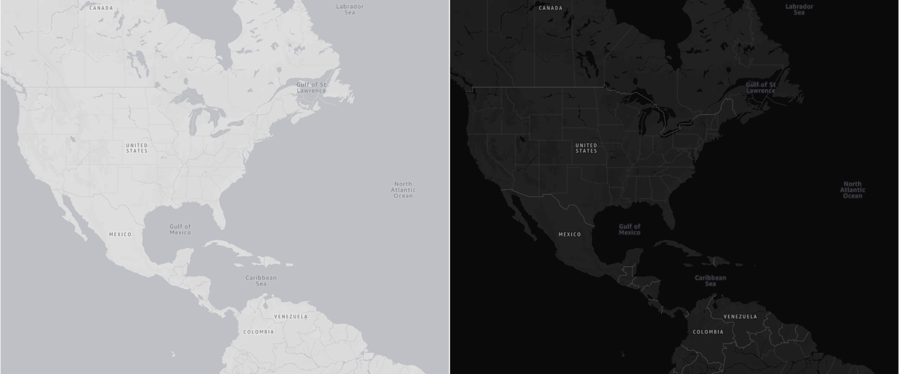
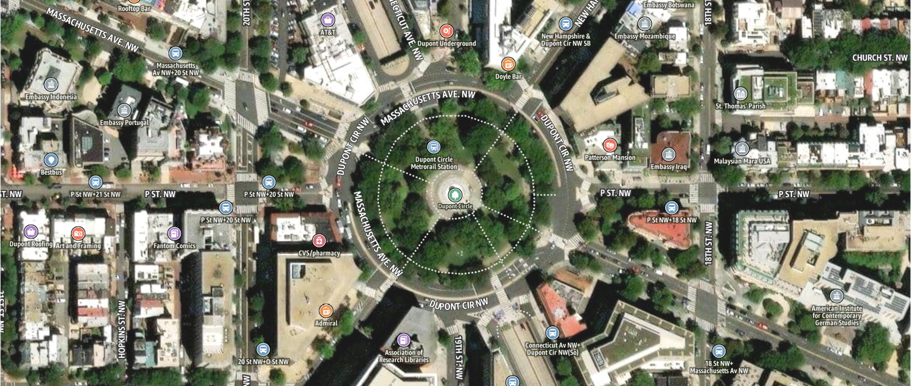
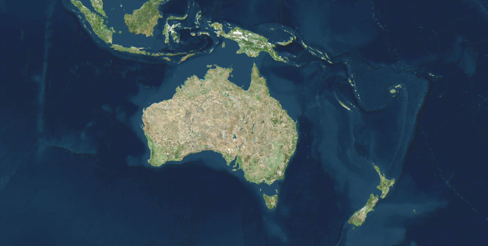

# AWS map styles and customization

## Map styles overview

To request a map, you must choose first a map style. Map styles define the visual
appearance of the rendered map, including the styling for map tiles, glyphs, and
sprites. Map tiles can be either vector (MVT) or raster (image). While the style may
change as you zoom in or out, it generally maintains a consistent theme. You can
override parts or the entire style before passing it to the map rendering
library.

## AWS map styles

AWS map styles adhere to industry standards, offering a sophisticated and
professional look. These styles reduce time-to-market and eliminate the need for
dedicated cartographers to create map styles from scratch. These predesigned styles
enable you to quickly and effectively create visually appealing maps for your end
users.

By leveraging the predesigned AWS map styles, you can bypass the time-consuming and
resource-intensive process of designing and constructing map styles from scratch. This
accelerates your development process, allowing you to focus on core
functionalities.

| Map style name | Description                                 | Color scheme   | Supports                           |
| -------------- | ------------------------------------------- | -------------- | ---------------------------------- | ----------------------------------------------------------------------------------------------------------------------------------------------------------------------------------------------------------------------------------------------------------------------------------------------------------------------------------------------------------------------------------------------------------------------------------------------------------------------------------------------------------------------------------------------------------------------------------------------------------------------------------------------------------------------------------------------------------------------------------------------------------------------------------------------------------------------------------------------------------------------------------------------------------------------------------------------------------------------------------------------------------------------------------------------------------------------------------------------------------------------------------------------------------------------------------------------------------------------------------------------------------------------------------------------------------------------------------------------------------------------------------------------------------------------------------------------------------------------------------------------------------------------------------------------------------------------------------------------------------------------------------------------------------------------------------------------------------------------------------------------------------------------------------------------- |
| Standard       | Colored map style                           | Dark and Light | Dynamic Map: Yes, Static Maps: No  |
| Monochrome     | Grey scale map styles                       | Dark and Light | Dynamic Map: Yes, Static Maps: No  |
| Hybrid         | Road and label overlay on satellite imagery | Not Applicable | Dynamic Map: Yes, Static Maps: No  |
| Satellite      | Satellite imagery-based map style           | Not Applicable | Dynamic Map: Yes, Static Maps: Yes | Amazon Location Service provides styles following the [MapLibre GL style specification](https://maplibre.org/maplibre-style-spec/ "https://maplibre.org/maplibre-style-spec/"). ## Standard map style The Standard map style is a clean and modern general-purpose map design that fits beautifully and functionally into almost any application or website. To learn more, see [Standard map style](standard-map-style.md "standard-map-style.md").  ## Monochrome map style The Monochrome map style is a minimalist canvas with a constrained color palette, designed for use with data visualization overlays. The Monochrome style offers both light and dark modes, communicating all the essential information needed for geographic context. To learn more, see [Monochrome map style](monochrome-map-style.md "monochrome-map-style.md").  ## Hybrid map style The hybrid map style combines global satellite imagery with clear labels and configurable POI categories from our vector maps. To learn more, see [Hybrid map style](hybrid-map-style.md "hybrid-map-style.md").  ## Satellite map style The Satellite map style presents high-resolution, real-world imagery captured by satellites, offering a realistic view of landscapes, buildings, and terrain. This style typically includes minimal labels or overlays to keep the focus on geographical details.  |
