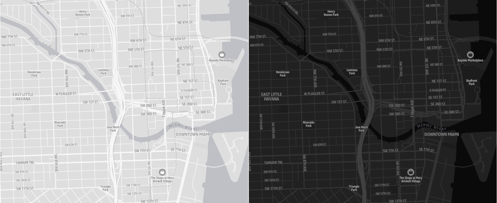
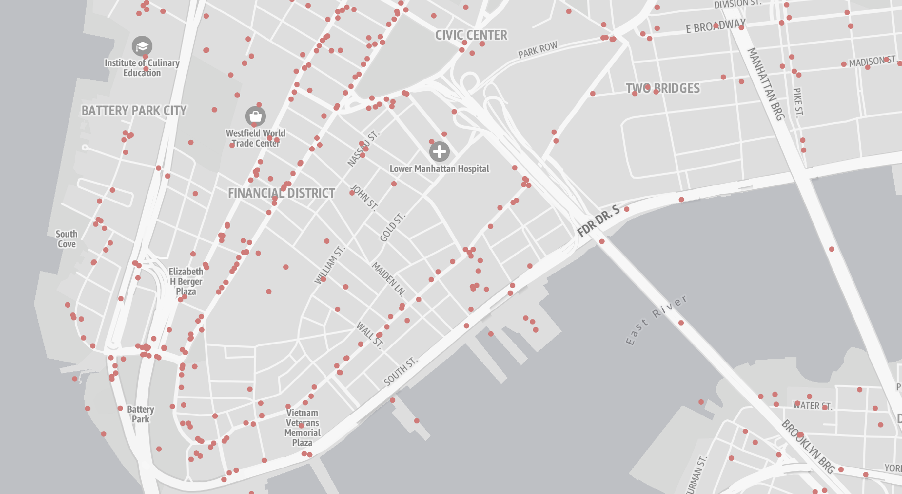
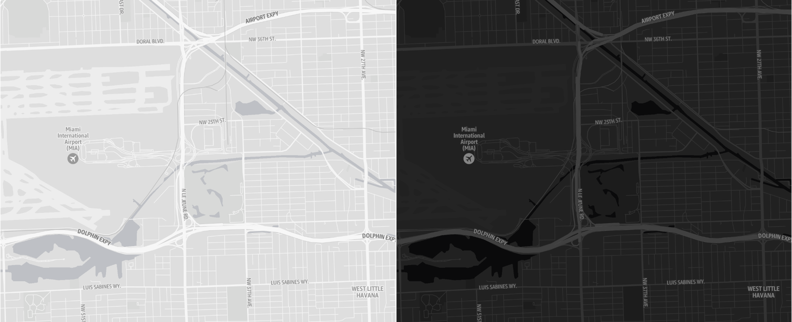
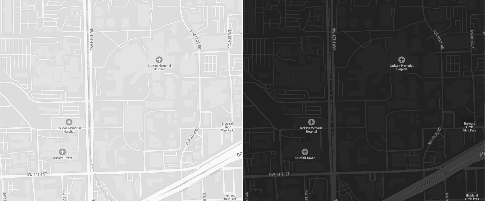
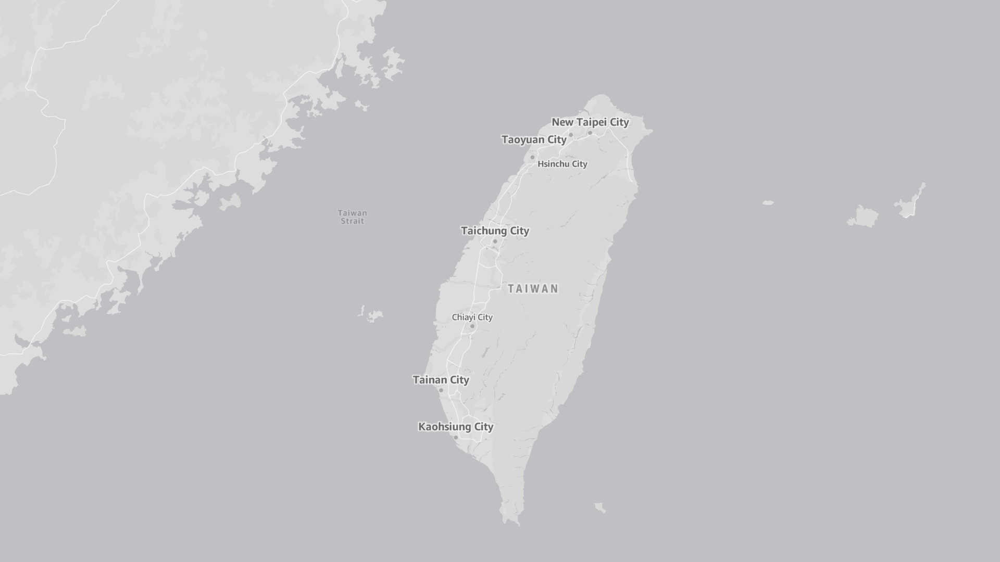

# Monochrome map style

The Monochrome style is a minimalist canvas with a constrained color palette, designed
for use with data visualization overlays. This style supports both light and dark modes,
each of which communicates all the essential information needed for geographic
context.

## Color schemes

The Monochrome style offers color choices for both dark and light modes.

Continent

Neighborhood

## Use cases

The Monochrome style is well-suited for data visualization and
minimalistic design needs.

### Data visualization

The Monochrome style deliberately uses only shades of gray, allowing you
complete freedom of color choice for data overlay layers such as choropleths,
heatmaps, or dot maps.

### Minimalist design

To maintain a clean and unobtrusive map, the Monochrome styles include a
reduced set of points of interest (POIs) for essential features, such as
airports, parks, hospitals, and universities.

Airport

Neighborhood

Although the Monochrome style includes a reduced set of POIs, the underlying tiles
still contain the complete set of POI data. This allows you to display POIs that are
not visually present in the style.

## Designed for the world

The Monochrome style supports different political views, ensuring that maps
display the correct borders for your users. The style also allows for easy switching
between languages for map labels, with dozens of supported languages and writing
systems.

