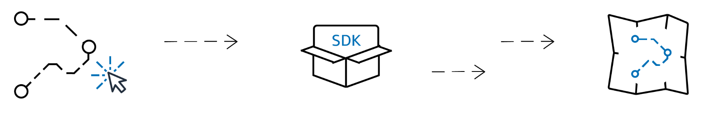
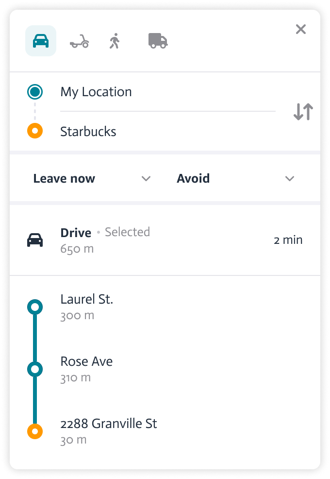

# Amazon Location Service Routes

With Amazon Location Service Routes, you can calculate travel time and distance between multiple starting
points and ending points, visualize vehicle GPS traces aligned with roads, and better
understand your serviceable areas. This helps reduce operating costs and improve customer
experience.

## Features

**Plan a route path**

Calculate routes between two or more locations, considering various
factors such as distance, time, and road conditions. You can also see
alternative routes for the same set of locations.

**Route Optimization**

Optimize routes for time or distance, choosing the fastest or shortest
route. You can also sequence waypoints to optimize for the traveling
salesman problem.

**Route Analysis**

Analyze performance metrics like travel time, distance, or the number of
stops to ensure the route meets your desired goals.

**Service Area**

Defines the geographic area that can be serviced from a particular
location based on distance or time limits.

**Toll Costs**

Calculate the costs associated with toll infrastructure on your
route.

**Avoidances**

Constrain your route calculation by avoiding highways, tunnels, ferries,
and toll roads.

**Speed Limits**

Find speed limits for each segment of a route, ensuring drivers comply
with local regulations.

## Use cases

**Provide efficient routes and turn-by-turn directions**

Plan routes from any starting location (address, POI, or GPS coordinates)
and calculate the best path to multiple destinations, factoring in vehicle
dimensions and restrictions.

For more information, see [Calculate routes](calculate-routes.md "calculate-routes.md").

**Optimize delivery routes**

Use waypoint sequencing to solve the Traveling Salesman Problem and
calculate the optimal route to multiple destinations, minimizing time and
distance.

For more information, see [Optimize waypoints](actions-optimize-waypoints.md "actions-optimize-waypoints.md").

**Make sure deliveries are made from the nearest warehouse**

Use Matrix Routing and Waypoint Sequencing to identify the fastest route
from your warehouses to each customer, maximizing efficiency and minimizing
costs.

For more information, see [Calculate routes](calculate-routes.md "calculate-routes.md") and [Calculate route matrix](calculate-route-matrix.md "calculate-route-matrix.md").

**Improve taxi and ride-share dispatch**

Use Matrix Routing to identify the nearest available vehicle and calculate
optimal routes based on real-time traffic. This ensures the closest vehicle
reaches the customer efficiently, driving both customer satisfaction and
business productivity. Make more trips, save on fuel costs, and deliver a
superior service experience.

For more information, see [Calculate routes](calculate-routes.md "calculate-routes.md"), [Calculate route matrix](calculate-route-matrix.md "calculate-route-matrix.md"), and [Calculate isolines](calculate-isolines.md "calculate-isolines.md").

**Find service areas**

Use Isoline routes to determine the geographic reach of your business,
based on time or distance constraints. This allows the business to identify
potential customers and make dispatch plans. In-home healthcare providers
can ensure they have enough staff and resources to reach all patients within
15 minutes. Isoline helps optimize service areas, ensure timely deliveries,
and locate new facilities.

For more information, see [Calculate isolines](calculate-isolines.md "calculate-isolines.md").

**Snap GPS trace to roads**

Align GPS traces to roads and visualize vehicle movements, ensuring route
adherence and regulatory compliance. Fleet managers can see if vehicles are
staying on planned routes and identify deviations. Verify that drivers are
following guidelines, spot inefficiencies, and ensure compliance with
regulations. Corrects GPS inaccuracies and variations, and presents a
realistic view of vehicle activity. Enable better decision-making around
route optimization, driver behavior, and fleet management.

For more information, see [Snap to Roads](snap-to-roads.md "snap-to-roads.md").

## APIs

This table provides an overview of key Amazon Location Service APIs for route planning and
location-based data processing. Each API offers unique functionality, such as
calculating routes, optimizing waypoints, and snapping GPS traces to roads for accurate
tracking.

| APIs                   | API name                                                                                                                                                                        | Description                                                                            | Read more |
| ---------------------- | ------------------------------------------------------------------------------------------------------------------------------------------------------------------------------- | -------------------------------------------------------------------------------------- | --------- |
| Calculate Routes       | Calculate a travel distance, travel time, and turn-by-turn directions between a starting point and multiple destinations factoring vehicle restrictions, and real-time traffic. | [Calculate routes](calculate-routes.md "calculate-routes.md")                          |
| Calculate Route Matrix | Calculate route distance and time between a set of departure points and a set of destinations, factoring real time traffic.                                                     | [Calculate route matrix](calculate-route-matrix.md "calculate-route-matrix.md")        |
| Calculate Isolines     | Identify the geographic area that can be reached within a specified time or distance based on your travel modes.                                                                | [Calculate isolines](calculate-isolines.md "calculate-isolines.md")                    |
| Optimize Waypoints     | Find the efficient order to travel to multiple destinations, reducing travel time and distance while accounting for factors like traffic and vehicle constraints.               | [How to optimize waypoints for a route](optimize-waypoints.md "optimize-waypoints.md") |
| Snap to Roads          | Match GPS traces to the nearest road segment, to improve accuracy of vehicle tracking and route visualization.                                                                  | [Snap to Roads](snap-to-roads.md "snap-to-roads.md")                                   |
