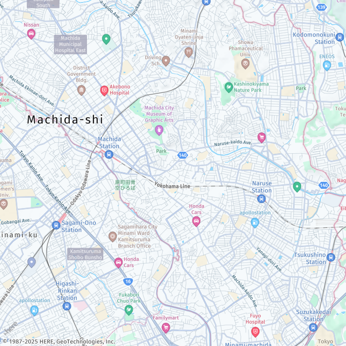
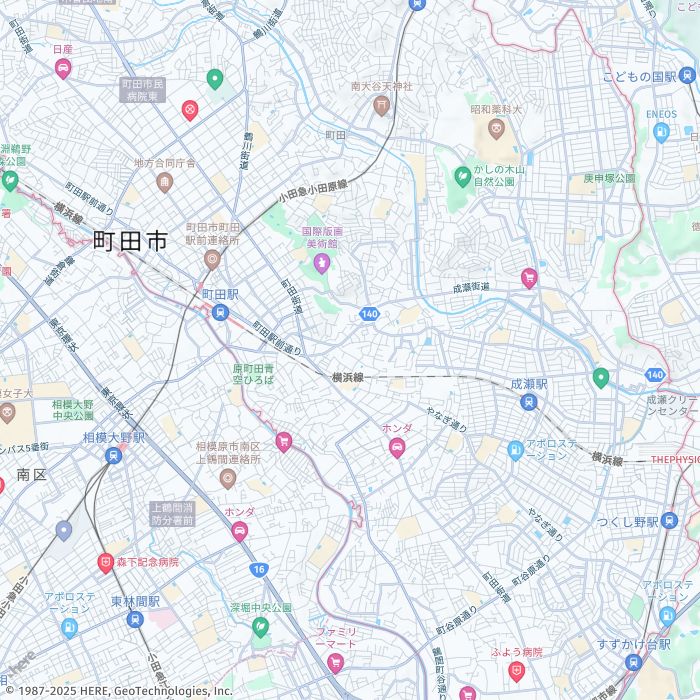

# How to set language for static maps

You can set the language for a static map, in case you don't want to use the default language.

In this example, a location in Tokyo which would generally default to Japanese text
is requested in English, overwriting the regional default.

The example shows the response image for a request where language is provided, and
one where the language is not provided. The corresponding labels reflect the difference
between a map showing the requested language and a map that shows the default
language.

Request URL - English set as the language

```
https://maps.geo.us-east-1.amazonaws.com/v2/static/map?center=139.4575,35.539&style=Standard&lang=en&height=700&width=700&zoom=14
```

Response image



Request URL - default language

```
https://maps.geo.us-east-1.amazonaws.com/v2/static/map?center=139.4575,35.539&style=Standard&height=700&width=700&zoom=14
```

Response image


