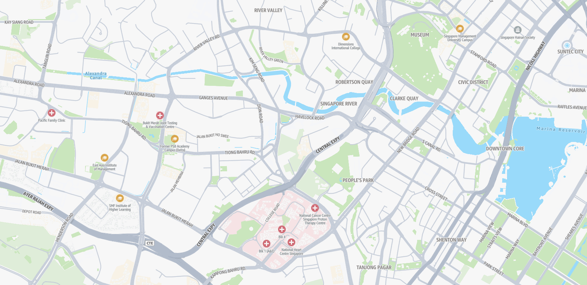

# Standard map style

The Standard map style offers a clean, modern, and general-purpose map design that can
seamlessly fit into almost any application or website.

## Color scheme

The Standard map style comes in both light and dark modes. The light mode is
versatile and can fit into any context, while the dark mode features a constrained
palette, designed to show details clearly and maintain readability in darker
environments. This ensures minimal distractions, especially in scenarios such as
night-time navigation.

Forest

Road

City

Neighborhood

## A pleasing, modern palette

Soft colors provide important land-use context without overwhelming the map,
offering useful information at both high and low zoom levels. Zoomed out, features
such as forests, deserts, and glaciers add richness to the map. When zoomed in, a
range of colors highlights important landmarks like schools, hospitals, recreation
areas (like parks and sports facilities), and urban districts like commercial and
industrial zones.

The overall style features a cohesive color palette, including POI markers that
complement their respective land-use areas. The road network is displayed in shades
of gray, providing detail without overwhelming the map with bright, distracting
colors.

Highway

Beach

Island

Neighborhood

Intersection

Roundabout

## Rich points of interest (POI)

The Standard map style supports a rich array of configurable points of interest
(POIs). Using the `PoiCategories` and `PoiDensity` parameters
in [GetStyleDescriptor](../APIReference/API_geomaps_GetStyleDescriptor.md "../APIReference/API_geomaps_GetStyleDescriptor.md"), you can choose which POI categories appear and how
many are shown. Amazon Location Service returns a style descriptor that renders only the requested
POIs, so maps display correctly with no additional client-side code.

### POI density

The `PoiDensity` parameter controls how many POIs render on the
map. Use lower density values to reduce visual clutter for apps with custom
markers, or higher values for discovery-focused applications.

### POI categories

The `PoiCategories` parameter filters the map to show only the
POI categories you specify. You can pass one or more categories to tailor the
map to your application's needs. When omitted, all categories are displayed.
For example, a property-listing site can surface only accommodations, a logistics
fleet app can show only transit and fuel, and a tourist map can highlight sights
and dining.

For more information about supported density levels and categories, see [Maps
features](maps-concepts.md#maps-concepts-features "maps-concepts.md#maps-concepts-features") and the [GetStyleDescriptor API Reference](../APIReference/API_geomaps_GetStyleDescriptor.md "../APIReference/API_geomaps_GetStyleDescriptor.md").
For instructions on using these parameters, see [How to filter
POI on the map](how-to-filter-poi-map.md "how-to-filter-poi-map.md").

The following tabs show examples of POI filtering and density configurations.

POI filtering

POI density

## Designed for the world

The Standard style supports different political views, ensuring that maps display
the correct borders for your users. The style also allows easy language switching
for map labels, with dozens of supported languages and writing systems.

To learn more, see [Localization and internationalization](maps-localization-internationalization.md "maps-localization-internationalization.md").

Languages

Political view

## Topography

The Standard map style provides detailed topographic visualization that highlights
elevation variations and natural geographic features. Contour lines, shading, and terrain
textures create a realistic representation of the landscape, enabling users to easily
interpret slopes, valleys, and peaks. This topographic rendering is ideal for outdoor planning,
environmental analysis, and applications where understanding terrain characteristics enhances
decision-making and spatial awareness.

Both Terrain and Contour Density

Only terrain

Only contour density

## Navigation

The Standard map style provides options to provide dynamic visualization designed to
optimize navigation and route planning. Live traffic data highlights congestion, incidents,
and road conditions, enabling users to anticipate delays and adjust their routes accordingly.
With multiple travel modes—such as truck or public transit—this feature empowers users to select
the most efficient and context-appropriate option for their route, ensuring smoother and more informed
routing experiences.

Traffic

Transit

Truck

## 3D

The Standard map style provides immersive three-dimensional visualization that renders terrain elevation and building structures with spatial depth and perspective. Adjustable viewing angles, pitch controls, and three-
dimensional rendering create a realistic representation of both natural landscapes and urban environments, enabling users to easily interpret elevation changes, terrain complexity, and spatial relationships.
This three-dimensional rendering is ideal for route planning, urban navigation, and applications where understanding vertical dimensions and depth perception enhances decision-making and spatial awareness..

3D Terrain

3D Buildings

## Land use

The Standard map style uses vibrant colors to indicate designated land uses.
Greens represent forests, grass, golf courses, sports centers, and parks. Relevant
colors are used for water bodies, glaciers, deserts, and beaches. Additionally, land
uses such as commercial, industrial, airports, military zones, medical facilities,
and educational areas are highlighted with specific vibrant categories.

Light

Dark

