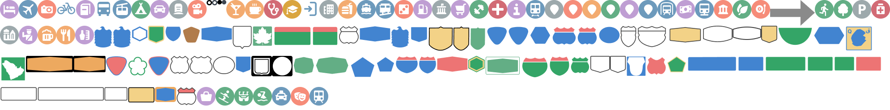
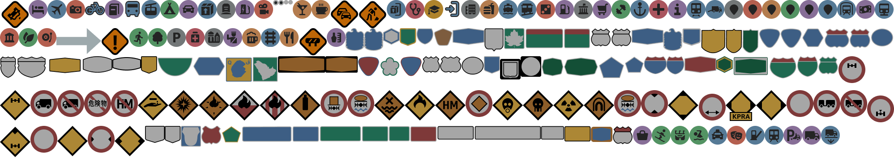
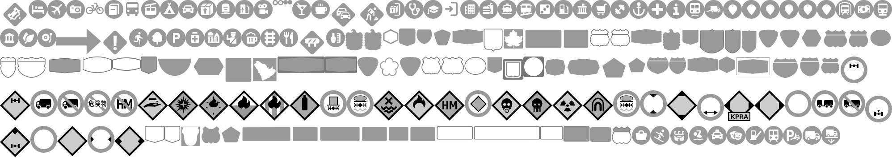
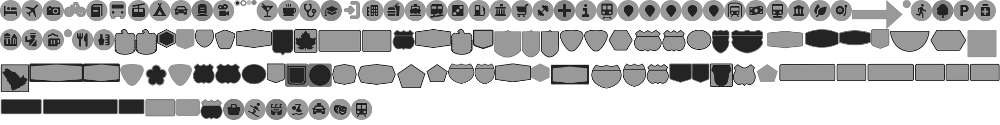
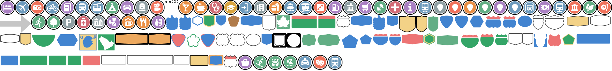

# Style iconography with sprites

A sprite is a Portable Network Graphic (PNG) image file that contains small raster
images such as icons, markers, and other elements rendered on a map. Sprites can be
customized based on parameters like style, color scheme, and variant. Amazon Location Service provides
a sprite sheet through the `GetSprites` API. You can also use custom icons by
either loading your own icon set (see [How to add an icon on the map](how-to-add-icon-on-map.md "how-to-add-icon-on-map.md")) or
customizing the style descriptor to load your custom sprites.

For more information, see [GetSprites](../APIReference/API_geomaps_GetSprites.md "../APIReference/API_geomaps_GetSprites.md") in the
_Amazon Location Service API Reference_.

## Use cases

- Rendering custom map elements using sprite sheets for specific styles and
  color schemes.
- Fetching sprites for various map styles such as Standard, Monochrome, or
  Hybrid.
- Customizing iconography on the map by modifying sprites.

## Understand the request

The request requires URI parameters such as `ColorScheme`,
`FileName`, and `Style`. These parameters allow for the
customization of the sprite sheet based on the map's color scheme, style, and the
specific sprite file required.

- **`ColorScheme`**: Defines the
  color scheme for the sprites, such as "Light" or "Dark".
- **`FileName`**: The name of the
  sprite file to retrieve, which could be a PNG or JSON file.
- **`Style`**: Specifies the map
  style, such as "Standard" or "Monochrome".

## Understand the response

The response contains headers such as `CacheControl`,
`ContentType`, and `ETag`, and returns the sprite data as
either a binary blob or a JSON file. These headers provide caching information, the
content type of the response, and version control for the sprite data.

- **`CacheControl`**: Caching
  configurations for the sprite file.
- **`ContentType`**: The format of
  the response, indicating whether it contains PNG or JSON data.
- **`ETag`**: Identifier for the
  sprite's version, used for cache validation.
- **`Blob`**: Contains the body of
  the sprite sheet or the JSON offset file.

Standard Light

Standard Dark

Monochrome Light

Monochrome Dark

Hybrid

