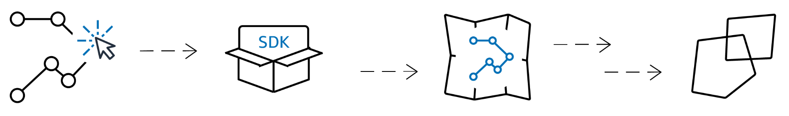

# Amazon Location Service trackers

###### Note

Tracker storage is encrypted with AWS owned keys automatically. You can add
another layer of encryption using KMS keys that you manage, to ensure that only you
can access your data. For more information, see [Data encryption at rest for Amazon Location Service](encryption-at-rest.md "encryption-at-rest.md").

A tracker stores position updates for a collection of devices. The tracker can be used
to query the devices' current location or location history. It stores the updates, but
reduces storage space and visual noise by filtering the locations before storing
them.

Each position update stored in your tracker resources can include a measure of
position accuracy and up to 3 fields of metadata about the position or device that you
want to store. The metadata is stored as key-value pairs, and can store information such
as speed, direction, tire pressure, or engine temperature.

Tracker position filtering and query are useful on their own, but trackers are
especially useful when paired with geofences. You can link trackers to one or more of your
geofence collection resources, and position updates are evaluated automatically against the
geofences in those collections. Proper use of filtering can greatly reduce the costs of your
geofence evaluations, as well.

1. First, you create a tracker resource in your AWS account.
2. Next, decide how you send location updates to your tracker resources. Use
   [AWS SDKs](dev-sdks.md "dev-sdks.md") to integrate
   tracking capabilities into your mobile applications. Alternately, you
   can use MQTT by following step-by-step directions in [tracking using MQTT](tracking-using-mqtt.md "tracking-using-mqtt.md").
3. You can now use your tracker resource to record location history and visualize
   it on a map.
4. You can also link your tracker resource to one or more geofence collections so
   that every position update sent to your tracker resource is automatically
   evaluated against all the geofence in all the linked geofence collections. You
   can link resource on the tracker resource details page of the Amazon Location console
   or by using the Amazon Location Trackers API.
5. You can then integrate monitoring using services such as Amazon CloudWatch and
   AWS CloudTrail. For more information see, [Monitor with Amazon CloudWatch](cloudwatch.md "cloudwatch.md") and [Monitor and log with AWS CloudTrail](cloudtrail.md "cloudtrail.md").

## Features

- **Position filtering** – Trackers can automatically filter
  the positions that are sent to them. There are several reasons why you might
  want to filter out some of your device location updates. If you have a system
  that only sends reports every minute or so, you might want to filter devices by
  time, storing and evaluating positions only every 30 seconds. Even if you are
  monitoring more frequently, you might want to filter position updates to clean
  up the inherent noisiness associated with GPS hardware and position reporting.
  Their accuracy is not 100% perfect, so even a device that is stationary appears
  to be moving around slightly. At low speeds, this _jitter_
  causes visual clutter and can cause false entry and exit events if the device is
  near the edge of a geofence.

The position filtering works as position updates are received by a tracker,
reducing visual noise in your device paths (jitter), reducing the number of false
geofence entry and exit events, and helping manage costs by reducing the number of
position updates stored and geofence evaluations triggered.

Trackers offer three position filtering options to help manage costs and reduce
jitter in your location updates.

- **Accuracy-based** – _Use with
  any device that provides an accuracy measurement. Most GPS and mobile
  devices provide this information._

The accuracy of each position measurement is affected by many environmental
factors, including GPS satellite reception, landscape, and the proximity of WiFi
and Bluetooth devices. Most devices, including most mobile devices, can provide
an estimate of the accuracy of the measurement along with the measurement. With
`AccuracyBased` filtering, Amazon Location ignores location updates if
the device moved less than the measured accuracy.

For example, if two consecutive updates from a device have an accuracy range
of 5 m and 10 m, Amazon Location ignores the second update if the device has moved
less than 15 m. Amazon Location neither evaluates ignored updates against geofences,
nor stores them.

When accuracy is not provided, it is treated as zero, and the measurement
is considered perfectly accurate, and no filtering will be applied to the
updates.

###### Note

You can use accuracy-based filtering to remove all filtering. If you
select accuracy-based filtering, but override all accuracy data to zero,
or omit the accuracy entirely, then Amazon Location will not filter out any
updates.

- **Distance-based** – _Use when
  your devices do not provide an accuracy measurement, but you still want to
  take advantage of filtering to reduce jitter and manage costs._

`DistanceBased` filtering ignores location updates in which devices
have moved less than 30 m (98.4 ft). When you use `DistanceBased`
position filtering, Amazon Location neither evaluates these ignored updates against
geofences nor stores the updates.

The accuracy of most mobile devices, including the average accuracy of iOS
and Android devices, is within 15 m. In most applications,
`DistanceBased` filtering can reduce the effect of location
inaccuracies when displaying device trajectory on a map, and the bouncing
effect of multiple consecutive entry and exit events when devices are near
the border of a geofence. It can also help reduce the cost of your
application, by making fewer calls to evaluate against linked geofences or
retrieve device positions.

Distance-based filtering is useful if you want to filter, but your device
doesn't provide accuracy measurements, or you want to filter out a larger
number of updates than with accuracy-based.

- **Time-based** – (default) _Use
  when your devices send position updates very frequently (more than once
  every 30 seconds), and you want to achieve near real-time geofence
  evaluations without storing every update._

In `TimeBased` filtering, every location update is evaluated
against linked geofence collections, but not every location update is stored. If
your update frequency is more often than 30 seconds, only one update per 30
seconds is stored for each unique device ID.

Time-based filtering is particularly useful when you want to store fewer
positions, but want every position update to be evaluated against the
associated geofence collections.

###### Note

Be mindful of the costs of your tracking application when deciding your filtering
method and the frequency of position updates. You are billed for every location
update and once for evaluating the position update against each linked geofence
collection.

For example, when using time-based filtering, if your tracker is linked to two
geofence collections, every position update will count as one location update
request and two geofence collection evaluations. If you are reporting position
updates every 5 seconds for your devices and using time-based filtering, you will be
billed for 720 location updates and 1,440 geofence evaluations per hour for each
device.

## Use cases for Amazon Location Service trackers

The following are a few common uses for Amazon Location Service trackers.

**Use trackers with geofences**

Trackers provide additional functionality when paired with geofences. You
associate a tracker with a geofence collection, either through the Amazon Location console
or the API, to automatically evaluate tracker locations. Each time the tracker
receives an updated location, that location will be evaluated against each geofence
in the collection, and the appropriate `ENTER` and `EXIT`
events are generated in Amazon EventBridge. You can also apply filtering to the tracker, and,
depending on the filtering, you can reduce the costs for geofence evaluations by
only evaluating meaningful location updates.

If you associate the tracker with a geofence collection after it has already
received some position updates, the first position update after association is
treated as an initial update for the geofence evaluations. If it is within a
geofence, you will receive an `ENTER` event. If it is not within any
geofences you will not receive an `EXIT` event, regardless of the
previous state.

**Improve field service operations**

Keep a pulse on your mobile workforce with real-time tracking. Set geofences around
customer sites and service areas to receive alerts when staff arrive and depart. Use
location data to optimize scheduling, dispatch the nearest available technician, and
reduce response times. Empower your field teams (such as a your plumbing or HVAC repair
business) to work more efficiently, while enhancing the customer experience.

**Monitor and control critical assets**

Utilize Amazon Location Service to track the real-time location and status of your
valuable equipment, inventory, and other mobile assets. Set up geofences to receive
alerts on unauthorized movements or removals, enhancing security and compliance. Use
this location visibility to improve asset utilization, optimize maintenance schedules,
and ensure your critical resources are accounted for at all times. Always monitor your
heavy machinery, IT hardware, or retail inventory with precision, reduce losses, and
make more informed operational decisions.

**Enhance supply chain visibility**

Leverage Amazon Location Service to track shipments and deliveries across your entire supply chain.
Define geofences around distribution centers, stores, and other key facilities to
monitor the movement of inventory and assets. Use real-time location data to improve
inventory management, optimize logistics planning, and deliver a superior customer
experience. Gain end-to-end visibility into your supply chain operations, identify
bottlenecks, and make data-driven decisions that drive efficiency and responsiveness.

**Location-based marketing**

Unlock the power of location data to supercharge your geomarketing efforts. Use
Amazon Location Service to set virtual boundaries around competitor locations, events, and high-traffic
areas. Trigger personalized ads, offers, and notifications when customers enter these
geofenced zones. Analyze foot traffic patterns to optimize ad placements and uncover
prime sites for new business locations. Monitor customer movements within your own
geofenced spaces to gain deeper insights on browsing behaviors and path-to-purchase.
Combine real-time location tracking with precision geofencing to deliver hyper-targeted,
contextual engagement that drives sales and loyalty in the physical world.
