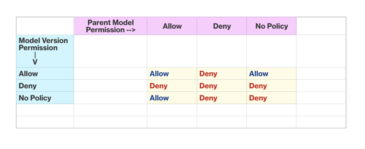

On October 7, 2026, AWS will discontinue support for
Amazon Lookout for Equipment. After October 7, 2026, you will no longer be
able to access the Lookout for Equipment console or resources. For more
information,
[see the following](https://aws.amazon.com/blogs/machine-learning/preserve-access-and-explore-alternatives-for-amazon-lookout-for-equipment/ "https://aws.amazon.com/blogs/machine-learning/preserve-access-and-explore-alternatives-for-amazon-lookout-for-equipment/").

# Importing a model

###### Topics

- [Importing a model](#importing-model "#importing-model")
- [APIs related to importing](#importing-APIs "#importing-APIs")
- [Importing a dataset](#import-dataset "#import-dataset")
- [Controlling access to your model](#control-model-access "#control-model-access")
- [Comparing access to model versions with access to
  parent models](#versions-and-parents "#versions-and-parents")
- [Importing a model version with accumulated
  inference data](#importing-with-data "#importing-with-data")

## Importing a model

This section describes how to copy existing Lookout for Equipment resources from one user account to
another. For instance, as a user you might want to do this if you maintain different
accounts for Development, QA, and Production pipelines to restrict user access at the
various stages. Or, as an integrator you want to develop models in your user account and
then provide them to your end users in their own AWS accounts. Importing is the
mechanism allowing you to move Lookout for Equipment resources across these account boundaries.

In this guide, the term _resources_ indicates the machine learning
models that Lookout for Equipment generates, as well as the user datasets that you provide to train
those models.

The following resources can be associated with a model version:

- the model version metadata
- the inference scheduler
- the training dataset
- the accumulated inference data
- the model performance metrics
- the retraining scheduler

The import resources APIs allow users to import the model version metadata, training
datasets, accumulated inference data, and model metrics (if available). However, the
inference scheduler and retraining schedulers are not copied over, and must be
re-created in the target account.

In the context of performing an import, there is a _source account_
and a _target account_. The API must be called from the target
account, and it references information about the resources in the source account that
you want to import.

In order for a target to be able to import resource from a source account, the source
account must grant the appropriate permissions to the target account. See [Controlling access to your model](#control-model-access "#control-model-access").

## APIs related to importing

The following APIs will help you to import a model:

- [ImportDataset:](API_ImportDataset.md "API_ImportDataset.md") Imports the data that was used to train the original
  model.
- [ImportModelVersion:](API_ImportModelVersion.md "API_ImportModelVersion.md") Imports a model from another account. Use the
  attribute `SourceModelVersionArn` to indicate the version of the
  model that you want to import.

###### Note

If you plan to import both a model and the dataset that was used to create
it, then you should first call [ImportDataset](API_ImportDataset.md "API_ImportDataset.md"), and then [ImportModelVersion](API_ImportModelVersion.md "API_ImportModelVersion.md").

Whether or not you call both of these APIs depends on your use case. You may choose to
import a model, but not the dataset that was used to create it. In that case, you would
only call [ImportModelVersion](API_ImportModelVersion.md "API_ImportModelVersion.md"). You might do this because you already have a version of
the same model in your account, and you are importing an improved version of the same
model.

###### Note

If you plan to import both a model and the dataset that was used to create it,
then you should first call ImportDataset, and then ImportModelVersion.

## Importing a dataset

This section explains how to import your dataset using the Lookout for Equipment APIs.

For the purposes of this example, let us suppose that target account
`2222222222` wants to import a dataset from source account
`111111111111`.

###### Note

If the source account and the target account are the same, then you can skip the
first two steps of this procedure.

1. The source account gives the target account permission to import the dataset
   `testDataset` with the following policy, using the
   [PutResourcePolicy](API_PutResourcePolicy.md "API_PutResourcePolicy.md") API.

JSON

```
`{
 "Version":"2012-10-17",
 "Statement": {
 "Effect": "Allow",
 "Principal": {
 "AWS": "arn:aws:iam::`111122223333`:role/Admin"
 },
 "Action": [
 "lookoutequipment:ImportDataset"
 ],
 "Resource": "arn:aws:lookoutequipment:us-west-2:111111111111:dataset/testDataset/00af0697-095b-433a-889c-9f4eed39db8b"
 }
}`

```

2. Users of the source account may have used a AWS Key Management Service key to encrypt the
   original ingestion data. If that is the case, then the source account must give
   the target account permission to encrypt and decrypt the AWS KMS key.

For more information, see [Authentication and
access control for AWS Key Management Service](../../../kms/latest/developerguide/control-access.md "../../../kms/latest/developerguide/control-access.md") in the _AWS Key Management Service Developer
Guide_ 3. The target account calls the ImportDataset API, supplying the dataset ARN
(`arn:aws:lookoutequipment:us-west-2:111111111111:dataset/testDataset/00af0697-095b-433a-889c-9f4eed39db8b`).
This action triggers the importation of the dataset.

###### Note

Labels associated with the source model will not be copied. Therefore, if
labels are needed, the target account must explicitly provide them through
the [LabelsInputConfiguration](API_ImportModelVersion.md#LookoutForEquipment-ImportModelVersion-request-LabelsInputConfiguration "API_ImportModelVersion.md#LookoutForEquipment-ImportModelVersion-request-LabelsInputConfiguration") parameter of the [ImportModelVersion](API_ImportModelVersion.md "API_ImportModelVersion.md") API.

## Controlling access to your model

This section explains how a customer controls access to a model.

In order for a target to import resources from a source account, the source account
must give permissions to the target account. These permissions are granted by applying
resource policies to either the model, the model version, or the dataset
resources.

Only the source account can apply, view or delete resource policies.

The following APIs will help you in controlling access to your model:

- [PutResourcePolicy](API_PutResourcePolicy.md "API_PutResourcePolicy.md")
- [DescribeResourcePolicy](API_DescribeResourcePolicy.md "API_DescribeResourcePolicy.md")
- [DeleteResourcePolicy](API_DeleteResourcePolicy.md "API_DeleteResourcePolicy.md")

Here is an example resource policy for setting the import permissions for a
dataset:

JSON

```
`{
 "Version":"2012-10-17",
 "Statement": {
 "Effect": "Allow",
 "Principal": {
 "AWS": "arn:aws:iam::`111122223333`:role/Admin"
 },
 "Action": [
 "lookoutequipment:ImportDataset"
 ],
 "Resource": "arn:aws:lookoutequipment:us-west-2:111111111111:dataset/testDataset/00af0697-095b-433a-889c-9f4eed39db8b"
 }
}`

```

This is an example policy for setting permissions for importing a specific model
version:

JSON

```
`{
 "Version":"2012-10-17",
 "Statement": {
 "Effect": "Allow",
 "Principal": {
 "AWS": "arn:aws:iam::`111122223333`:role/Admin"
 },
 "Action": [
 "lookoutequipment:ImportModelVersion"
 ],
 "Resource": "arn:aws:lookoutequipment:us-west-2:111111111111:model/testModel/00af0697-095b-433a-889c-9f4eed39dbbc/model-version/1"
 }
}`

```

This is an example policy to set the permissions to import all model versions (setting
the permissions on a parent model):

JSON

```
`{
 "Version":"2012-10-17",
 "Statement": {
 "Effect": "Allow",
 "Principal": {
 "AWS": "arn:aws:iam::`111122223333`:role/Admin"
 },
 "Action": [
 "lookoutequipment:ImportModelVersion"
 ],
 "Resource": "arn:aws:lookoutequipment:us-west-2:111111111111:model/testModel/00af0697-095b-433a-889c-9f4eed39dbbc"
 }
}`

```

By default, when you import a model version, you also accumulate inference data along
with it. For information about changing that option, see [Importing a model version with accumulated
inference data](#importing-with-data.title "#importing-with-data.title").

###### Note

The policies above only support ImportDataset and ImportModelVersion. They cannot
be used to give cross-account permissions to any other APIs associated with
Lookout for Equipment.

What follows are explanations of several elements contained in the policies
above.

- **Effect**: The effect can be `Allow`
  or `Deny`. By default, IAM users don't have permission to use
  resources and API actions, so all requests are denied. An explicit
  `Allow` overrides the default. An explicit `Deny`
  overrides any `Allow`s.
- **Action**: The action is the specific Lookout for Equipment
  action for which you are granting or denying permission.
- **Resource**: The resource that's affected by the
  action.
- **Condition**: Conditions are optional. They can
  be used to control when your policy is in effect.

You may use the Lookout for Equipment ResourcePolicy APIs to control access to models, model versions,
and datasets. For more information, see the API references for [PutResourcePolicy](API_PutResourcePolicy.md "API_PutResourcePolicy.md") and [DeleteResourcePolicy](API_DeleteResourcePolicy.md "API_DeleteResourcePolicy.md").

Lookout for Equipment access control policies follow the same format as IAM policies. However, Lookout for Equipment
policies will not appear in the IAM console, nor in the context of using IAM APIs.
For more information, see [Policies and permissions in
IAM](../../../IAM/latest/UserGuide/access_policies.md "../../../IAM/latest/UserGuide/access_policies.md") in the _IAM User Guide_.

## Comparing access to model versions with access to

parent models

When you give another account access to a model, you are giving that account access to
_all_ versions of that model.

When two policies exist, one for the model, and one for a version of that model, the
more restrictive of the two policies applies.

If an account attempts to access a particular model or version, and no IAM policy
exists for either the model itself or any version of that model, then access is not
allowed.

For example, suppose you have a model called Pump_1. This model will serve as the
parent model.

This model has two versions:

- Pump_1 version 1
- Pump_1 version 2

Now suppose that we set a policy _only_ at the level of the parent
model (Pump_1).

JSON

```
`{
 "Version":"2012-10-17",
 "Statement": {
 "Effect": "Allow",
 "Principal": {
 "AWS": "arn:aws:iam::`111122223333`:role/Admin"
 },
 "Action": [
 "lookoutequipment:ImportModelVersion"
 ],
 "Resource": "arn:aws:lookoutequipment:us-west-2:111111111111:model/Pump_1/00af0697-095b-433a-889c-9f4eed39dbbc"
 }
}`

```

This policy indicates that all versions under model Pump_1 can be imported. No
policies are specified at the level of the model _version_.
Therefore, Lookout for Equipment will look at the permissions on the parent model level and apply them
to all the versions.

Now, let us suppose that you also set a policy at the model version level. In this
case, the model version will be Pump_1 Version 2.

JSON

```
`{
 "Version":"2012-10-17",
 "Statement": {
 "Effect": "Deny",
 "Principal": {
 "AWS": "arn:aws:iam::`111122223333`:role/Admin"
 },
 "Action": [
 "lookoutequipment:ImportModelVersion"
 ],
 "Resource": "arn:aws:lookoutequipment:us-west-2:111111111111:model/Pump_1/00af0697-095b-433a-889c-9f4eed39dbbc/model-version/2"
 }
}`

```

This policy indicates that Version 1 can be imported, but that Version 2 cannot be
imported.

Lookout for Equipment looks at the permission at the model level and sees that it is set to
**Allow**. Then, Lookout for Equipment will examine the permission for Version 2,
and find that it is set to **Deny**.

Lookout for Equipment will then apply the more restrictive of the two permissions. Thus, Version 2
cannot be imported.

Finally, since there is no explicit permission on Version 1, Lookout for Equipment continues to apply
the permission from the parent model (Allow). Therefore, Version 1 can be
imported.

The table below illustrates the relationship between parent model permissions and
model version permissions.



## Importing a model version with accumulated

inference data

When you're importing a model version, you may want to also import the accumulated
inference data along with it.

For example, if the retraining scheduler had the lookback window set to
`P360D`, then the retraining execution would use data up to 360 days up
to the current day of the retraining execution. If the inference data imported from the
source account falls in that time period, then it would be used to retrain the
model.

You can set three options with `InferenceDataImportStrategy` while calling
the [ImportModelVersion](API_ImportModelVersion.md "API_ImportModelVersion.md") API:

- **NO_IMPORT:** No data with regard to inference
  will be imported
- **ADD_WHEN_EMPTY:** Only when the target model
  version has no inference data associated with it, then the inference data will
  be imported.
- **OVERWRITE:** Even if the target model version
  has some inference data associated with it, the inference data from the source
  account will overwrite it.

If nothing is set as input for `InferenceDataImportStrategy`, then the
default setting is `NO_IMPORT`.

Before you can import a model version with the accumulated inference data, you must
verify that the resource policy allows the importing of data related to the model
version.

If you do not want to allow `ImportModelVersions` requests that import the
inference data (that is, `InferenceDataImportStrategy` is set to
`NO_IMPORT` in the request) then you should set the condition key
`lookoutequipment:IsImportingData` to false on the resource policy of a
model or model version that allows `ImportModelVersion` action.

If you want to allow `ImportModelVersions` requests with any
`InferenceDataImportStrategy`, you don’t need to additionally set
`lookoutequipment:IsImportingData` on a resource policy of a model or
model version that allows the `ImportModelVersion` action, because it is the
default behavior when `lookoutequipment:IsImportingData` is not set.

It is unusual to only allow `ImportModelVersions` requests that import the inference
data (that is `InferenceDataImportStrategy` is set to `ADD_WHEN_EMPTY` or `OVERWRITE` in the
request), but if you have such a use case, you can explicitly set
`lookoutequipment:IsImportingData` to true to achieve this permission control.

This is an example policy that will prevent the inference data from being
imported:

JSON

```
`{
 "Version":"2012-10-17",
 "Statement": {
 "Effect": "Allow",
 "Principal": {
 "AWS": "arn:aws:iam::`111122223333`:role/Admin"
 },
 "Action": [
 "lookoutequipment:ImportModelVersion"
 ],
 "Resource": "arn:aws:lookoutequipment:us-west-2:111111111111:model/testModel/00af0697-095b-433a-889c-9f4eed39dbbc",
 "Condition": {
 "Bool": {
 "lookoutequipment:IsImportingData": "false"
 }
 }
 }
}`

```
