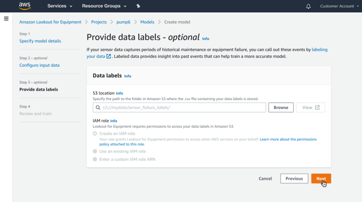

On October 7, 2026, AWS will discontinue support for
Amazon Lookout for Equipment. After October 7, 2026, you will no longer be
able to access the Lookout for Equipment console or resources. For more
information,
[see the following](https://aws.amazon.com/blogs/machine-learning/preserve-access-and-explore-alternatives-for-amazon-lookout-for-equipment/ "https://aws.amazon.com/blogs/machine-learning/preserve-access-and-explore-alternatives-for-amazon-lookout-for-equipment/").

# Labeling your data

You've made a decision about your [training and
evaluation](configuring-input-data.md "configuring-input-data.md") settings. If you decided to use [labeled](understanding-labeling.md "understanding-labeling.md") data, now is the time to upload it.

Lookout for Equipment takes labeling information in as two timestamps in a CSV file stored in an
Amazon Simple Storage Service (Amazon S3) bucket. The first timestamp indicates when abnormal behavior is
expected to have started. The second timestamp is when the failure or abnormal
behavior was first noticed. Alternatively, the second timestamp can indicate a
maintenance event. Lookout for Equipment uses this window as the basis for looking for signs of an
upcoming event so it can better understand what those events look like on this
machine. Ideally, the timestamps correspond to data during a maintenance event. We
recommend that you filter out data from any restart procedure.

The following is an example of such a CSV file.

| Row | Timestamp 1    | Timestamp 2    |
| --- | -------------- | -------------- |
| 1   | 1/1/2020 0:00  | 1/3/2020 0:00  |
| 2   | 2/2/2020 0:05  | 2/7/2020 0:05  |
| 3   | 4/11/2020 0:10 | 4/21/2020 0:10 |

Row 1 represents a maintenance event on January 3rd with a 2-day window for Lookout for Equipment
to look for abnormal behavior.

Row 2 represents a maintenance event on February 7th with a 5-day window for Lookout for Equipment
to look for abnormal behavior.

Row 3 represents a maintenance event on April 21st with a 10-day window for Lookout for Equipment
to look for abnormal behavior.

Lookout for Equipment uses all of these time windows to look for an optimal model that finds
abnormal behavior within these windows. Note that not all events are detectable and
most are highly dependent on the data provided.

###### To label your data

1. Create your labeled data.

Store the label data as a .csv file that consists of two columns. The file has
no header. The first column has the start time of the abnormal behavior. The second
column has the end time.

The following example shows how your label data should appear as a .csv file.

```

2020-02-01T20:00:00.000000,2020-02-03T00:00:00.000000
2020-07-01T20:00:00.000000,2020-07-03T00:01:00.000000

```

2. Upload your data labels to Amazon S3. Here you'll follow the same procedure as in
   Uploading your data to Amazon S3.

You can use the same Amazon S3 bucket or a different one. If you use the same one, it's
a good practice to create a separate folder for your data labels. 3. In the Lookout for Equipment console, on the **Provide data labels** page, indicate the location of your data labels.

 4. Choose your IAM role.

This is the role that authorizes Lookout for Equipment to access the Amazon S3 bucket where your data
labels are stored. If you're using the same bucket as before, you can choose the
role that you already created. You can also select **Create an IAM
role**, and the proper role will be created for you. 5. Choose **Next**. 6. Review your training [settings](reviewing-settings.md "reviewing-settings.md") and then train the model.
