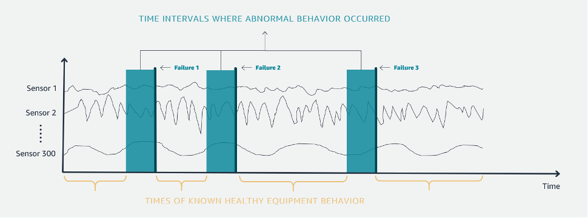

On October 7, 2026, AWS will discontinue support for
Amazon Lookout for Equipment. After October 7, 2026, you will no longer be
able to access the Lookout for Equipment console or resources. For more
information,
[see the following](https://aws.amazon.com/blogs/machine-learning/preserve-access-and-explore-alternatives-for-amazon-lookout-for-equipment/ "https://aws.amazon.com/blogs/machine-learning/preserve-access-and-explore-alternatives-for-amazon-lookout-for-equipment/").

# Understanding labeling

Amazon Lookout for Equipment takes an input dataset, which it assumes is under normal operating conditions,
and trains a model to detect deviations from this baseline, normal operation. However, if
there are known periods of abnormal behavior in the input dataset, then that abnormal
behavior can lead to less accurate models. To address this, we recommend that you use
labels to identify the abnormal behavior in the input dataset and Lookout for Equipment can exclude that
labeled data from model training. For example, if it is known that historical data for a
machine contains data for planned or unplanned downtime states, you can use labels to
identify and exclude the downtime state data from model training.

By using the labels as inputs to the model, Lookout for Equipment can use additional modeling
techniques that can improve the accuracy of the model.

As an example, the following image shows the time intervals of known healthy equipment
behavior and the time intervals of abnormal equipment behavior (that is, the width of the bars in
the image).

In your labeling data, you define the abnormal time interval (bar width in image) from the
actual failure point (for example, _Failure 1_). You provide the labeled
data as a CSV file to model training. Each line of the CSV indicates the time intervals when
your equipment did not function properly. For more information, see [Labeling your data](labeling-data.md "labeling-data.md").

By consulting with Subject
Matter Experts (SMEs) and understanding the various failure modes of the equipment you can
provide a “lookahead” window indicating the amount of time the onset of the problem could
have been detected.

You typically get information for labeling abnormal behavior data
from two sources:

- Work orders which have been reported on the equipment. Work orders are notoriously
  subjective and inconsistent. That is why with Lookout for Equipment you only need to provide the
  approximate time of the failure and the approximate lookahead window in the labeling data you provide to
  Lookout for Equipment for model training.
- SMEs who work and maintain the equipment often have in depth knowledge about when
  machinery was in an erroneous state.
  For information on how to apply labels when training a model, and the format of the label
  file, see [Labeling your data](labeling-data.md "labeling-data.md").
