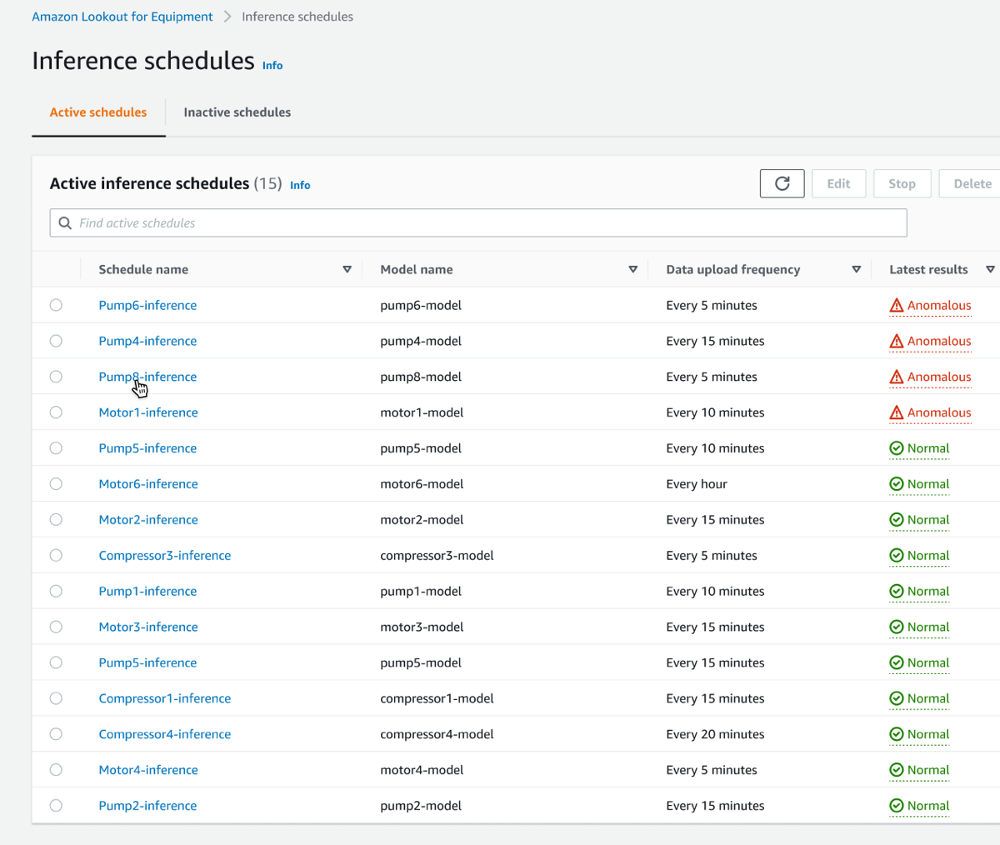
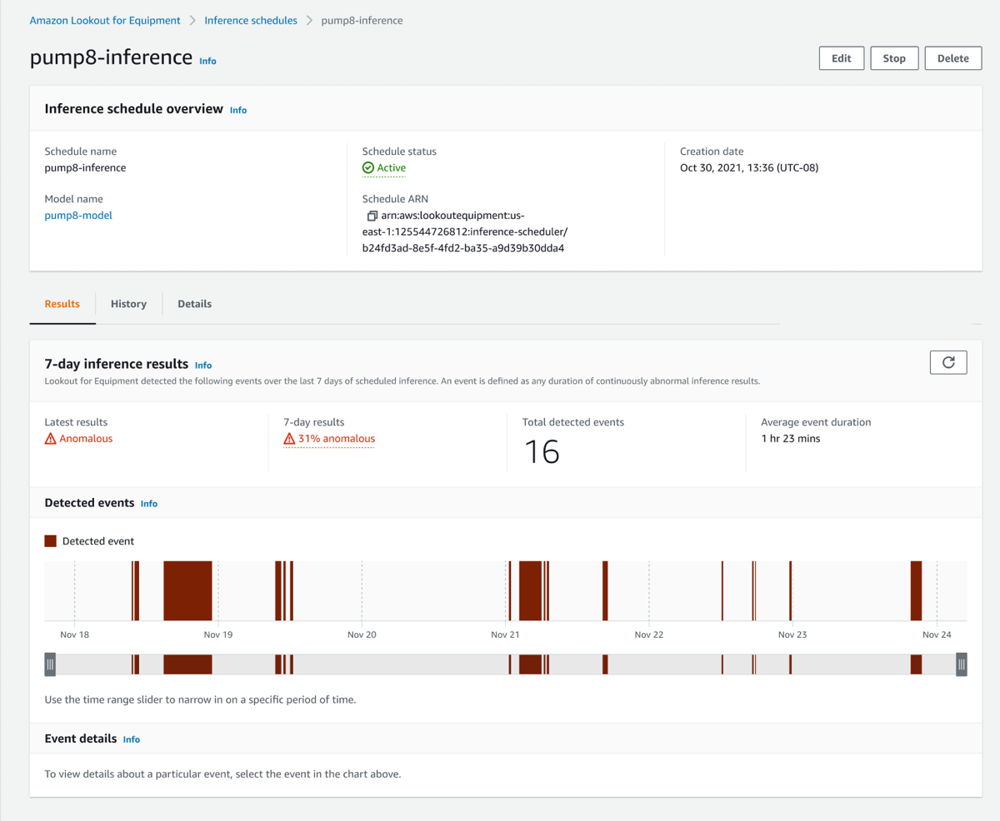
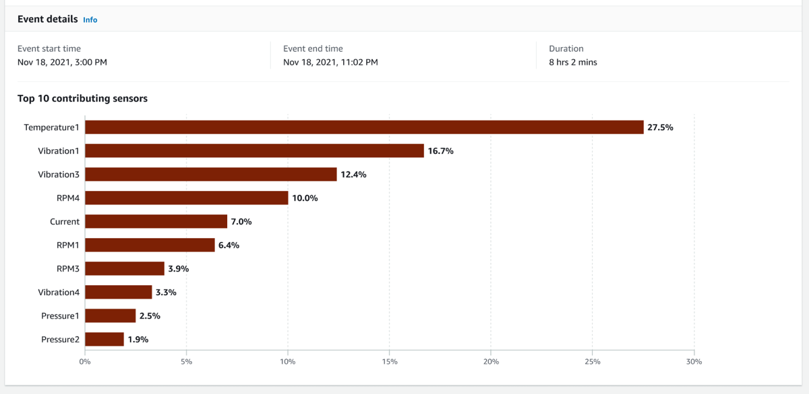

On October 7, 2026, AWS will discontinue support for
Amazon Lookout for Equipment. After October 7, 2026, you will no longer be
able to access the Lookout for Equipment console or resources. For more
information,
[see the following](https://aws.amazon.com/blogs/machine-learning/preserve-access-and-explore-alternatives-for-amazon-lookout-for-equipment/ "https://aws.amazon.com/blogs/machine-learning/preserve-access-and-explore-alternatives-for-amazon-lookout-for-equipment/").

# Reviewing inference results in the console

## Using the main inference schedules page

On the inference schedules main page you'll find your list of inference schedules, both active and inactive (on different tabs). For each schedule, you'll find the model name, data upload frequency, and latest results.

In this context, _latest results_ means the results from the most recent inference run.

To edit, delete, stop, or restart a schedule, see [Managing inference schedules](managing-inference-schedules.md "managing-inference-schedules.md").

## Using the inference schedule detail page

On the inference schedule detail page you'll find details about the anomalous behavior of your assets, as presented in the context of a particular inference schedule.

You'll also find metadata about the schedule itself.

At the top of the results tab are the 7-day inference results. These results provide information about anomalous behavior that occurred over the past week.

_Latest results_ refers to results from the latest inference run.

_7-day results_ indicates the percentage of hours during the last seven days, during which an anomaly was detected.

Use the slider to zoom in on a particular event (red bar).

Click on a particular event (red bar) to view details about it.

After you click on a particular event, the **Event details** tab indicates which sensors contributed the most to that event.

###### Note

Lookout for Equipment only records events that last longer than 5 minutes.
