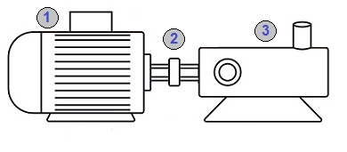
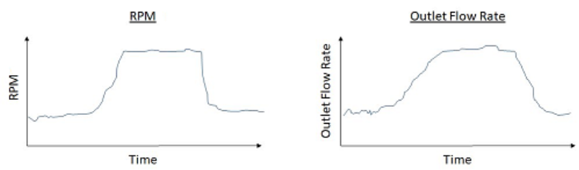
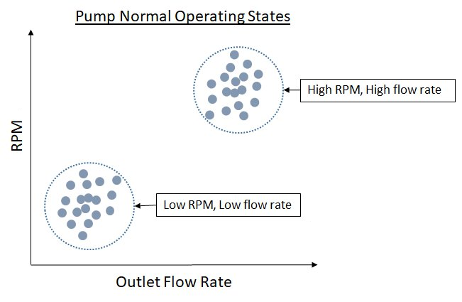
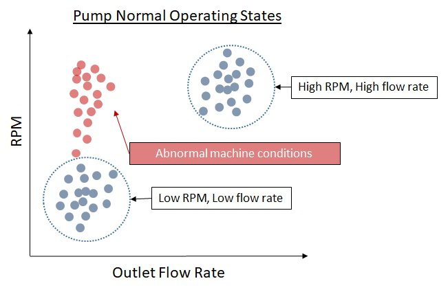
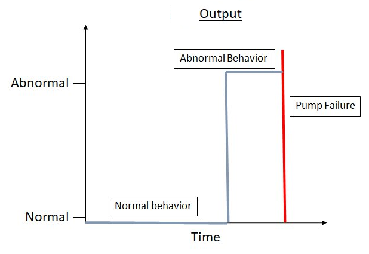

On October 7, 2026, AWS will discontinue support for
Amazon Lookout for Equipment. After October 7, 2026, you will no longer be
able to access the Lookout for Equipment console or resources. For more
information,
[see the following](https://aws.amazon.com/blogs/machine-learning/preserve-access-and-explore-alternatives-for-amazon-lookout-for-equipment/ "https://aws.amazon.com/blogs/machine-learning/preserve-access-and-explore-alternatives-for-amazon-lookout-for-equipment/").

# Use case: fluid pump

**Example**

Lookout for Equipment is designed primarily for stationary industrial equipment that operates
continuously. This includes many types of equipment, including pumps, compressors, motors,
and turbines.

As an example of using Lookout for Equipment on data from a high-level machine , let's look at a fluid
pump.

In a simplified form, this fluid pump consists of three major components and their
sensors. Note that this is just an example and not a complete list of features and
components of such a pump.

1. **Motor** – The motor converts electricity
   into mechanical rotation. Key sensors might measure the current, voltage, or
   revolutions per minute (RPM).
2. **Bearing** – Bearings keep the rotating shaft
   in position while allowing it to rotate with minimal friction. Key sensors measure
   vibration.
3. **Pump** – The pump is an impeller that
   rotates on the shaft and pulls fluid from one direction and forces fluid in another
   direction, similar to a boat propeller. Key sensors measure inlet and outlet flow
   rate, pressure, and temperature.
   For a simple application of Amazon Lookout for Equipment, let's say that the only available data consists of
   measurements of how fast the pump is spinning in RPM, and the outlet flow rate of the fluid.
   The following historical time-series plots show both sets of measurements.

These graphs show the expected relationship between RPM and flow rate: as the pump rotates
faster, the fluid flows faster. The graphs show two operating modes: one with low RPM and a
low flow rate, and a second mode with high RPM and high flow rate. In this case, Amazon Lookout for Equipment
wants to learn this normal relationship in terms of operating modes. .The following graph
shows another way to visualize the learned normal operating modes.

The normal behavior of this pump is clear. The operator runs the pump at low RPM and high
RPM in order to get a low flow rate or a high flow rate. As the pump continues to run, we
expect that the data will continue to fall into one of these two operating modes. However,
if the pump starts to have problems, this relationship might not hold true.

Over time, the impeller (the part similar to a boat propeller) starts to rust, chip,
loosen, or become misaligned. As this happens, the data might show abnormal behavior. When
the pump rotates at higher a RPM, the flow rate remains low, as shown in the following
graph.

These types of issues are precisely what Amazon Lookout for Equipment is designed to detect.

In this case, we see a simple representation of the normal operating states of the pump
and abnormal behavior if the pump has an issue. The following graph shows a simplified view
of how Lookout for Equipment detects the output over time. When the relationship between RPM and flow rate
is normal, Lookout for Equipment detects that everything is normal. However, as the RPM increases but the
flow rate stays the same, Lookout for Equipment starts detecting abnormal behavior. The vertical red line
denotes the potential failure point for the pump, at which unplanned downtime occurs.

This is a very simple example of a straightforward application with only two inputs (RPM
and flow rate) that have a direct linear relationship with each other. The situation become
dramatically more complex when we add additional inputs, such as pressure, temperature,
motor current, motor voltage, bearing vibration, and so on. The more you increase the number
of inputs, the more complex the relationships between all of the inputs becomes. With some
equipment, the number of inputs can easily reach into the hundreds. In addition, this
simplified example doesn't attempt to represent the time-series aspect of the
problem—the model also has to learn the changes in relationships over time. For
example, even subtle changes in vibration over time can be critical to detecting issues.

Amazon Lookout for Equipment works with up to 300 inputs at once. Keep in mind that to accurately analyze the
data, Lookout for Equipment requires that the inputs are related to issues that you want to find, and that
the historical data used to train (and evaluate) the model represents the equipment's normal
behavior.
